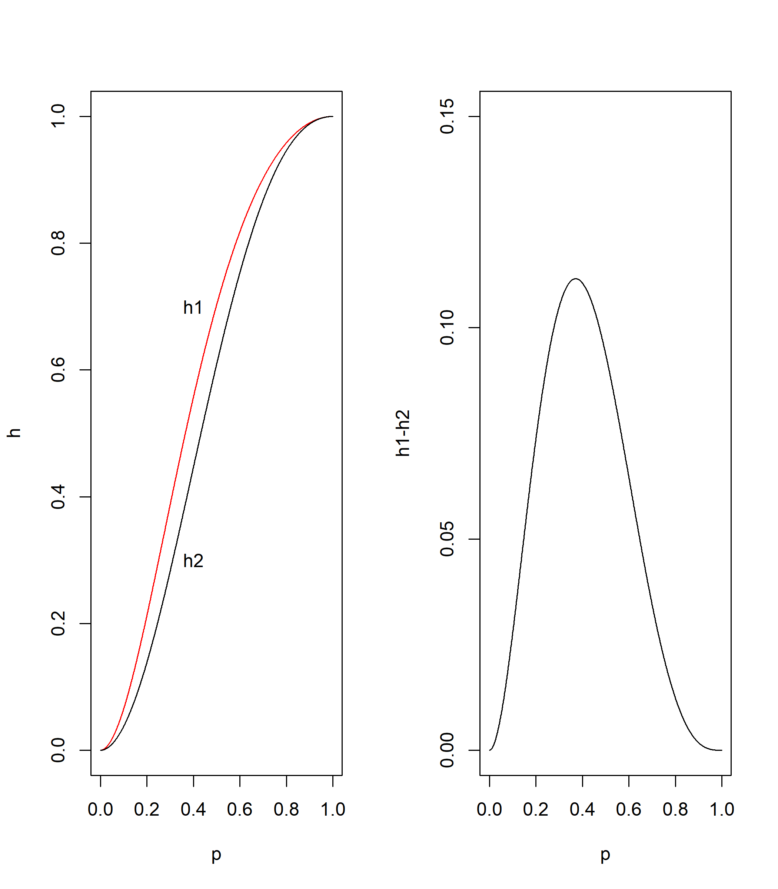

Chapter 1. System and Model
================
Jae Kwan Koo

-   [1.1 System](#system)
    -   [System Identification](#system-identification)
    -   [Hospital Example](#hospital-example)
    -   [Temporary or Permanent](#temporary-or-permanent)
    -   [Series system](#series-system)
    -   [Parallel system](#parallel-system)
    -   [Diamond system](#diamond-system)
    -   [More complexed model](#more-complexed-model)
-   [1.3 Model](#model)
    -   [Model](#model-1)
        -   [Condition of good model](#condition-of-good-model)
        -   [Condition of analysis data](#condition-of-analysis-data)
        -   [Model type](#model-type)
    -   [Simulation](#simulation)
        -   [Merit](#merit)
        -   [Demerit](#demerit)
        -   [Kinds of simulations](#kinds-of-simulations)
    -   [Model diagnosis](#model-diagnosis)
        -   [Note](#note)

1.1 System
----------

단순히 시스템은 문제가 주어진 현재 상황이다. 우리는 이 시스템에 주어진 문제를 해결 해보자는 것이다.
예를 들면, "오늘의 날씨는 어떻기 때문에 내일은 비가 올 것이다." 와 같이 구체적으로 표현하여 논리적으로 파악하고 싶은 것이다.

원을 하나의 시스템이라고 한다면 경계선 내부에는 내부 구성요소 간의 복합적인 상호작용을 할 것이다.
시스템 바깥으로부터도 서로 영향을 주고 받을 있다. 하지만, 일반적으로 내부에서 영향을 받는다.
크게 시스템은 내부적인 요인, 외부적인 요인으로 구분할 수 있지만 전체적으로 크게 구성요소로 볼 수 있다.

### System Identification

시스템의 구성요소 파악이 가장 중요하다. 또한, 구성요서 간 관계 및 상호작용은 존재할 것이다.
내적 관계, 외적 관계 또한 파악이 필요하지만, 파악하는 것은 쉽지 않다.
날씨안의 구성요소 간 관계와 같은 자연적인 관계보다 공장에서의 인위적인 공정, 설비 등이 더 파악하기 쉽다.
구성요소 간의 관계는 확률적인 모의실험을 통해 문제 해결하려고 노력해야 한다.

-   구성요소 : 시스템을 구성하고 있는 부품. 시스템 내부의 구성요소와 외부의 구성요소. 단순히 구성요소라고도 한다.

-   속성 : 속성은 보통 논리적(T,F) 또는 수치적으로 표현할 수 있다. 구성요소는 값을 가질 수 있는데 이 구성요소의 특징을 나타낸다.

구성요소의 관측된 값을 속성이라고 한다면, 변수를 구성요소라고 할 수 있다.

-   외생변수 : 시스템 외부로 부터 내부에 영향을 주는 변수를 말한다. 즉, 외적 구성요소이다.

-   내생변수 : 시스템 내부의 구성요소이다.

일방적으로 영향을 주는 변수를 외생변수라고 부르고 영향을 받아 시스템 내부에서 변화하는 변수를 내생변수라고 부른다. 하지만, 굳이 딱 잘라 구별하지는 않는다.

### Hospital Example

속성 파악이 중요하다고 했는데, 그렇다면 "많이 파악할수록 좋은 것인가?" 라는 질문을 던저볼 수도 있다.
구성요소 파악도 '적당히'하는 말을 쓰곤 한다.

우리는 터무니 없이 긴 환자 대기시간과 같은 시스템 문제들을 생각해볼 수 있다.
이러한 시스템을 파악하여 문제해결을 하려고 하는 것인데,
결국 이것을 통해 하고자 하는 것은 병원에서 환자들을 더 많이 치료해 돈을 버는 것이다.
즉, "모형화".

모형을 단순화해서도 적합이 잘된다고 한다면, `복잡한 것 보다는 단순한 것이 더 좋다.`
그래서 모형을 구축할 때, 적합뿐만 아니라, 단순화에 대해서도 생각하게 된다.

-   진료 대기시간 등 병원 안에서 이루어 지는 일들은 내생변수라고 볼 수 있다.
-   환자 도착시간 등 병원 안에서 이루어 지지 않는 일들은 외생변수라고 볼 수 있다.

먼저 시스템화를 한 후, 모형화를 하는 것이 목적이다.

### Temporary or Permanent

고정된 시스템과 유동적인 시스템이 있다.

-   주사위 실험 : 독립적인 확률실험에 속하기 때문에 이런 시스템은 변화하지 않는다. 즉, 고정된 상태라고 말한다.
-   무한 모집단에서 유한개 표본 임의 추출 : 확률표본이기 때문에 각 표본추출 확률은 동일하다. 따라서 고정된 시스템이라고 한다.
-   이차원 확률보행 실험 : 동서남북으로 가는 사건들은 서로 영향이 없지만 만약, 동쪽으로 먼저 움지이고 북쪽으로 간다면 앞선 사건에 영향을 받기 때문에(시간에 영향을 받기 때문에) 일시적인 상태로 볼 수 있다.
-   우체국 직원의 서비스 시간 측정 : 저녁에 가까울수록 일의 능률이 떨어져 처리시간이 늘어날 수 있다. 업무처리속도를 이야기하게 되면 시간에 영향을 받기 때문에 위와 마찬가지로 고정된 상태가 아닌 일시적인 상태로 볼 수 있다.

시간의 흐름에 따라 변화하게 되는 일시적인 상태를 배제하고 고정된 상태만 가지고 이야기를 해보자.

### Series system

현 상태에서 작동하고 있는지(T), 아닌지(F)를 수치로 표현하여 1,0으로 하자.
작동할 확률이 높다는 것은 제품에 대한 신뢰도가 높다라고 할 수 있다.
i번째 구성요소가 작동할 확률을 i번째 구성요소의 `신뢰도(reliability)`라고 한다.

0 ≤ *p* ≤ 1

p가 위의 부등호의 범위에 들어가는 것은 확률 입장에서 보면 당연하다. 또한, 1에 가까울수록 좋으면 신뢰도가 높다. 마찬가지로, 0에 가까우면 신뢰도가 매우 떨어진다고 이야기한다.

전체 공장설비가 작동할 확률을 이야기 했을 때, 직렬시스템이라면 모든 구성요소가 작동을 해야 한다. 즉, 모두 다 1의 값을 가지고 있어야 작동한다. 여기에 대한 신뢰도(작동할 확률)에 대해 구하자면, 모든 구성요소가 작동할 확률의 곱으로 나타날 것이다.

*p*(*ϕ* = 1)=*Π**p*<sub>*i*</sub>

즉, 이 값이 클수록 전체 시스템에 대한 신뢰도가 높다.

### Parallel system

병렬시스템은 이전보다 조금 복잡하다.
먼저 서로 `독립`이라는 가정을 했다. 독립이 아니라면 내적 구성요소, 외적 구성요소 등 과의 상호작용을 고려해야한다.
5개 구성요소 중 어느 하나라도 작동되기만 하면 시스템은 작동한다.

*p*(*ϕ* = 1)=1 − *Π*(1 − *p*<sub>*i*</sub>)

직렬과 병렬이 같이 있는 경우를 생각해볼 수 있다.
만약 1번 구성요소와 2,3번이 병렬로 되어 있는 그룹과 직렬로 이어져있는 경우이다.

*p*(*ϕ* = 1)=*p*<sub>1</sub> × (1 − (1 − *p*<sub>2</sub>)(1 − *p*<sub>3</sub>))

로 해결할 수 있다. 자세한 그림은 PDF파일을 참고하면 된다.

### Diamond system

직렬같기도 하고 병렬 같기도 하다. 가운데 3번째 구성요소가 작동하는지 여부에 따라 나누어 생각해야 한다.
3번째 작동하지 않으면 오른쪽그림을 생각할 수 있을 것이다. 이 경우, 병렬구조가 큰 틀이다.
첫번째 그림을 놓고보면 병렬처럼 보이지만, 3번째를 통과하기 때문에 큰 틀에서 보면 병렬은 아니다.
조건부 확률로 3번째가 작동하는지 나누어 줄 수 있다.

~~*물론 작은 공장을 가더라도 위 예제보다 시스템이 더 복잡하기 때문에 신뢰도를 구하는데 조금 힘들 수 있다.*~~

### More complexed model

두 시스템은 구성요소 1,2,3번째가 각 두개씩 사용되었다.
두 그림은 단순히 배치만 다르게 보인다. 그래서 어느쪽 시스템을 사용해야 하는지 신뢰도를 계산하여 판단해야 한다.

``` r
knitr::include_graphics('https://raw.githubusercontent.com/koojaekwan/jaekwan-s-R/master/Computerized_Statistics/Chapter1/1.1system.PNG')
```


``` r
p<-seq(0,1,0.001)
h1<-(1-(1-p)^2)*(1-(1-(1-(1-p)^2))^2)
h2<-1-(1-p*(1-(1-p)^2))^2

h.dif<-h1-h2
summary(h.dif)
```

    ##    Min. 1st Qu.  Median    Mean 3rd Qu.    Max. 
    ## 0.00000 0.01092 0.04970 0.05233 0.09299 0.11160

``` r
result<-cbind(p,h1,h2,h.dif)

par(mfrow=c(1,2))
plot(p,h1,ylab='h',type='l',col='red')
text(0.4,0.7,'h1')
lines(p,h2)
text(0.4,0.3,'h2')

plot(p,h.dif, type='l', ylim = c(0,0.15),ylab='h1-h2')
```

 시뮬레이션을 하니 h1이 신뢰도가 더 높아 보인다.
신뢰도의 차이는 `p : 0.3~0.4`에서 차이가 많이 나는 것 처럼 보인다.

1.3 Model
---------

### Model

인위적인 시스템은 언제든지 구성요소를 파악가능하다.
하지만, 자연적인 시스템은 수 많은 구성요소를 파악해도 관계를 설명하는 것이 쉽지 않다. 즉, 분석이 어렵다.
하지만, 인위적인 시스템만 다룰 수 없으니 여기서는 자연적인 시스템에 집중해서 살펴보자.
또한, 적당한 구성요소와 적당히 설명히 가능한 모형을 만들어 보자.
구성요소 간 관계는 명확히 밝히되, 구성요소 수를 적당히 단순화 시켜보자.

#### Condition of good model

-   전체가 아닌, 적당한 구성요소를 포함하되 주요 구성요소는 포함해야 한다.
-   현실적으로 모형을 설명 가능하도록 만들어야 한다.
-   모형을 단순화 시켰기 때문에 오차가 발생하는데 모형과 실제 차이가 작을수록 좋은 모형이다.

#### Condition of analysis data

대부분이 하나의 특성을 유지하고 있어야 한다.
하지만, 같은 특성을 띄지않는 요소 몇몇이 있을 수는 있다.
미래의 패턴이 달라질 수 있지만, 우리가 생각하는 패턴이 나타날 기대는 있어야 한다.

#### Model type

모형 종류를 굳이 구분지어 부르지는 않는다.

-   회귀모형이 상징적 모형에 해당하는 예이다.
-   회귀분석도 정적 모형에 해당 한다.

우리가 여기서 주로 다루게 되는 것은 통계적 모형이다.
확률변수가 없다면 항상 일정한 상수일 뿐이다. 입실론 있다면 통계적 모형이다. 즉, 확률변수를 포함하는 모형을 통계적변수라고 말한다.
수학에서 사용하는 것은 결정적 모형이라고 말한다.

### Simulation

시스템에 대해 항상 우리는 실험을 해보고 싶다.
다양한 구성요소를 파악하여 구성요소를 적용시켜보자. 단, 있는 그대로 적용하기엔 무리가 있다.
최적의 해를 이론적으로 구할 수 없기 때문에 단순화 시켜 모형화를 하는데 초점을 맞추자.
시스템에 대해 신뢰도를 구하는 것 뿐만아니라, 조금 더 단순화 시켜서 구하는 것이 모형화이다.
구성요소가 많다는 것은 찾아야 할 해가 많다는 것을 의미한다. 즉, 분석에 여러가지 에로사항이 발생할 수 있다.
모형을 만들어 효율적인 알고리즘을 구현해보자.

공정단계를 새로 만든다고 생각했을 때, 공정을 다 만들어놓고 별로라고 판단하면 시간, 돈 낭비가 심하므로 미리미리 테스트를 하는데 이것을 `모의실험`이라고 한다.
환경을 임의로 만들고 결과 값을 토대로 앞으로 어떻게 할지 보는 것이다.

예컨대, 설문지를 작성해서 바로 뿌리는 것이 아니라, 예비조사를 실시하는 것과 같다.
다시 설문지를 점검하고 응답률을 살펴볼 필요가 있다. 이때 회수해서 문제없는지 등 체크를 한다.

우리는 현재 직접 시스템을 구현 할 수 없으니 가상환경으로 분석하자.
장점으로는 임의로 만들었기 때문에 과정들을 하나하나 컨트롤하면서 결과를 볼 수 있다.

모의실험 의도는 좋다. 시간, 비용 측면에서는 모의실험 해보고 검정 해본 후 결정을 내린다.
해를 찾기 어려울 때, 여러번 모의실험을 통해 해를 찾을 수 있다.

~~*모의실험 하는 과정이 좋은 알고리즘 덕분에 짧아지면 좋겠지만, 대체로 시간이 오래걸리기도 한다. (세밀한 검토가 필요)*~~
~~*장점은 그냥 pdf파일을 한번 읽어보도록 하자.*~~

#### Merit

`중요한 것은 외부한경의 변화에 따라 내부 구성의 변화에 따른 시스템 반응 및 효과를 분석가능`

-   직전, 그 이전시점으로 부터 영향받게 되는 동적모형도 활용가능하다. &lt;- 큰 장점이다.
-   각 구성요소에 대해 우리 마음대로 컨트롤 하고 결과를 만들어 낼 수 있다.
-   모의실험을 통해 정보를 얻을 수 있기 때문에 의사결정을 통해 도움이 되기도 한다.

#### Demerit

모의실험을 통해 최적해를 찾을 수 있지, 정확한 값을 찾을 수 없다.
최적해에 굉장히 가까운 근사해를 찾게 되는데 이 것은 장점, 단점 둘 다 된다.
비슷한 값으로 찾을 수 있어 좋을 수는 있지만, 정확한 값은 아니기 때문에 생각해 볼 필요가 있다.

ex) 기본적으로 CLT는 n이 무한대로 갈때인데 컴퓨터로는 무한대로 돌릴 수 없다.
따라서 정확히 정규분포로 찾아보려고 할 수 없다. 거의 정규분포에 매우 가깝게 된다는 것만 보여줄 수 있다.

~~*모든 통계분석에서 모집단의 분포는 전부 모른다. 알고있으면 우리가 ㅈ뺑이 치는일은 없음. 가장 좋은 경우는 모집단에 대한 특성, 모수의 정보 등 아는경우이다. 모르기 때문에 표본을 추출하여 모집단의 특성을 찾아가는 것이다. 모의실험하는 하나하나의 것이 표본을 확보하는 것이다. 표본을 키워 표본으로 부터 모집단의 정보를 거꾸로 추정하게 되면 정확한 것은 아니지만, 근사적으로 값을 찾을 수 있지 않겠냐 라는 말. 즉, 실험을 많이 하여 정확도, 신뢰도가 높게 해야한다. -&gt;시간이 오래걸림 실험 횟수를 얼마만큼 할거냐(표본크기를 얼마나 할거냐) 등 여러가지 문제점이 있기도 한다.*~~

#### Kinds of simulations

통계적 모의실험은 확률변수가 당연히 포함되어 있다.

### Model diagnosis

모형화를 통해 단순화를 하였다. 따라서 그대로 복사한게 아닌, 축소를 했기 때문에 모형에서 실제 시스템에서는 있지만, 모형에는 없는 요인들이 존재할 것.
실험하는데 있어서 영향을 크게 미치지는 않겠지만, 영향력이 0은 아니기 때문에 이것들을 모아두고 보면 고려하지 않았기 때문에 발생한 오차라고 볼 수 있다.

잔차같은 경우 오차와는 조금 다른 의미이다. 잔차는 추정값과 실제값의 차이를 말한다.

훈련자료로 모형을 만들고 검정자료를 통해 결론을 내린다.
안정성은 서로다른 데이터를 가지고 실험해 보더라도 같은 결론을 내릴 수 있는지 등을 말한다.
표적에 모여있는 화살이 안정성이라면 정중앙 쪽에 있는 화살을 타당성이라고 할 수 있다.

#### Note

보기편하려고 소수점 표현을 생략하는 경우가 있다. 이 결과 값 간의 차이가 발생할 수 있는데 오차가 발생할 수 있다.
데이터가 쌓이면서 오차가 누적되어 나중에 큰 오차로 발현될 수 있다.
예컨대, 이런경우 소수점 2째자리까지의 모형과 소수점 10째자리까지의 오차를 비교하여 미미하다면 괜찮겠지만 오차가 크다면 10째자리까지 쓴 모형을 사용하는 것이 좋을 것이다.
