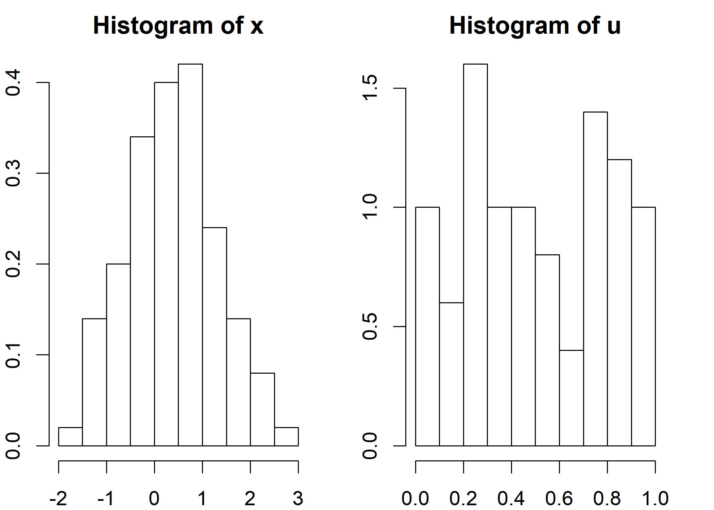
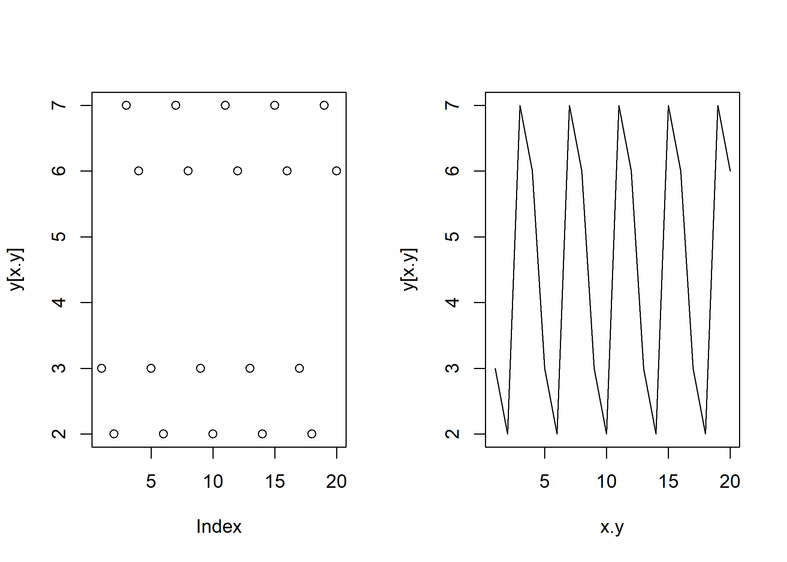

chapter 2.2 카이제곱 적합도 검정, 콜모고로프 검정, 런 검정
================
Jae Kwan Koo

-   [표준균일분포의 검정](#표준균일분포의-검정)
-   [카이제곱분포를 이용한 적합도 검정](#카이제곱분포를-이용한-적합도-검정)
-   [<카이제곱분포를 이용한 적합도 검정>](#section)
-   [콜모고로프-스미르노프 적합도 검정](#콜모고로프-스미르노프-적합도-검정)
    -   [K-S Test code](#k-s-test-code)
-   [난수의 독립성 검정](#난수의-독립성-검정)
-   [런 검정](#런-검정)
    -   [2번째 방법](#번째-방법)
    -   [Code for run test](#code-for-run-test)

### 표준균일분포의 검정

모의실험이기 때문에 자료가 없다. 따라서 우리가 자료를 생성해 내야 하기 때문에 표본의 추출 필요성이 있다. 확률표본이기 때문에 균일분포를 이야기 했었다. 표본이 균일분포를 따르는지 안따르는지 확인할 필요성도 있다.
딱히 표준 균일분포가 아니어도 된다. 그냥 균일분포를 따르는지에 대한 검정을 말하고 있다.

모수적인 방법, 비모수적인 방법, 그래프를 이용한 방법 등 여러가지 방법이 있다.
예컨대, 카이제곱분포를 이용한 적합성 검정의 경우 모수적인 방법이다.

비모수적 방법인 경우 모집단 특성을 나타내고 있는 모수가 포함되어 있지 않는 경우를 말한다. 이럴 때, 경험적인 분포를 보통 사용한다.
그래프를 이용하여 볼 수 있기도 한데, 동일한 패턴에 대한 검정으로 런검정을 이용할 수도 있다.

~~조금 있다 살펴보자~~

### 카이제곱분포를 이용한 적합도 검정

결국 알고 싶은 것은 생성한 자료에 대한 분포가 균일분포를 따르는지 알고싶은 것이다.
균일분포로부터 표본을 생성했을 경우, 자료는 균일분포를 따르게 된다. ~~모집단이 균일분포이기 때문~~

일반적으로 생성된 난수들은 `이론적 분포를 따른다` 라고 한다.
적합도 검정에서는 단측검정을 딱히 이야기 하지 않고, 양측검정의 결과로 이야기하게 된다.

기대빈도와 관측빈도 간의 차이를 이용하여 만약 생성한 난수가 균일분포가 따르게 된다면 기대빈도와 관측빈도 차이가 0에 가깝게 될 것이다. ~~따르지 않게 된다면 큰 차이를 가지게 될 것.~~

기대빈도와 관측빈도의 차이를 이용한다. 어떨때는 관측이 어떨때는 기대가 클수도 있다. 값이 상쇄가 되는 것을 방지해 주려면 부호를 통일해주기 위해 제곱을 한다. 이 w라는 통계량은 최소값이 0이 될 것이다.
우리가 기대하는 것은 0 근방에서 나타나게 되는 것이다. (귀무가설을 기각하지 않기 위해서)
균일분포의 빈도와 내가 가진 빈도와 차이가 없으므로 "균일분포를 따르고 있구나" 라고 생각할 수 있다.

w라는 통계량을 보통 우리는 `카이제곱 통계량`이라고 부른다.
~~카이제곱 통계량이라고 하지만, 실제 가설검정에서 쓰기 때문에 일반적으로는 검정통계량이라고 부르는 것이 학계정설~~
이 검정통계량이 크냐 작냐에 따라 기각여부를 결정하게 된다.

즉, "검정통계량의 값이 작다" = "기대빈도와 관측빈도의 값의 차이가 없다."

### <카이제곱분포를 이용한 적합도 검정>

카이제곱검정은 비율이 필요하기 때문에 각 범주별로 관측 빈도가 필요하다.
R상에서 table함수를 이용해보자.

``` r
library(MASS)
data(survey)

str(survey)
```

    ## 'data.frame':    237 obs. of  12 variables:
    ##  $ Sex   : Factor w/ 2 levels "Female","Male": 1 2 2 2 2 1 2 1 2 2 ...
    ##  $ Wr.Hnd: num  18.5 19.5 18 18.8 20 18 17.7 17 20 18.5 ...
    ##  $ NW.Hnd: num  18 20.5 13.3 18.9 20 17.7 17.7 17.3 19.5 18.5 ...
    ##  $ W.Hnd : Factor w/ 2 levels "Left","Right": 2 1 2 2 2 2 2 2 2 2 ...
    ##  $ Fold  : Factor w/ 3 levels "L on R","Neither",..: 3 3 1 3 2 1 1 3 3 3 ...
    ##  $ Pulse : int  92 104 87 NA 35 64 83 74 72 90 ...
    ##  $ Clap  : Factor w/ 3 levels "Left","Neither",..: 1 1 2 2 3 3 3 3 3 3 ...
    ##  $ Exer  : Factor w/ 3 levels "Freq","None",..: 3 2 2 2 3 3 1 1 3 3 ...
    ##  $ Smoke : Factor w/ 4 levels "Heavy","Never",..: 2 4 3 2 2 2 2 2 2 2 ...
    ##  $ Height: num  173 178 NA 160 165 ...
    ##  $ M.I   : Factor w/ 2 levels "Imperial","Metric": 2 1 NA 2 2 1 1 2 2 2 ...
    ##  $ Age   : num  18.2 17.6 16.9 20.3 23.7 ...

``` r
head(survey)
```

    ##      Sex Wr.Hnd NW.Hnd W.Hnd    Fold Pulse    Clap Exer Smoke Height
    ## 1 Female   18.5   18.0 Right  R on L    92    Left Some Never 173.00
    ## 2   Male   19.5   20.5  Left  R on L   104    Left None Regul 177.80
    ## 3   Male   18.0   13.3 Right  L on R    87 Neither None Occas     NA
    ## 4   Male   18.8   18.9 Right  R on L    NA Neither None Never 160.00
    ## 5   Male   20.0   20.0 Right Neither    35   Right Some Never 165.00
    ## 6 Female   18.0   17.7 Right  L on R    64   Right Some Never 172.72
    ##        M.I    Age
    ## 1   Metric 18.250
    ## 2 Imperial 17.583
    ## 3     <NA> 16.917
    ## 4   Metric 20.333
    ## 5   Metric 23.667
    ## 6 Imperial 21.000

MASS::survey 데이터를 사용해 글씨를 왼손으로 쓰는 사람과 오른손으로 쓰는 사람의 비율이 30% : 70%인지 여부를 분석해보자. 아래에서 수행한 chisq.test()에서 귀무가설은 분할표에 주어진 관측 데이터가 30 : 70의 분포를 따른다는 것이다.
left가 1 right가 2로 입력이 되어 있음을 str로 확인해보자 대립가설은 왼손잡이가 30%가 될 것이라고 주장하고 있다.

``` r
x <-table(survey$W.Hnd)
x
```

    ## 
    ##  Left Right 
    ##    18   218

왼손은 18명 오른손이 218명인 것을 알 수 있다.

``` r
nrow(survey)
```

    ## [1] 237

``` r
summary(survey$W.Hnd)
```

    ##  Left Right  NA's 
    ##    18   218     1

table에서의 236명과 전체 행 갯수는 다름을 알 수 있는데, 결측이 1명 존재함을 알 수 있다.

``` r
chisq.test(x, p=c(0.3,0.7))
```

    ## 
    ##  Chi-squared test for given probabilities
    ## 
    ## data:  x
    ## X-squared = 56.252, df = 1, p-value = 6.376e-14

H0 : 왼손잡이는 30%, 오른손잡이는 70%인 분포를 따를 것이다.
X-squared는 카이제곱 통계량을 의미하고, df는 자유도를 의미한다.
p-value &lt; 0.05이므로 글씨를 왼손으로 쓰는 사람과 오른손으로 쓰는 사람의 비가 30% : 70%라는 귀무가설을 기각한다.

``` r
chisq.test(x, p=c(0.05,0.95))
```

    ## 
    ##  Chi-squared test for given probabilities
    ## 
    ## data:  x
    ## X-squared = 3.4291, df = 1, p-value = 0.06406

H0 : 왼손잡이는 5%, 오른손잡이는 95%인 분포를 따른다.

remark) 범주로 되어 있는 것은 편한데, 수치로 된 것(키, 나이) 등은 구간으로 범주화를 시켜야한다. 이때, 자료의 정보 손실이 발생할 수 밖에 없다.

### 콜모고로프-스미르노프 적합도 검정

비모수적인 방법을 이용한다했을 때 모비율, 모분산, 모평균을 이야기 할 수 없으므로 경험적으로 해보자.

1/N씩 계속 증가하는 cdf의 계단의 형태를 생각할 수 있다.
나의 표본 만큼은 계단형태로 나타나게 되는데 이 것은 우리가 구한, 경험한 자료이다.
모집단은 우리가 경험하지 못한 자료이다. 즉, 우리가 경험한 표본에 대한 분포이므로 경험분포함수라고 한다.

계단 형태로 나타나긴 했지만 내가 생각하고 있는 분포함수와 형태가 비슷하다면, 내가 들고 있는 표본도 이론적 분포를 따르겠다고 생각할 수 있다. 아예 모양이 다르다면 형태를 따르지 않는다고 결론을 내리게 될 것이다.

즉, 우리가 하고 싶은 것은 이론분포함수와 경험분포함수를 비교하는 것이다.

값이 같다라고 한다면 Fn-F0 =0 을 말한다.
전 구간에 걸쳐서 차이가 날 수 있기 때문에, 부호가 바뀔 수 있어 절댓값을 씌운다.

어떤구간에서는 차이값이 작을 수도 클수도 있다. 차이값이 작은 것은 우리가 원하는 것이다.
우리는 다른지를 보고 싶으므로 가장 차이가 큰 지점에서의 값을 통해 가설검정을 하면 될 것이다.

검정통계량 값이 어떤 분포를 따르는지 가정은 필요없다. ~~여기서, F0는 이론적 분포, FN은 경험적분포~~

이론적으로 제약이 없어 어떤 상황에서든 사용 가능하므로 콜모고로프 적합도 검정이 많이 사용된다.

#### K-S Test code

x라고 하는 표본이 정규분포를 따르는지 확인해보자.
u가 표준균일분포를 따르는지 보자.
x와 u의 분포가 서로 같은지도 확인해보자.

``` r
# K-S test as a goodness-of-fit test
x <- rnorm(100,0.5,1) 
u <- runif(50,0,1)
summary(x)
```

    ##    Min. 1st Qu.  Median    Mean 3rd Qu.    Max. 
    ## -1.8582 -0.3177  0.3833  0.3710  0.9542  2.5992

``` r
summary(u)
```

    ##    Min. 1st Qu.  Median    Mean 3rd Qu.    Max. 
    ## 0.06719 0.24620 0.47130 0.51129 0.76813 0.98296

``` r
par(mfrow=c(1,2), mar=c(2,2,2,2), cex=1.2)
hist(x,freq=FALSE)
hist(u,freq=FALSE)
```



``` r
# k-s test
ks.test(x,u)          
```

    ## 
    ##  Two-sample Kolmogorov-Smirnov test
    ## 
    ## data:  x and u
    ## D = 0.39, p-value = 5.89e-05
    ## alternative hypothesis: two-sided

``` r
ks.test(x,"pnorm",0.5,1)   
```

    ## 
    ##  One-sample Kolmogorov-Smirnov test
    ## 
    ## data:  x
    ## D = 0.098942, p-value = 0.2815
    ## alternative hypothesis: two-sided

``` r
ks.test(u,"punif",0,1)  #0,1 can be omitted because of standidized uniform dist         
```

    ## 
    ##  One-sample Kolmogorov-Smirnov test
    ## 
    ## data:  u
    ## D = 0.078851, p-value = 0.8908
    ## alternative hypothesis: two-sided

`ks.test(x,u)` : x,u 의 경험적 분포가 같냐 다르냐를 확인하는 것

x, u가 둘다 sample이기 때문에 two sample이라고 한다.
x가 정규분포를 따르는지, u가 표준균일분포를 따르는지 보기 때문에 one sample이라고 한다.
pnorm은 누적분포를 말한다.

검정통계량 D값이 0에 가까우면 차이가 안난다는 말이므로 귀무가설 기각 가능성 낮아질 것이다.
D라고 하는검정통계량은 0과 1사이 값으로 나타나게 된다. ~~(누적분포함수의 최댓값은 1이기 때문)~~

결론적으로 x라고 하는 표본은 평균0.5 표준편차 1인 정규분포를 따른다 이론적인 분포의 누적함수와 경험적인 분포의 누적함수가 서로 같다라고 판단한다.

-   x의 경험분포함수와 u의 경험분포함수가 같은지 보자. 앞에서 히스토그램 봤을 때, 분포함수는 아니긴 하지만 누가보더라도 같다고 할 수 없을 것 같다.(비슷한 모양 조차아님) 애초에 범위부터 다르다. D=0.35는 0에 가깝긴 하지만 작은 숫자는 아니다. 유의확률을 보니 작으므로 귀무가설 기각. 즉, 둘 경험적 분포는 서로 다르다.

x는 모집단의 분포를 따를 것이고, u도 다른 모집단의 분포를 따를 것이므로, 경험적 분포가 다르다는 것은 애초에 모집단의 분포가 다르다라는것을 내포하고 있다. 조금 더 나아가서는 x와 u의 분포는 다르다 라고 말한다.
물론 전제되어야 할 것은 x,u는 모집단의 특성을 잘 대표하는 표본이라는 것이다.

### 난수의 독립성 검정

``` r
knitr::include_graphics('https://raw.githubusercontent.com/koojaekwan/jaekwan-s-R/master/Computerized_Statistics/Chapter2/난수독립성.PNG')
```


가설검정을 통해 보는게 가장 객관적인 이야기이다.

각각의 산점도를 그렸을 때, 산점도에서 특별한 경향성이나 패턴이 발견된다면 독립적이지 않다고 말한다. 상관계수를 말할 때 서로 증가하는 경향, 감소하는 경향, 패턴이 존재하면 서로 연관성이 있다고 말한다. 무작위적으로 산점도가 나타나게 되면 연관성이 없다고 판단한다.~~(주관적)~~

자기상관의 독립성을 이야기 할때, 1,2그림은 점점 증가 점점 감소 경향이 있다. 4번째는 증가하다 감소, 5번째는 감소하는.., 6번째는 큰 폭으로 증가하고 작은 폭으로 증가한다.

3번째는 특별한 경향이 있다고 하기 어렵다. 경향이 없기 때문에 난수같은 경우 서로 독립이라고 할 수 있다. 하지만, 사람마다 다른 판정을 할 수 있어 좋은 방법은 아니다. 정확하게 판단할 때, 그래프는 애매하다.

### 런 검정

런 검정은 비모수적인 방법이다.
값이 증가 하는, 감소하는 경향이 있다는가 등 복잡한 이야기를 하는 것이 아니라 단순히 "일단은 증가를 했다. 감소를 했다"만 이야기 한다. 즉, `부호화`를 가지고 이야기한다.

같은 성질을 가지는 연속된 수의 집합을 `런`이라고 부르게 되는데, 이 런들은 같은 성질을 가지게 된다.
표본자료의 평균을 중심으로 해서 가지고있는 난수들이 평균보다 증가를 했는지 등 +,-로 표현 가능하다.

-   첫 번째 난수부터 부호를 따진다(평균과 비교).
-   평균보다 크면 +로 표현 한다면, 평균보다 큰 성질을 가지는 것을 하나의 런 (만약 1,2번째) 3번째를 하나의 런(집합)으로 보게 된다.
-   변환점을 통해 런의 길이를 결정할 수 있다. 예) 3번째는 1,2와 성질이 다르므로 다른 런이다.

예) 0.5를 기준으로 부호를 결정하고 런의 길이를 결정.(마지막은 길이가 5인 런을 가지고 있다.)

0을 제외한 이항분포와 비슷한 성질을 가지고 있다. 따라서 이것을 이용하여 정규분포로 근사 가능하다.

#### 2번째 방법

앞에서는 단순히 크다작다로 이야기했다.
이번에는 초기하 분포를 이용하는 방법이다.
~~앞의 방법이 더 쉬워보인다.~~

전체적으로 표본의 크기가 굉장히 큰 경우 물론 초기하를 이용하여 정규분포로 정규근사 시킬수도 있다. 이 경우 앞의 보다 조건이 더 붙으므로 복잡하다. (평균보다 큰 것, 작은것도 많아야한다. 어느한쪽에 치우쳐서 많은 게 아니라 모두 많아야한다.)

가지고 있는 자료가 방대하기도 하고, 이 조건을 만족한다면 초기하 사용이 좋지만, 이런 경우는 찾기 힘들다.
~~그냥 이항분포로 정규근사 시키자~~

#### Code for run test

``` r
# 선형합동법을 이용한 난수생성.
m <- 8; a <- 3; c <- 1; x <- 3
for(i in 2:10) x[i] <- (a*x[i-1]+c)%%m
x
```

    ##  [1] 3 2 7 6 3 2 7 6 3 2

``` r
y<-3
for(i in 1:999){
  y[i+1]<-(a*y[i]+c)%%m
}

head(y,12)
```

    ##  [1] 3 2 7 6 3 2 7 6 3 2 7 6

``` r
x.y <- 1:20

par(mfrow=c(1,2))
plot(y[x.y])
plot(x.y, y[x.y], 'l')
```



``` r
# install.packages('tseries')
library(tseries)

x <- factor(sign(rnorm(100)))
runs.test(x)
```

    ## 
    ##  Runs Test
    ## 
    ## data:  x
    ## Standard Normal = 0.91381, p-value = 0.3608
    ## alternative hypothesis: two.sided

runs.test만 쓰면 되므로 간단하다. ~~two side가 default~~

기본 난수를 사용하는게 아니라, 패턴의 형태로 사용해야한다. (각 범주의 수준이라고 이야기 하기도 한다.)
100개 난수로 뭔 패턴을 만드느냐? -&gt; sign으로 부호만 가지고 온다. (1 또는 -1)
이 위치에 있는 난수가 0보다 클 때, 1이다. &lt;-굳이 평균과 비교하지 않아도 되는 특수한 상황이다.
물론 팩터로 변환을 꼭 해주어야한다.

-   우리는 어찌되었던 연속확률분포로 이야기 할 것이기 때문에 언제든지 표준정규분포로 변환해줄 수 있으므로 "표준정규분포를 통한 가설검정을 하였다"라는 의미로 검정통계량이 standard normal이라고 나온다.

검정 결과 우리가 가진 난수는 독립이다.

``` r
diff_y <- 100*diff(log(y))
runs.test(factor(diff_y > 0))
```

    ## 
    ##  Runs Test
    ## 
    ## data:  factor(diff_y > 0)
    ## Standard Normal = 10.559, p-value < 2.2e-16
    ## alternative hypothesis: two.sided

y의 값을 차분한다는 표현한다. (경향성을 없앤다) ~~diff는 차분이라는 표현~~
애초에 0보다 큰 값이 있는 것에 평균 값을 빼준다. `y-mean(y)`

또 여기서 우리가 부호만 가지고 와서 해도되지만, 그냥 100\*diff(log(y))하자.
log를 취하게 되는 이유는 3276은 비슷한 값이기 때문에 차이가 분명하게 커지게끔 하기 위해 log를 취했다. 결국 여기서도 취하게 되는 것은 부호이다. 하지만 우리는 T, F만으로도 가져올 수 있다.

런 테스트를 해보게 되면, 독립이 아니다는 것을 알 수 있다.
