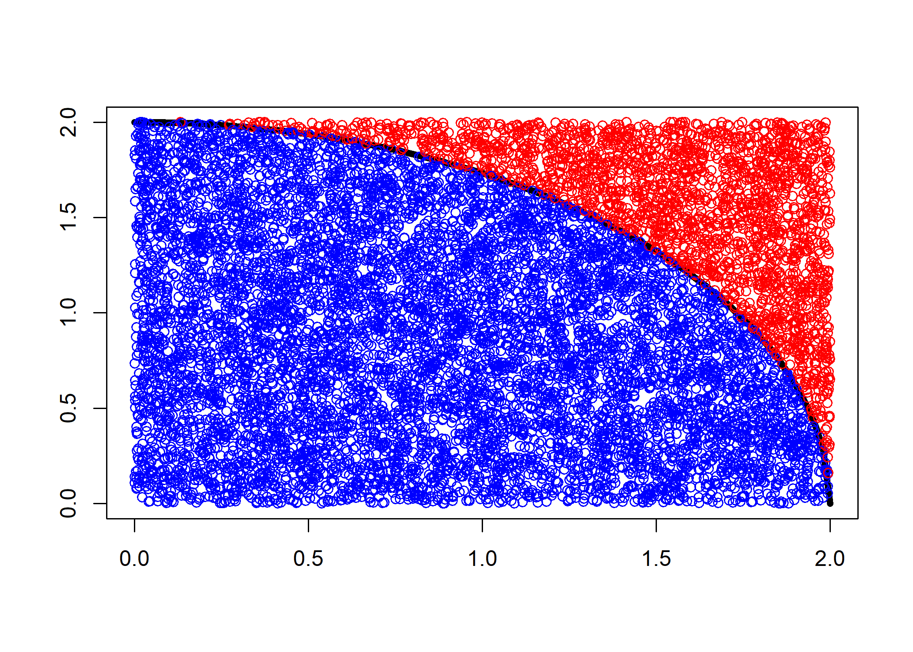
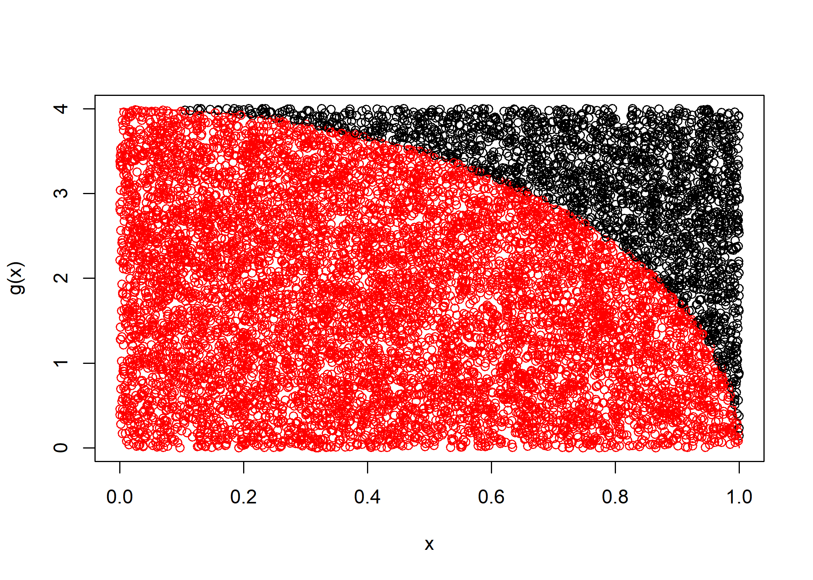
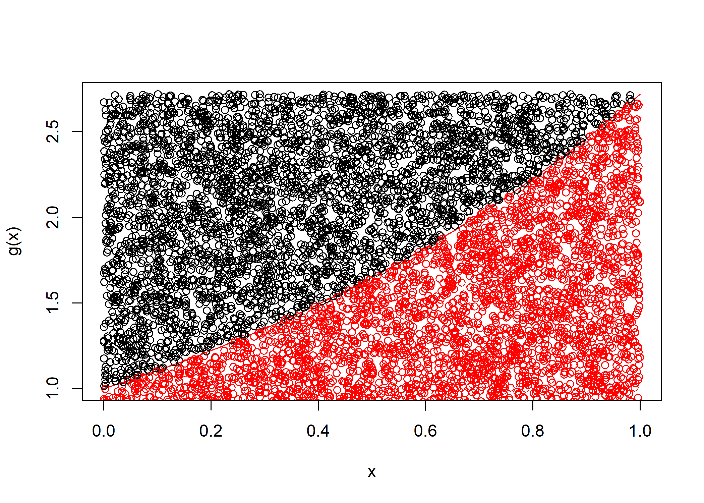
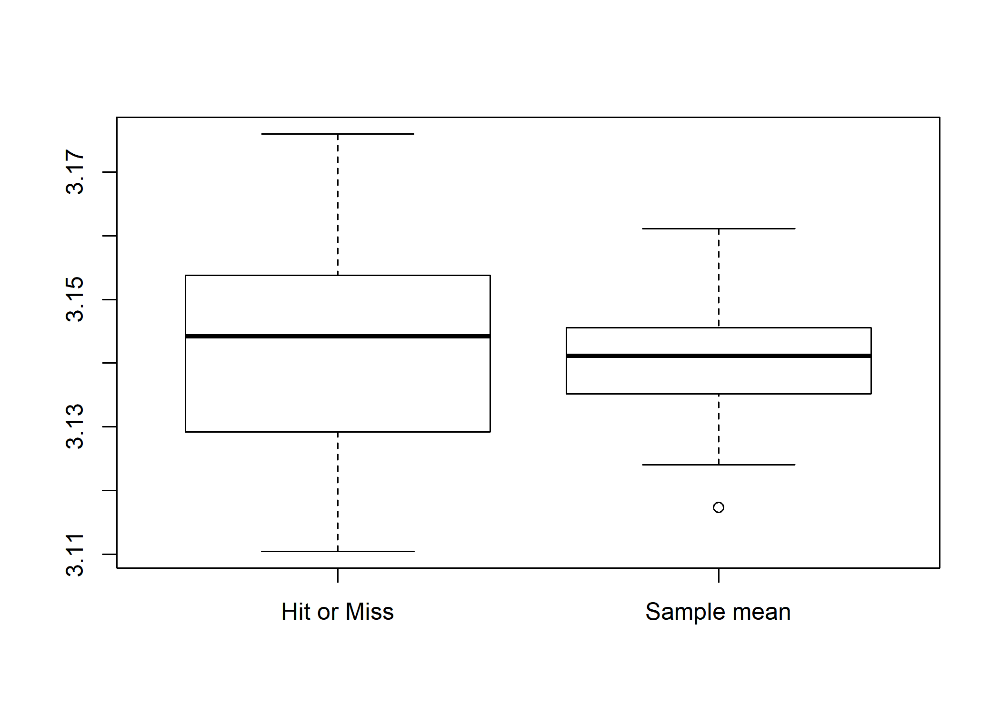
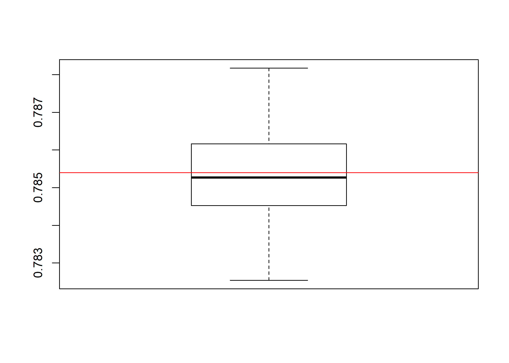
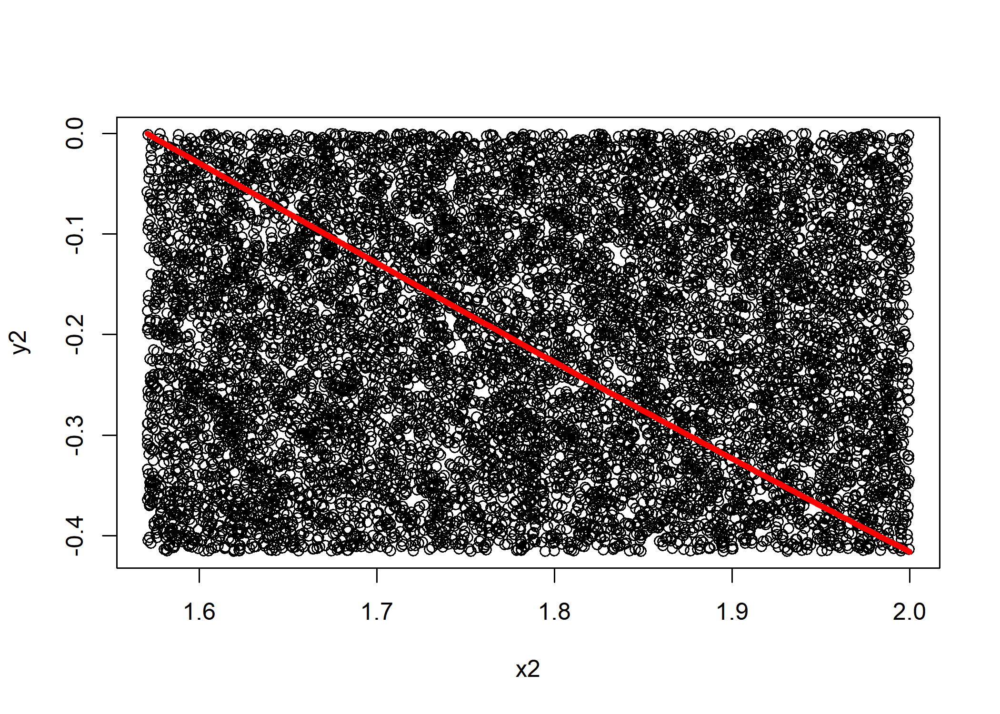

chapter 3.1 Monte Carlo method
================
Jae Kwan Koo

-   [몬테카를로 방법](#몬테카를로-방법)
    -   [Example)](#example)
-   [표본평균법](#표본평균법)
    -   [compare the running time](#compare-the-running-time)
        -   [표본평균법](#표본평균법-1)
        -   [hit or miss](#hit-or-miss)
    -   [표준균일분포를 이용한 알고리즘](#표준균일분포를-이용한-알고리즘)
-   [주표본기법](#주표본기법)
    -   [Example) pi/4 모의실험](#example-pi4-모의실험)
-   [More example)](#more-example)
    -   [hit or miss](#hit-or-miss-1)
        -   [application problem](#application-problem)
    -   [표본평균법](#표본평균법-2)
    -   [주표본기법](#주표본기법-1)

몬테카를로 방법
---------------

난수를 이용하여 함수의 값을 확률적으로 계산하는 알고리즘이다.

몬테카를로 방법 : *λ* = *던**져**진**것**중**선**에**걸**쳐**진**횟**수*/*총**던**진**횟**수*

``` r
n<-10000

for (i in 1:n) {
  x <- runif(n, min=0, max=2)
  y <- runif(n, min=0, max=2)

  xy <- ifelse(x^2 + y^2 <= 2^2, TRUE, FALSE)
  
  pi_val <- 4*(sum(xy)/n)
}

pi_val
```

    ## [1] 3.1388

원 넓이 = *π*2<sup>2</sup>
정사각형 넓이 = 4 \* 4 = 16
원 넓이 / 정사각형 넓이 = *π*/4 이므로 *π*를 추정하기 위해서는 4\*원넓이/정사각형 넓이를 고려해야 한다.

``` r
plot(1, type="n", xlab="", ylab="", xlim=c(0, 2), ylim=c(0, 2))
f<-function(x) sqrt(4-x^2)

curve(f,0,2,col='black',lwd=5,add=TRUE)
for(i in 1:10000) {
  if(x[i]^2+y[i]^2 <=2^2) {
    points(x[i], y[i], col="blue")} 
  else {
    points(x[i], y[i], col="red")}
  } 
```



-   위의 예제의 다른 방법

``` r
n<-10000
x<-runif(n, 0, 2)
y<-runif(n, 0, 2)

lambda<-mean(x^2+y^2 < 2^2)

cat("pi=",lambda*4, "\n")
```

    ## pi= 3.1456

### Example)

$\\int^1\_04\\sqrt{1-x^2}$

``` r
g<-function(x) 4*sqrt(1-x^2)

n<-10000

x<-runif(n, min=0, max=1)
y<-runif(n, min=0, max=4)   # x에 대한 y의 범위

p_hat<-mean(y<=g(x))        # 성공확률의 추정량 : p_hat = 맞춘횟수 / 시행횟수
I_hat<-4*p_hat              # 정적분 추정값 I_hat = (직사각형 면적) x (맞춘횟수 / 시행횟수)

I_hat
```

    ## [1] 3.1124

``` r
#plot
col<-1+as.integer(y<=g(x))

curve(g, xlim=c(0,1), col="red")
points(x,y, col=col)
```



∫<sub>0</sub><sup>1</sup>*e*<sup>*x*</sup>

``` r
g<-function(x) exp(x)

n<-10000

x<-runif(n, 0,1)
y<-runif(n, 0, exp(1))    # x에 대한 y의 범위

p_hat<-mean(y<=g(x))      # 성공확률의 추정량 : p_hat = 맞춘횟수 / 시행횟수
I_hat<-exp(1)*p_hat       # 정적분 추정값 I_hat = (직사각형 면적) x (맞춘횟수 / 시행횟수)

I_hat
```

    ## [1] 1.714149

``` r
#plot
col<-1+as.integer(y<=g(x))

curve(g, xlim=c(0,1), col="red")
points(x,y, col=col)
```



표본평균법
----------

모의실험이기 때문에 정확한 값을 얻을 수 없지만, 근사값을 얻을 수 있다. hit or miss는 사각형을 그려 함수의 정적분 값을 구할때 사용하곤 했다. 이 경우, 바깥쪽에 찍히면 실패라고 해서 이항분포를 이용해서 실험해보았다.

표본평균법은 hit or miss방법과 가장 많이 비교된다. 차이는 크게 없다.
표본평균법은 체감이 큰 것은 아니지만 조금 더 빠르고, 분산이 조금 더 작다.

hit or miss는 g라는 함수보다 작은 값 난수가 생성되면 성공, 아니면 실패라고 보았다. 전체 중 성공의 비율, 즉 표본의 비율을 모비율 대신 활용하였다.

표본평균법은 다른방법으로 기댓값의 원리를 사용한다. g라고 하는 함수의 정적분을 계산하는 것이 목표이다. 계산이 어려우므로 조금 더 바꿔서 f라는 새로운 함수를 도입했다.

g는 구해야 되는 함수이고 f는 확률밀도함수이다. g/f가 편하게 계산될 수 있도록 적당한 f를 설정해야 한다. 보통 f를 정규분포나 균일분포를 가정하게 된다.

표본 마다 g/f를 계산하게 되면 변동을 가질 수 밖에 없다. 같은 값을 가지는건 거의 불가능하다. 여러개의 값이 나오는데 원하는 정적분의 값이나 E(g/f)는 얼마라고 말할 수 없으므로 대표값을 이야기 한다. 이들의 평균을 구해서 I를 정적분의 값에 대한 추정치로 생각하게 된다. 정확한 값이 아니라 추정값이다.

### compare the running time

#### 표본평균법

``` r
g<-function(x) 4*sqrt(1-x^2)    # 구하고 싶은 함수

n<-10000
out1<-numeric(100)          #100개의 numeric 빈 공간을 생성
out2<-numeric(100)

system.time(                #걸리는 시간 측정
    for(i in 1:100){
        x<-runif(n)             #역변환 이용해야 하지만, runif함수로 해결
        out1[i]=mean(g(x))           
    }                                   
)                
```

    ##    user  system elapsed 
    ##    0.09    0.02    0.14

#### hit or miss

``` r
system.time(
    for(i in 1:100){
        const=4 # c
        x=runif(n, 0,1)
        y=runif(n, 0, const)            #y축같은 경우 0부터 4까지 값을 가진다.
        out2[i]=4*mean(y<=g(x))         #결과값이 전부 다르므로, 100번의 실험 값을 하나의 값으로 요약 필요
    }
)
```

    ##    user  system elapsed 
    ##    0.13    0.00    0.14

hit or miss 보다 표본평균법이 조금 더 빠른 모습을 보여준다.
위의 결과들을 요약하여 비교해보자.

``` r
apply(cbind(out1,out2), 2, summary)     #out별(열별) summary. 
```

    ##             out1    out2
    ## Min.    3.117790 3.10400
    ## 1st Qu. 3.135620 3.12950
    ## Median  3.143607 3.14400
    ## Mean    3.142620 3.14214
    ## 3rd Qu. 3.149041 3.15360
    ## Max.    3.160109 3.17440

``` r
ss=apply(cbind(out1,out2), 2, sd)   

boxplot(cbind("Hit or Miss"=out2,"Sample mean"=out1))
```



대푯값인 평균으로만 놓고보면, out1(표본평균법)이 더 잘 원주율에 일치한다. 즉, 더 잘 추정했다.
변동으로 보면 out2가 조금 더 퍼져있다. (hit or miss 방법의 분산이 더 크다)
분산이 작다는 것은 안정적으로 값을 구해준다는 것이다.표본이 바뀌게 되더라도 안정적임을 뜻한다.

분산이 더 작은 표본평균법이 hit or miss방법보다는 좋아보인다.

### 표준균일분포를 이용한 알고리즘

runif를 통해 표준균일분포를 따르는 표본 생성하였다.
하지만, 여기서 역함수법으로 x를 구할 수 있다.
*u*<sub>*i*</sub> = *F*(*x*)=(*x* − *a*)/(*b* − *a*) =&gt; *x* = (*b* − *a*)\**u*<sub>*i*</sub> + *a*

f(x) = 1 / b-a = 1
I\_hat = sum g(xi) / f(xi), 여기서 f(xi)는 1이므로 굳이 식에 넣어 계산하지 않았다.
어짜피 b-a가 1이기 때문에 1/N sum g(xi)로 계산하였다.

말 그대로 표본에 대한 평균을 계산하기 때문에 `표본평균법`이라고 불린다.
hit or miss, 표본평균법 둘 다 비편향추정량을 계산하므로 어느 것을 쓰더라도 값을 잘 찾아낼 것이다. 하지만, 실험을 여러번 걸쳐서 했을 때, I\_hat 값이 들쭉날쭉한 것 보다 분산의 폭이 좁은 것이 좋은 추정량의 성질을 가지고 있을 것이다. 즉, MSE가 더 작다는 말이다.
표본평균법의 분산이 더 작기 때문에 hit or miss 보단 표본평균법을 더 많이 쓰고 있다.

주표본기법
----------

f가 표준균일분포가 아니라 다른분포일 수도 있다. 또한, 어떤 데이터든 간에 다 표준균일분포를 따르는게 아니다. 주표본기법은 f가 다른 분포형태를 다르게 가지게 될 때, 사용하는 방법이다.
어떻게 본다면 표본평균법이 주표본기법의 특수한 경우라고 볼 수 있다.

여기서는 f가 1이 아니기 때문에 f도 계산을 해야한다(즉, 제약이 증가). f를 계산해야 할 뿐만 아니라, 이 계산이 쉽지만은 않다. g/f를 아까와는 달리 함께 계산해야 한다.
표본평균법의 성질을 그대로 들고온다.

분산이 여기서는 명확하게 hit or miss방법보다 더 좋다라고 하기 어렵다. 아까는 표준균일분포를 f로 선택했기 때문에 가능한 이야기이다. 하지만, 여기서는 f가 고정되어 있는 분포가 아니기 때문에 hit or miss보다는 분산이 작다라고 할 수는 없지만, 가능한 한 분산이 작은 방향으로 찾아보는 것이 목표이다.

안정적으로 비슷한 값으로 찾아내기 위해 f를 잘 찾아내야 한다. 확률밀도함수를 어떻게 선택하느냐에 따라 분산이 클수도 작을수도 있다.
그래서 이 f를 주요함수라고 한다. 주표본기법에서 매우 중요한 역할을 한다.

확률밀도함수를 적분했을 때, 또는 summation을 했을 때 모든확률의 합은 1이다. f를 적분하면 1이라는 값을 가질 것이다. 분모는 상수이고 분자에 적분이 들어가면 결국 약분되기 때문이다.

### Example) pi/4 모의실험

``` r
g<-function(x) sqrt(1-x^2)        #분산이 최소가되는 fx를 선택하는 과정

n<-10000
x<-runif(n)
f<-function(x) 6/5*(1-x^2/2)

mean(g(x)/f(x))                   #10000개에 대해 평균을 구하는 과정
```

    ## [1] 0.7670776

테일러 급수전개를 보통 1차, 2차까지만 하게 된다. 여기서는 1차까지만 해보자.

*g*(*x*)=1 − 1/(2 \* *x*<sup>2</sup>)라고 해보자. 쉽게 접근하기 위해서이다.
g를 0에서 1까지 적분하면 5/6가 나오게 된다. 그래서 적분했을 시, 전체면적을 1로 만들어 주기 위해 상수값 6/5를 앞에 곱한 *f* = (6/5)*g*로 선택할 수 있다.

``` r
rep<-100
out2<-rep(0,rep)

for(i in 1:rep){
    x<-rep(0,n)
    k <- 1
    
    while(k<=n){
        U <- runif(1)
        Y <- runif(1)
        if(U <= f(Y)/((6/5)*1)){     #f함수에 대한 난수 충족 여부 확인.     
            x[k] <- Y;
            k <- k+1
        }
    }
    out2[i] <- mean(g(x)/f(x))
}


boxplot(out2)
abline(h=pi/4, col="red")
```



난수가 10000개 전부 생성한다고 만들어지는게 아니라 탈락될 수 있기 때문에 u와 비교하는 것이다. 실제로 while문은 10000번보다 더 많이 돌아간다. (k가 충족될때까지 계속)

summary(out2)와 pi/4를 통해 비교해보자. 평균값과 pi/4는 거의 맞아떨어지는걸 볼 수 있다.
종합해서 보면, 이 예제에서는 분산이 좀 더 작은 주표본기법이 조금 더 좋은방법이라고 할 수 있다.

More example)
-------------

### hit or miss

∫<sub>0</sub><sup>1</sup>*c**o**s*(*x*)*d**x*

``` r
set.seed(123)
g<-function(x) cos(x)

n<-10000

x<-runif(n,0,1)
y<-runif(n,0,1)

mean(y<=g(x))
```

    ## [1] 0.8474

#### application problem

∫<sub>0</sub><sup>2</sup>*c**o**s*(*x*)*d**x*

``` r
x<-runif(n,0,pi/2)
y<-runif(n,0,1)

result1<-mean(y<=g(x))*(1*pi/2)            # I를 추정하기 위해서는 확률에다 사각형면적을 곱해야 한다.

x2<-runif(n,pi/2,2)
y2<-runif(n,cos(2),0)

result2<-mean(y2>g(x2))*((2-(pi/2))*cos(2))  


result1+result2
```

    ## [1] 0.9166805

cos(x)를 x가 0에서 2까지일 때에 대한 적분값을 hit or miss방법으로 구해보았다. *π*/2를 중심으로 나누어 생각하였다. 1구간은 0에서 *π*/2이고 2구간은 *π*/2에서 2까지이다.

``` r
plot(y2~x2)
curve(cos(x), xlim=c(pi/2,2), col="red",lwd=4,add=T)
```



2번째 구간에 대한 plot이다. 이번에는 cos(x)위쪽 구간의 점의 비율을 보면 된다.

### 표본평균법

``` r
set.seed(123)
x<-runif(n,0,1)

mean(g(x))
```

    ## [1] 0.8430995

### 주표본기법

``` r
set.seed(123)
x<-runif(n,0,1)

f<-function(x) 6/5*(1-x^2/2)

mean(g(x)/f(x))
```

    ## [1] 0.843877
