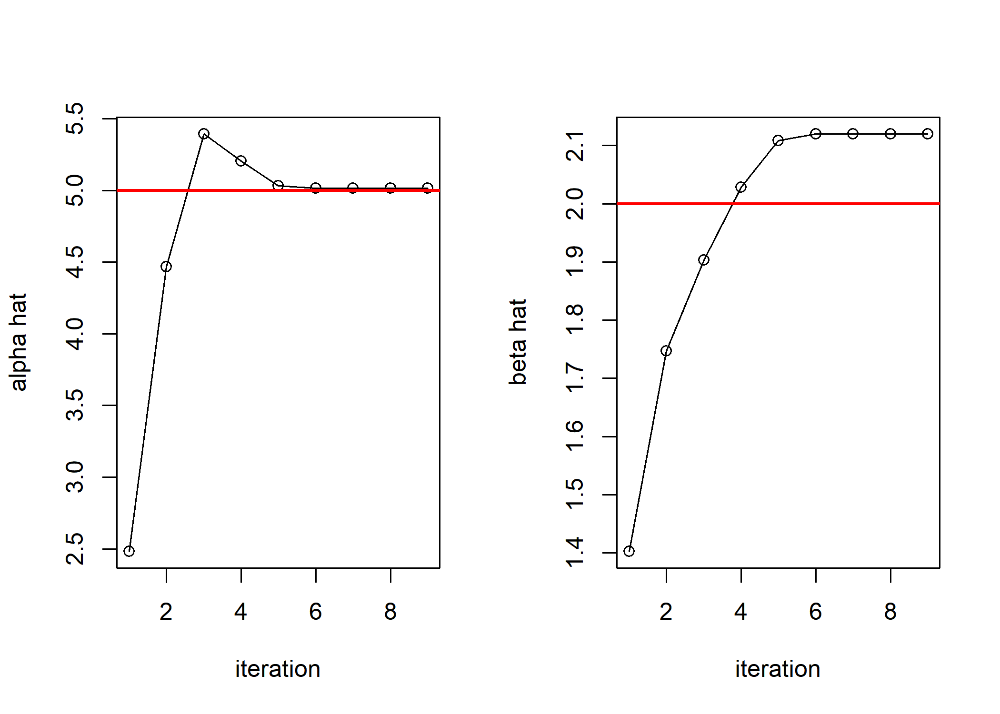
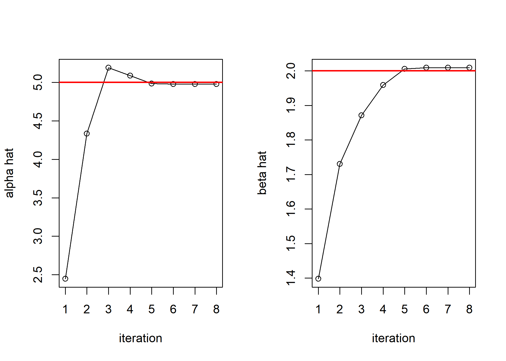

MLE of Gamma distribution with alpha and beta
================
Jae Kwan Koo

-   [Import library](#import-library)
-   [Newton raphson method with multiparameter](#newton-raphson-method-with-multiparameter)
-   [Newton-raphson을 위한 과정](#newton-raphson을-위한-과정)
    -   [Example of derivative using library("Deriv").](#example-of-derivative-using-libraryderiv.)
-   [Second way (not using matrix form)](#second-way-not-using-matrix-form)
    -   [define the function](#define-the-function)
    -   [set the initial value](#set-the-initial-value)
    -   [MLE of alpha and beta](#mle-of-alpha-and-beta)
    -   [check](#check)

### Import library

역행렬 계산을 위해 MASS library를 불러왔다.

``` r
library(MASS)
```

### Newton raphson method with multiparameter

alpha, beta에 대한 MLE를 구해야 하기 때문에 행렬식을 이용한 뉴턴-랩슨 방법을 이용하였다.

``` r
newton <- function(f, df, x0, tol=1e-07, N=300, ...) {
  x <- x0
  t <- 0
  p<-rep(0,N); q<-rep(0,N); i<-rep(0,N)
  while(t<N) {
    t <- t + 1
    x1 <- x - as.numeric(ginv(df(x, ...)) %*% f(x, ...))
    p[t]<-x1[1]; q[t]<-x1[2]; i[t]<-t
    if(mean(abs(x1 - x)) < tol) break
    x <- x1
  }
  p<-p[p!=0]; q<-q[q!=0]; i<-i[i!=0]
  return(data.frame(p,q,i))
}
```

### Newton-raphson을 위한 과정

log likelihood function을 한번 미분한 구배벡터와 한번은 alpha 또 다른 한번은 beta로 미분
또는 alpha, beta각각에 대해 두번씩 미분한 Hessian matrix를 만들었다.
loglikelihood function은 dgamma함수에 log=T를 취한 후, sum을 해서 구할 수도 있고, 직접 식을 작성해도 된다. 미분을 하는 과정은 "Deriv" package를 이용하였다. 구하는 과정은 잠시 뒤에 보일 것이다.

``` r
deriv_loglike <- function(theta, X, n) {
  alpha <- theta[1]
  beta <- theta[2]
  o1 <- sum(log(X)) - n * (digamma(alpha) + log(beta))
  o2 <- (sum(X)/beta - alpha * n)/beta
  return(c(o1, o2))
}


double_dl <- function(theta, X, n) {
  alpha <- theta[1]
  beta <- theta[2]
  o11 <- -(n * trigamma(alpha))
  o12 <- -(n/beta)
  o22 <- -((2 * (sum(X)/beta) - alpha * n)/beta^2)
  return(matrix(c(o11, o12, o12, o22), 2, 2, byrow=TRUE))
}
```

#### Example of derivative using library("Deriv").

``` r
library("Deriv")
Deriv("-n *log(gamma(a))- n*a*log(b) + (a-1)*sum(log(xdata)) - sum(xdata)/b","a")
```

    ## [1] "sum(log(xdata)) - n * (digamma(a) + log(b))"

``` r
Deriv("-n *log(gamma(a))- n*a*log(b) + (a-1)*sum(log(xdata)) - sum(xdata)/b","b")
```

    ## [1] "(sum(xdata)/b - a * n)/b"

``` r
Deriv("sum(log(xdata)) - n * (digamma(a) + log(b))","a")
```

    ## [1] "-(n * trigamma(a))"

``` r
Deriv("sum(log(xdata)) - n * (digamma(a) + log(b))","b")
```

    ## [1] "-(n/b)"

``` r
Deriv("(sum(xdata)/b - a * n)/b","b")
```

    ## [1] "-((2 * (sum(xdata)/b) - a * n)/b^2)"

각각 loglikelihood function을 alpha, beta에 대해 한번 또는 두번씩 미분하여 구배벡터, Hessian matrix를 만들기 위한 과정을 package를 이용할 수 있었다.

``` r
set.seed(20191010)

X <- rgamma(n=100, shape=5, scale=2)
n <- length(X)        

mle<-newton(deriv_loglike, double_dl, c(1,1), X=X, n=n)
mle
```

    ##          p        q i
    ## 1 2.480698 1.402238 1
    ## 2 4.467635 1.746492 2
    ## 3 5.395007 1.903242 3
    ## 4 5.205270 2.028475 4
    ## 5 5.032379 2.108489 5
    ## 6 5.014659 2.119741 6
    ## 7 5.013879 2.120152 7
    ## 8 5.013879 2.120152 8
    ## 9 5.013879 2.120152 9

seed를 고정시켜 난수의 발생을 항상 같게 하였다. 표본 100개의 감마분포에 대해 MLE를 구해보았다.
표본수가 많다면 alpha=5, beta=2에 가깝게 될 것이다.
아래는 표본 100개에 대한 MLE의 iteration별 이동에 대한 그래프이다.

``` r
par(mfrow=c(1,2))
plot(mle$p~mle$i,xlab='iteration',ylab='alpha hat',type="o"); abline(h=5,col='red',lwd=2)
plot(mle$q~mle$i,xlab='iteration',ylab='beta hat',type="o"); abline(h=2,col='red',lwd=2)
```



``` r
set.seed(20191010)

X <- rgamma(n=100000, shape=5, scale=2)
n <- length(X)        

mle2<-newton(deriv_loglike, double_dl, c(1,1), X=X, n=n)
mle2
```

    ##          p        q i
    ## 1 2.446188 1.397621 1
    ## 2 4.333606 1.730212 2
    ## 3 5.192946 1.871259 3
    ## 4 5.088200 1.959166 4
    ## 5 4.984175 2.005998 5
    ## 6 4.978632 2.009549 6
    ## 7 4.978540 2.009595 7
    ## 8 4.978540 2.009595 8

표본수를 100000까지 늘렸을 때의 alpha, beta의 MLE이다. 확실히 5와 2에 가까운 모습을 보인다.
다음으로 그래프로 확인해보기로 한다.

``` r
par(mfrow=c(1,2))
plot(mle2$p~mle2$i,xlab='iteration',ylab='alpha hat',type="o"); abline(h=5,col='red',lwd=2)
plot(mle2$q~mle2$i,xlab='iteration',ylab='beta hat',type="o"); abline(h=2,col='red',lwd=2)
```



Second way (not using matrix form)
----------------------------------

``` r
set.seed(20191010)
x<-rgamma(n=100,shape=5,scale=2)
```

앞과 마찬가지로 seed를 고정시킨 후, 표본을 생성하였다.

### define the function

``` r
f<-function(alpha,x,n) {
  n*log(alpha/mean(x))-n*digamma(alpha)+sum(log(x))
}

df<-function(alpha,n) {
  ((n/alpha)-n*trigamma(alpha))
}
```

### set the initial value

``` r
a0<-1
alpha<-a0
bhat<-mean(x)/a0
```

초기값을 지정해주었고, beta hat은 위와 같이 주어지므로 alpha의 mle값을 이용하여 대입만 시킬 것이다.

``` r
newton<-function(f,df,tol=1e-9,a0=1,x,N=100){
  i<-0
  a1<-a0
  p<-numeric(N)
  while(i<=N){
    a1<-(a0-(f(a0,x,length(x))/df(a0,length(x))))
    p[i]<-a1
    i<-i+1
    if(abs((a1-a0)/a0)<tol) break;
    alpha<-c(alpha,a0)
    bhat<-c(bhat,mean(x)/a1)
    a0<-a1
  }
  mle<-c(a1, mean(x)/a1)
  return(mle)
}
```

### MLE of alpha and beta

``` r
newton(f,df,x=x)
```

    ## [1] 5.013879 2.120152

alpha와 beta의 MLE는 위와 같다.

### check

``` r
mle<-matrix(0,nrow=100,ncol=2)

for(i in 1:100){
  mle[i,]<-newton(f,df,x=rgamma(n=100,shape=5,scale=2))
}

# all value are mle. what is the mean of the mle?
apply(mle,2,mean)
```

    ## [1] 5.005386 2.051471

``` r
colMeans(mle)
```

    ## [1] 5.005386 2.051471

seed를 고정하지 않은 상태에서 alpha와 beta의 mle들을 여러번 모아서 평균을 내보았다.

``` r
mse_alpha<-sum((mle[,1]-5)^2)/100
mse_beta<-sum((mle[,2]-2)^2)/100

c(mse_alpha,mse_beta)
```

    ## [1] 0.54733722 0.09939804

추정량과 참값의 제곱합을 자유도로 나눈 것이지만, 여기서 특별히 반복횟수로 나누었다. 이 것을 rmse라고 부른다.
beta의 MSE가 더 작으므로 단순히 mse만 놓고 본다면, 감마분포에서 해를 찾는데 beta가 alpha보다는 더 정확히 알고리즘에서 찾아준다고 말할 수 있다.
