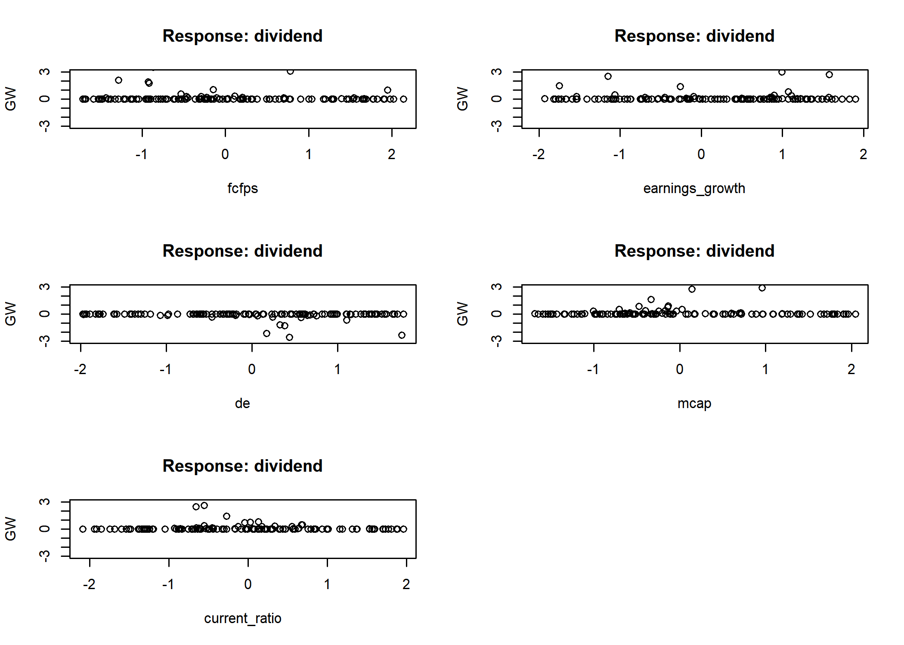
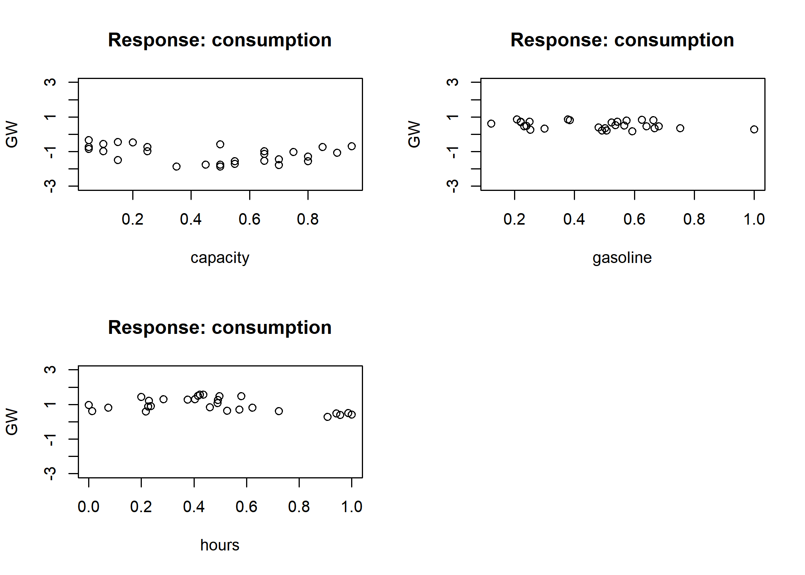

Artificial Neural Network
================
Jae Kwan Koo

-   [set the working directory](#set-the-working-directory)
-   [1) dividendifo DATA](#dividendifo-data)
    -   [forward propagation](#forward-propagation)
    -   [back propagation](#back-propagation)
-   [2) gasoline DATA](#gasoline-data)
    -   [forward propagation](#forward-propagation-1)
    -   [back propagation](#back-propagation-1)
-   [reference](#reference)

``` r
library(nnet)
library(devtools)
source_url('https://gist.githubusercontent.com/Peque/41a9e20d6687f2f3108d/raw/85e14f3a292e126f1454864427e3a189c2fe33f3/nnet_plot_update.r')
library(NeuralNetTools)
library(clusterGeneration)
library(scales)
library(reshape)

library(caret)  # for using createDataPartition function.
```

#### set the working directory

``` r
setwd("D:\\Jae Kwan\\R프로그래밍\\Computerized_Statistics\\chapter8")
getwd()
```

    ## [1] "D:/Jae Kwan/R프로그래밍/Computerized_Statistics/chapter8"

1) dividendifo DATA
-------------------

``` r
data<-read.csv("dividendinfo.csv",header=T, stringsAsFactors = F)

data$dividend<-as.factor(data$dividend)
data<-cbind(data[1], scale(data[-1]))

head(data)
```

    ##   dividend      fcfps earnings_growth         de       mcap current_ratio
    ## 1        0  0.3782923     -2.05446629 -0.9820079  0.6810337   -0.80642424
    ## 2        1  2.1052621     -0.71690882 -1.0011057  1.1365926   -0.04697766
    ## 3        1  0.4017354     -0.69958985 -1.8605058  0.7721455    0.66056634
    ## 4        0 -1.4346352      0.09175391 -0.4186234 -0.1604103    0.61331696
    ## 5        1  0.5267649     -0.60966442 -0.2944878  1.4260064    1.37409231
    ## 6        1  1.2769418     -1.19118218 -1.6026858  1.0883569    0.39191232

-   variable description.
    -   fcfps: Free cash flow per share (in $)
    -   earnings\_growth: Earnings growth in the past year (in %)
    -   de: Debt to Equity ratio
    -   mcap: Market Capitalization of the stock
    -   current\_ratio: Current Ratio (or Current Assets/Current Liabilities)
    -   dividend:　a value of 1 to a stock that pays a dividen a value of 0 to a stock that does not pay a dividend

반응변수를 제외한 변수들을 정규화 시켜주었다.

### forward propagation

``` r
set.seed(201711547)

resample<-createDataPartition(y=data$dividend, p=0.7, list=FALSE)
data.train <- data[resample,]
data.test <- data[-resample,]

nn.data<-nnet(dividend~fcfps+earnings_growth+de+mcap+current_ratio, data=data.train, size=c(2,1), rang=.1, decay=5e-4, maxit=200)
```

    ## # weights:  15
    ## initial  value 97.817322 
    ## iter  10 value 10.723976
    ## iter  20 value 7.004877
    ## iter  30 value 5.386604
    ## iter  40 value 5.107092
    ## iter  50 value 4.793537
    ## iter  60 value 4.658873
    ## iter  70 value 4.656212
    ## iter  80 value 4.652630
    ## iter  90 value 4.652501
    ## final  value 4.652401 
    ## converged

70% 확률로 train, test dataset을 분리 하였다. 우리의 목표는 새로 들어오는 데이터에 대해서 결과를 예측하는 것인데, 만약 train을 100%로 사용한다면 현재 가지고 있는 데이터에 대해서만 정확도가 매우 높을 것이다. 이런 경우 overfitting 될 것이다. 따라서 70%를 train에 사용하고 나머지 30%는 검증하는 작업에 사용하도록 한다.

또한, 분리된 train 데이터 셋에 대해서 각각 은닉노드가 2개, 1개인 은닉층 2개로 설정하여 순전파를 적용시켰다.

-   nnet의 주요 옵션들
    -   size : hidden node 수
    -   maxit : 반복횟수
    -   decay : overfitting을 피하기 위해 사용하는 weight decay parameter
    -   rang : Initial random weights on \[-rang, rang\]. default 0.5

``` r
summary(nn.data)
```

    ## a 5-2-1 network with 15 weights
    ## options were - entropy fitting  decay=5e-04
    ##  b->h1 i1->h1 i2->h1 i3->h1 i4->h1 i5->h1 
    ##  -4.64  -9.66  -3.53   9.42 -10.93 -12.30 
    ##  b->h2 i1->h2 i2->h2 i3->h2 i4->h2 i5->h2 
    ##   0.53   7.47   4.40   0.51  16.46  12.69 
    ##   b->o  h1->o  h2->o 
    ##  -0.90 -14.50  15.47

5-2-1 구조를 가지고 있는 신경망이라고 할 수 있다. 또한, 총 15개의 가중치가 필요하다.

``` r
( confusion_matrix<-table(data.test$dividend, predict(nn.data, newdata = data.test, type='class')) )
```

    ##    
    ##      0  1
    ##   0 27  2
    ##   1  4 26

``` r
round(prop.table(confusion_matrix) * 100, digit = 1)
```

    ##    
    ##        0    1
    ##   0 45.8  3.4
    ##   1  6.8 44.1

반응변수가 범주형인 경우이므로 `type='class'` 옵션을 사용하여 test데이터의 반응변수의 실제 값과 train으로 학습시킨 인공신경망 모델에서의 test데이터의 반응변수의 예측 값과의 분할표를 살펴보기로 한다. 또한, percent로 나타내어 정분류율, 오분류율도 확인할 수 있을 것이다.

``` r
sum(diag(round(prop.table(confusion_matrix) * 100, digit = 1)))
```

    ## [1] 89.9

정분류율은 약 89.9%이다.

### back propagation

``` r
data<-read.csv('dividendinfo.csv',stringsAsFactors = F)
data<-cbind(data[1], scale(data[-1]))

set.seed(201711547)
resample<-createDataPartition(y=data$dividend, p=0.7, list=FALSE)
data.train <- data[resample,]
data.test <- data[-resample,]

library(neuralnet)
net.dividend <- neuralnet(dividend~fcfps+earnings_growth+de+mcap+current_ratio, hidden=c(2,1), data=data.train, linear.output=F)
net.dividend$result.matrix
```

    ##                                     [,1]
    ## error                        1.467970151
    ## reached.threshold            0.009463436
    ## steps                       98.000000000
    ## Intercept.to.1layhid1       -1.397883682
    ## fcfps.to.1layhid1           -1.245261222
    ## earnings_growth.to.1layhid1 -1.795044952
    ## de.to.1layhid1               1.563761919
    ## mcap.to.1layhid1            -3.458235484
    ## current_ratio.to.1layhid1   -3.189632905
    ## Intercept.to.1layhid2       -1.394305414
    ## fcfps.to.1layhid2           -1.231671269
    ## earnings_growth.to.1layhid2 -1.757772189
    ## de.to.1layhid2               1.526101873
    ## mcap.to.1layhid2            -3.556364983
    ## current_ratio.to.1layhid2   -3.083615135
    ## Intercept.to.2layhid1        5.831053639
    ## 1layhid1.to.2layhid1        -7.334287304
    ## 1layhid2.to.2layhid1        -5.404240644
    ## Intercept.to.dividend       -4.776841663
    ## 2layhid1.to.dividend         8.160585648

역전파 알고리즘을 사용하기 위해 neuralnet함수를 이용한다. 반응변수가 0과 1만 가지는 범주형이기 때문에, `linear.output`옵션에서 F로 둔 것을 알 수 있다. T라고 두면 예측모형으로 보게 된다.
neuralnet에서는 반응변수를 수치로 보게 된다.
또한, 결과창에서 예컨대 Intercept.to.1layhid1 : -1.397883682는 첫 번째 은닉층, 첫 번째 은닉노드에 -1.397883682만큼 신호가 전달되었다는 뜻이다.

-   threshold : 에러의 감소분이 threshold 값보다 작으면 stop
-   hidden : hidden node 수.
    -   hidden=c(2,1) : hidden layer 2개가 각각 hidden node 2개, 1개를 가짐.
-   linear.output: 활성함수('logistic' or 'tanh')가 출력 뉴런에 적용되지 않아야 하는 경우(즉, 회귀) TRUE로 설정(default)
-   stepmax: 훈련 수행 최대 횟수

``` r
plot(net.dividend)
```

``` r
net.results <- compute(net.dividend, data.test)
results <- data.frame(actual = data.test$dividend, prediction = net.results$net.result)

final_results <- ifelse(results>=0.5,1,0)

(pred<-table(final_results[,1],final_results[,2]))
```

    ##    
    ##      0  1
    ##   0 25  4
    ##   1  0 31

확률 값 중, 0.5이상은 1로 취급하고 나머지는 0을 갖게 될 것이다. 그렇게 교차표를 만들어 확인해보자.

``` r
sum(diag(pred))/sum(pred)
```

    ## [1] 0.9333333

정분류율은 약 93.3%이다. 순전파의 방법보다 이 예제에서는 더 높은 정분류율을 보여준다.

``` r
par(mfrow=c(3,2))
gwplot(net.dividend, selected.covariate='fcfps', min=-3, max=3)
gwplot(net.dividend, selected.covariate='earnings_growth', min=-3, max=3)
gwplot(net.dividend, selected.covariate='de', min=-3, max=3)
gwplot(net.dividend, selected.covariate='mcap', min=-3, max=3)
gwplot(net.dividend, selected.covariate='current_ratio', min=-3, max=3)
```



gw는 generalize weight이다. 회귀모형과 비교시 원인과 결과를 알기 어렵다. 가중치를 회귀모형안에서 회귀계수처럼 이용하는 가중치를 gw라고 한다.
모든 변수의 gw가 0에서 크게 벗어나지 않는다. 대부분 변수는 모형 안에서의 영향력이 매우 미미하다.

2) gasoline DATA
----------------

### forward propagation

``` r
data2<-read.csv("gasoline.csv",header=T)
apply(data2,2,function(x) sum(is.na(x)))
```

    ## consumption    capacity    gasoline       hours 
    ##           0           0           0           0

``` r
summary(data2$consumption)
```

    ##    Min. 1st Qu.  Median    Mean 3rd Qu.    Max. 
    ##    1043    1457    1622    1595    1711    1980

-   variable description.
    -   consumption: Spend (in $) on gasoline per year for a particular vehicle
    -   capacity: Capacity of the vehicle's fuel tank (in litres)
    -   gasoline: Average cost of gasoline per pump
    -   hours: Hours driven per year by owner

``` r
maxs <- apply(data2, 2, max) 
mins <- apply(data2, 2, min)
scaled_data2 <- as.data.frame(scale(data2, center = mins, scale = maxs - mins))
```

각 수치들은 scale을 통해 정규화 작업을 거쳤다.

``` r
set.seed(201711547)

resample2<-createDataPartition(y=scaled_data2$consumption, p=0.7, list=FALSE)
scaled_data2_train <- scaled_data2[resample2,]
scaled_data2_test <- scaled_data2[-resample2,]
```

70%로 train과 test를 랜덤하게 할당.

``` r
nn.data2<-nnet(consumption~capacity+gasoline+hours, data=scaled_data2_train, size=c(2,1),rang=.1, decay=5e-4, maxit=200)
```

    ## # weights:  11
    ## initial  value 1.133247 
    ## iter  10 value 0.456137
    ## iter  20 value 0.330919
    ## iter  30 value 0.302476
    ## iter  40 value 0.247596
    ## iter  50 value 0.211187
    ## iter  60 value 0.207798
    ## iter  70 value 0.207470
    ## iter  80 value 0.207385
    ## iter  90 value 0.207373
    ## iter 100 value 0.207369
    ## iter 110 value 0.207369
    ## iter 120 value 0.207368
    ## final  value 0.207368 
    ## converged

``` r
summary(nn.data2)
```

    ## a 3-2-1 network with 11 weights
    ## options were - decay=5e-04
    ##  b->h1 i1->h1 i2->h1 i3->h1 
    ##  -0.57  -1.64  -2.77   3.97 
    ##  b->h2 i1->h2 i2->h2 i3->h2 
    ##  -1.38  -0.46   8.48   2.78 
    ##  b->o h1->o h2->o 
    ## -4.17  2.35  4.01

3-2-1구조를 가지는 인공신경망 모델이다. 마지막 수렴 값은 0.207368이다.

``` r
original<-(scaled_data2_test$consumption)*(max(data2$consumption)-min(data2$consumption))+min(data2$consumption)

pre<-predict(nn.data2, newdata = scaled_data2_test,type='raw')*(max(data2$consumption)-min(data2$consumption))+min(data2$consumption)


(temp<-data.frame(original,prediction=pre))
```

    ##    original prediction
    ## 4      1341   1243.484
    ## 7      1432   1169.018
    ## 9      1446   1399.844
    ## 17     1570   1478.514
    ## 18     1586   1484.186
    ## 20     1616   1596.775
    ## 24     1641   1680.401
    ## 26     1674   1609.423
    ## 30     1707   1800.414
    ## 34     1774   1818.705
    ## 39     1898   1831.247
    ## 40     1980   1808.062

scale시켰던 값들을 원래 값으로 다시 되돌렸다.
다음은 test 데이터셋의 기존값과 인공신경망 모델을 이용한 예측값이다.

``` r
MSE <- sum((temp[,1] - temp[,2])^2) /  nrow(scaled_data2_test)
MSE
```

    ## [1] 12530.9

순전파에서의 MSE는 12530.9이다. 표본이 많이 없어 좋은 결과는 보여주지 못하는 것 같다.

### back propagation

``` r
net.data2 <- neuralnet(consumption~capacity+hours+gasoline, data=scaled_data2_train, hidden=c(2,1), linear.output=T)

net.data2$result.matrix
```

    ##                                   [,1]
    ## error                      0.037021666
    ## reached.threshold          0.009431451
    ## steps                    288.000000000
    ## Intercept.to.1layhid1     -1.919403419
    ## capacity.to.1layhid1      -2.667691728
    ## hours.to.1layhid1          5.188534012
    ## gasoline.to.1layhid1      -2.279814086
    ## Intercept.to.1layhid2     -4.361625767
    ## capacity.to.1layhid2      -1.345902209
    ## hours.to.1layhid2          6.512754204
    ## gasoline.to.1layhid2      18.426977019
    ## Intercept.to.2layhid1     -0.583882805
    ## 1layhid1.to.2layhid1      -2.619677703
    ## 1layhid2.to.2layhid1      -1.398374938
    ## Intercept.to.consumption   0.894529687
    ## 2layhid1.to.consumption   -3.557508232

결과창에서 예컨대 Intercept.to.1layhid1 : -1.919403419는 첫 번째 은닉층, 첫 번째 은닉노드에 -1.919403419만큼 신호가 전달되었다는 뜻이다.

``` r
plot(net.data2)
```

아래는 GW Plot이다.

``` r
par(mfrow=c(2,2))
gwplot(net.data2, selected.covariate='capacity', min=-3, max=3)
gwplot(net.data2, selected.covariate='gasoline', min=-3, max=3)
gwplot(net.data2, selected.covariate='hours', min=-3, max=3)
```



일반화 가중치는 같은 범위 안에서 모든 공변량에서 주어진다. 일반화 가중치의 기여는 공변량 capacity, hours변수는 consumption에 영향이 있다고 추정한다. 그러므로 모든 일반화 가중치는 거의 0과는 다르다. 그리고 공변량 capacity, hours는 비-선형 영향을 가진다. 그러므로 그들의 일반화 가중치 분산은 전체에서 1 보다 더 크다. 모형에 영향을 잘 끼치는 변수들 이라고 볼 수 있다.
하지만, 일반화 가중치의 기여는 공변량 gasoline는 consumption에 영향이 없다고 추정한다. 그러므로 모든 일반화 가중치는 거의 0과 비슷하게 나타난다.

``` r
pre_nn<-compute(net.data2,scaled_data2_test[,2:4])
pre_nn_<-pre_nn$net.result*(max(data2$consumption)-min(data2$consumption))+min(data2$consumption)
test_r <- (scaled_data2_test$consumption)*(max(data2$consumption)-min(data2$consumption))+min(data2$consumption)
MSE_nn <- sum((test_r - pre_nn_)^2)/nrow(scaled_data2_test)


(temp2<-data.frame(original,prediction=pre_nn_))
```

    ##    original prediction
    ## 4      1341   1413.397
    ## 7      1432   1360.447
    ## 9      1446   1383.807
    ## 17     1570   1401.610
    ## 18     1586   1475.780
    ## 20     1616   1713.248
    ## 24     1641   1765.709
    ## 26     1674   1640.397
    ## 30     1707   1724.401
    ## 34     1774   1628.416
    ## 39     1898   1765.375
    ## 40     1980   1780.869

``` r
MSE_nn
```

    ## [1] 13300.97

역전파에서의 MSE는 13300.97이다. 이 예제에서는 순전파가 조금 더 나아보인다.

reference
---------

-   <https://woosa7.github.io/R-%EC%9D%B8%EA%B3%B5%EC%8B%A0%EA%B2%BD%EB%A7%9D-NeuralNetwork/>
-   <http://www.datamarket.kr/xe/board_BoGi29/6641>
-   <https://nonmeyet.tistory.com/entry/R-R%EB%A1%9C-%EA%B5%AC%ED%98%84%ED%95%98%EB%8A%94-%EC%8B%A0%EA%B2%BD%EB%A7%9D-%EC%9D%B4%EB%A1%A0>
-   <https://ko.d2l.ai/chapter_deep-learning-basics/backprop.html>
-   <https://datascienceplus.com/neuralnet-train-and-test-neural-networks-using-r/>
