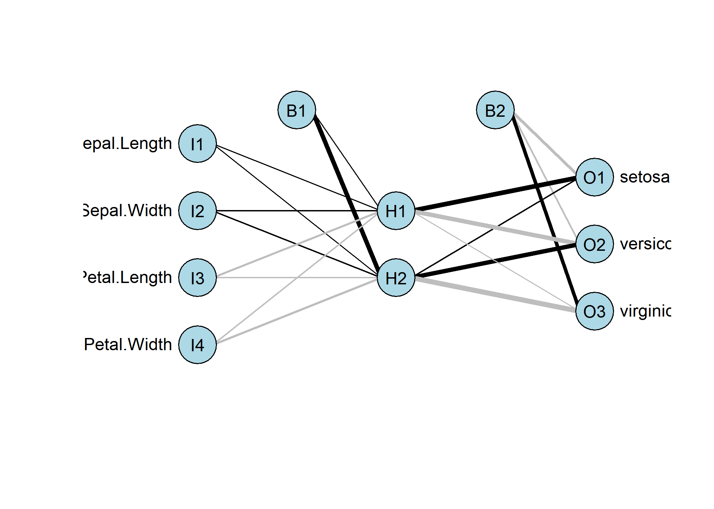
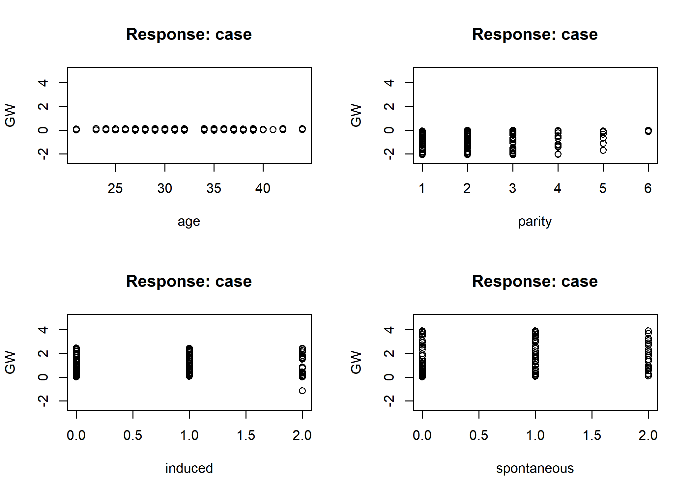
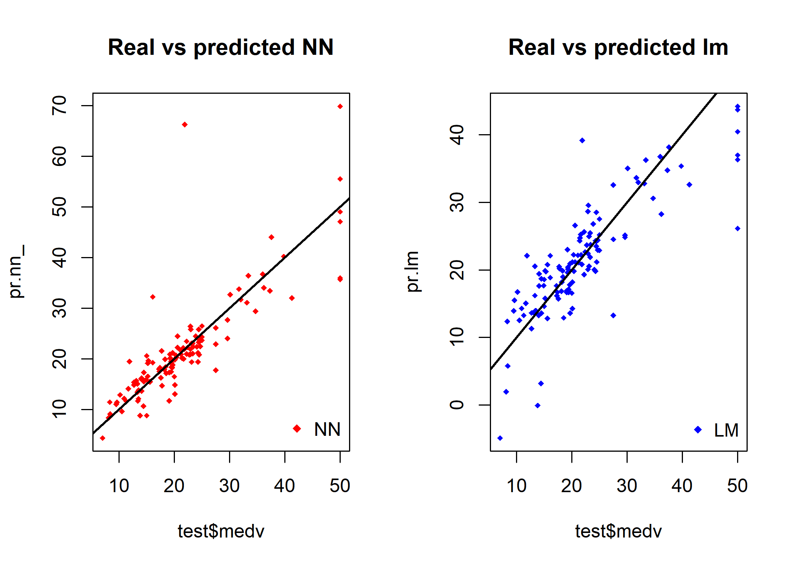
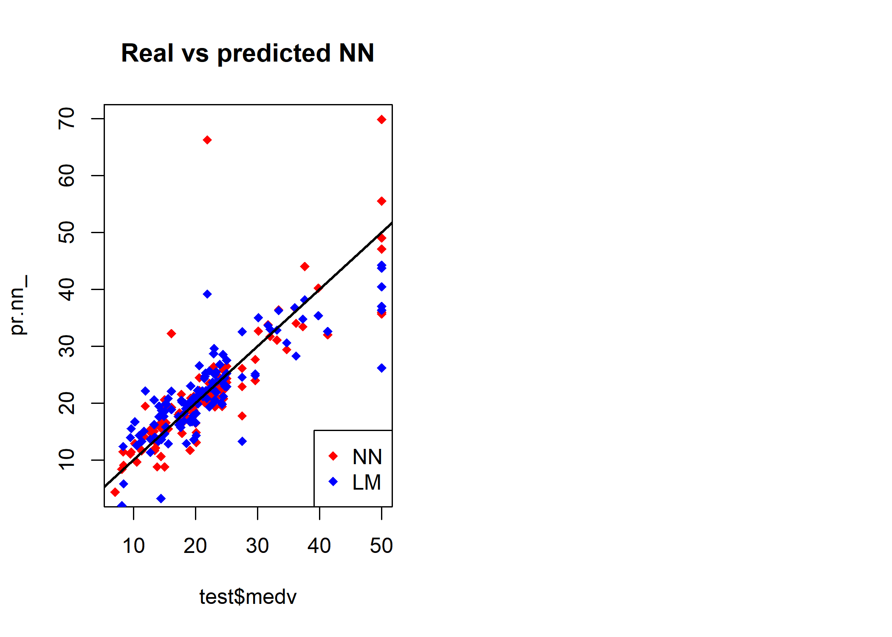

Jae Kwan Koo

-   [IRIS data - forward propagation](#iris-data---forward-propagation)
    -   [confusion matrix](#confusion-matrix)
-   [infert data - back propagation](#infert-data---back-propagation)
    -   [GW Plot](#gw-plot)
-   [Boston data](#boston-data)
    -   [glm](#glm)
    -   [back propagation](#back-propagation)
        -   [comparison](#comparison)

``` r
library(nnet)
library(devtools)
source_url('https://gist.githubusercontent.com/Peque/41a9e20d6687f2f3108d/raw/85e14f3a292e126f1454864427e3a189c2fe33f3/nnet_plot_update.r')

library(clusterGeneration)
library(scales)
library(reshape)
```

`nnet` : 순전파 알고리즘에 필요한 패키지.

IRIS data - forward propagation
-------------------------------

``` r
nn.iris <- nnet(Species~., data=iris, size=2, rang=.1, decay=5e-4, maxit=1000)
```

    ## # weights:  19
    ## initial  value 164.930656 
    ## iter  10 value 68.850274
    ## iter  20 value 32.925070
    ## iter  30 value 8.791971
    ## iter  40 value 8.481011
    ## iter  50 value 8.427830
    ## iter  60 value 8.419685
    ## iter  70 value 8.413060
    ## iter  80 value 8.409051
    ## iter  90 value 8.406982
    ## iter 100 value 8.386786
    ## iter 110 value 7.825857
    ## iter 120 value 7.366973
    ## iter 130 value 6.814388
    ## iter 140 value 6.546390
    ## iter 150 value 6.456097
    ## iter 160 value 6.373149
    ## iter 170 value 6.325692
    ## iter 180 value 6.321582
    ## iter 190 value 6.320099
    ## iter 200 value 6.318378
    ## iter 210 value 6.317686
    ## final  value 6.317628 
    ## converged

``` r
summary(nn.iris)
```

    ## a 4-2-3 network with 19 weights
    ## options were - softmax modelling  decay=5e-04
    ##  b->h1 i1->h1 i2->h1 i3->h1 i4->h1 
    ##   0.43   0.67   1.77  -3.09  -1.48 
    ##  b->h2 i1->h2 i2->h2 i3->h2 i4->h2 
    ##   8.73   0.51   1.38  -1.94  -3.76 
    ##  b->o1 h1->o1 h2->o1 
    ##  -4.82  10.00   1.36 
    ##  b->o2 h1->o2 h2->o2 
    ##  -2.59  -8.89   9.22 
    ##  b->o3 h1->o3 h2->o3 
    ##   7.41  -1.11 -10.58

4가지 변수 값을 이용해 종류를 분류해보려고 한다. size=2 : 은닉층이 1개이고 은닉노드가 2개인 순전파모형.
4-2-3구조를 가지고 있는 신경망.
모든 선들을 연결한다면 이 신호의 강도는 가중치이다. 이 가중치는 19개이다. 이 19개를 다 추정해야한다.
활성함수는 여러가지이다. 여기서 softmax modelling이다. 이것은 확장된 형태이고 우리는 시그모이드를 이야기 했었다.
w0의 의미를 가지는 것이 b이다. 절편의 역할을 한다고 볼 수 있다.

``` r
plot.nnet(nn.iris)    # plot(nn.iris)
```



### confusion matrix

``` r
confusion_matrix<-table(iris$Species, predict(nn.iris, iris, type='class'))
```

반응변수가 범주형인 경우이므로 type='class' 옵션을 사용.
~~그냥 단순한 예제로 여기서는 train, test data set은 나누지 않고 실습하였다.~~

``` r
round(prop.table(confusion_matrix) * 100, digit = 1)
```

    ##             
    ##              setosa versicolor virginica
    ##   setosa       33.3        0.0       0.0
    ##   versicolor    0.0       32.7       0.7
    ##   virginica     0.0        0.7      32.7

``` r
sum(diag(round(prop.table(confusion_matrix) * 100, digit = 1)))
```

    ## [1] 98.7

또한, percent로 나타내어 정분류율, 오분류율도 확인할 수 있을 것이다.
정분류율은 위와 같다.

infert data - back propagation
------------------------------

``` r
library(neuralnet)

data(infert)
net.infert <- neuralnet(case~age+parity+induced+spontaneous, hidden=2, data=infert, linear.output=F)

net.infert$result.matrix
```

    ##                                  [,1]
    ## error                    2.034906e+01
    ## reached.threshold        6.978062e-03
    ## steps                    1.676000e+03
    ## Intercept.to.1layhid1    9.227628e-01
    ## age.to.1layhid1         -1.499176e+00
    ## parity.to.1layhid1       6.121397e+00
    ## induced.to.1layhid1      2.577130e-01
    ## spontaneous.to.1layhid1 -1.545251e+02
    ## Intercept.to.1layhid2    5.463343e+00
    ## age.to.1layhid2         -1.273735e-01
    ## parity.to.1layhid2       2.016925e+00
    ## induced.to.1layhid2     -2.401622e+00
    ## spontaneous.to.1layhid2 -3.844395e+00
    ## Intercept.to.case        2.247601e+00
    ## 1layhid1.to.case        -2.085767e+01
    ## 1layhid2.to.case        -4.074707e+00

``` r
plot(net.infert)
```

역전파 알고리즘을 사용하기 위해 neuralnet패키지를 이용한다. 반응변수가 0과 1만 가지는 범주형이기 때문에, linear.output옵션에서 F로 둔 것을 알 수 있다.
은닉층이 1개 은닉노드가 2개임을 hidden을 통해 알 수 있다.

infert 데이터는 유아기 자녀들 248명을 대상으로 여러가지 물어보았다. case : 반응변수

hidden은 nnet에서 size와 동일하다. 은닉층, 은닉노드를 나타낸다.
linear.output : 인공신경망 모형을 수치이면 예측모형으로 사용가능하기 때문에 출력되는 결과가 수치인지 물어보는 것이다 T라고 두면 예측모형으로 보게 된다. 여기서는 여부를 나타내는 범주자료를 반응변수로 하게 되는 분류모형이기 때문에 F로 두자.

``` r
str(infert)
```

    ## 'data.frame':    248 obs. of  8 variables:
    ##  $ education     : Factor w/ 3 levels "0-5yrs","6-11yrs",..: 1 1 1 1 2 2 2 2 2 2 ...
    ##  $ age           : num  26 42 39 34 35 36 23 32 21 28 ...
    ##  $ parity        : num  6 1 6 4 3 4 1 2 1 2 ...
    ##  $ induced       : num  1 1 2 2 1 2 0 0 0 0 ...
    ##  $ case          : num  1 1 1 1 1 1 1 1 1 1 ...
    ##  $ spontaneous   : num  2 0 0 0 1 1 0 0 1 0 ...
    ##  $ stratum       : int  1 2 3 4 5 6 7 8 9 10 ...
    ##  $ pooled.stratum: num  3 1 4 2 32 36 6 22 5 19 ...

``` r
net.case <- compute(net.infert, infert)
results <- data.frame(actual = infert$case, prediction = net.case$net.result)

final_results <- ifelse(results>=0.5,1,0)

(pred<-table(actual = final_results[,1],prediction = final_results[,2]))
```

    ##       prediction
    ## actual   0   1
    ##      0 146  19
    ##      1  39  44

``` r
sum(diag(pred))/sum(pred)
```

    ## [1] 0.766129

정분류율은 약 76.6%이다.

### GW Plot

``` r
par(mfrow=c(2,2))
gwplot(net.infert, selected.covariate='age', min=-2.5, max=5)
gwplot(net.infert, selected.covariate='parity', min=-2.5, max=5)
gwplot(net.infert, selected.covariate='induced', min=-2.5, max=5)
gwplot(net.infert, selected.covariate='spontaneous', min=-2.5, max=5)
```



gw는 generalize weight이다. 회귀모형과 비교시 원인과 결과를 알기 어렵다.
가중치를 회귀모형안에서 회귀계수처럼 이용하는 가중치를 gw라고 한다.

gw가 0에서 크게 벗어나지 않는다 -&gt; age의 값이 어떤값을 가지든간에 0에 거의 되어있다.
즉, age변수같은 경우 모형 안에서의 영향력이 매우 미미하다.

다른변수들은 gw값의 폭이 큰 폭으로 되어있다. age는 다른변수에 비해 미치는 영향이 매우작다 -&gt; 모형에 포함시켜 모형을복잡하게 만들필요없다. age를 제외시키고 모형을 만들어봐도 괜찮지 않을까라는 생각을 해보기도 한다.

은닉층, 은닉노드를 늘려가며 예측을 더 잘하는 모형을 만들어봐도 괜찮을것 같다.

Boston data
-----------

### glm

``` r
library(MASS)
head(Boston)
```

    ##      crim zn indus chas   nox    rm  age    dis rad tax ptratio  black
    ## 1 0.00632 18  2.31    0 0.538 6.575 65.2 4.0900   1 296    15.3 396.90
    ## 2 0.02731  0  7.07    0 0.469 6.421 78.9 4.9671   2 242    17.8 396.90
    ## 3 0.02729  0  7.07    0 0.469 7.185 61.1 4.9671   2 242    17.8 392.83
    ## 4 0.03237  0  2.18    0 0.458 6.998 45.8 6.0622   3 222    18.7 394.63
    ## 5 0.06905  0  2.18    0 0.458 7.147 54.2 6.0622   3 222    18.7 396.90
    ## 6 0.02985  0  2.18    0 0.458 6.430 58.7 6.0622   3 222    18.7 394.12
    ##   lstat medv
    ## 1  4.98 24.0
    ## 2  9.14 21.6
    ## 3  4.03 34.7
    ## 4  2.94 33.4
    ## 5  5.33 36.2
    ## 6  5.21 28.7

``` r
apply(Boston,2,function(x) sum(is.na(x)))
```

    ##    crim      zn   indus    chas     nox      rm     age     dis     rad 
    ##       0       0       0       0       0       0       0       0       0 
    ##     tax ptratio   black   lstat    medv 
    ##       0       0       0       0       0

보스턴에 있는 각 지역에 평균집값에 영향주는 요인이 있을건데 어떤 영향을 주는지 보자.
앞의 예제와는 다르게 예측모형을 만드는 것이 목표이다.

medv는 수치자료이므로 수치자료에 대해 모형을 만들게 되면 예측모형이다. ~~(반응변수가 범주이면 분류모형)~~
자료에 대한 점검으로 str함수와 summary함수를 이용하자. ~~(범주형일경우 summary에서 평균을 보는 의미는 없다.)~~

apply로 각 변수별 결측 갯수를 보자.

``` r
index <- sample(1:nrow(Boston),round(0.75*nrow(Boston)))
train <- Boston[index,]
test <- Boston[-index,]
lm.fit <- glm(medv~., data=train)

pr.lm <- predict(lm.fit,test)
MSE.lm <- sum((pr.lm - test$medv)^2)/nrow(test)

summary(lm.fit)
```

    ## 
    ## Call:
    ## glm(formula = medv ~ ., data = train)
    ## 
    ## Deviance Residuals: 
    ##      Min        1Q    Median        3Q       Max  
    ## -10.6655   -2.7256   -0.7295    1.6476   26.9389  
    ## 
    ## Coefficients:
    ##               Estimate Std. Error t value Pr(>|t|)    
    ## (Intercept)  3.233e+01  5.842e+00   5.535 5.96e-08 ***
    ## crim        -1.297e-01  3.580e-02  -3.624 0.000331 ***
    ## zn           4.748e-02  1.489e-02   3.187 0.001559 ** 
    ## indus       -9.678e-04  7.027e-02  -0.014 0.989018    
    ## chas         2.936e+00  1.028e+00   2.857 0.004521 ** 
    ## nox         -1.512e+01  4.512e+00  -3.350 0.000892 ***
    ## rm           4.270e+00  4.863e-01   8.781  < 2e-16 ***
    ## age         -4.417e-03  1.431e-02  -0.309 0.757794    
    ## dis         -1.497e+00  2.274e-01  -6.581 1.62e-10 ***
    ## rad          3.674e-01  7.628e-02   4.817 2.14e-06 ***
    ## tax         -1.539e-02  4.301e-03  -3.577 0.000394 ***
    ## ptratio     -8.668e-01  1.443e-01  -6.007 4.55e-09 ***
    ## black        7.282e-03  3.345e-03   2.177 0.030102 *  
    ## lstat       -5.102e-01  6.037e-02  -8.451 6.92e-16 ***
    ## ---
    ## Signif. codes:  0 '***' 0.001 '**' 0.01 '*' 0.05 '.' 0.1 ' ' 1
    ## 
    ## (Dispersion parameter for gaussian family taken to be 21.35134)
    ## 
    ##     Null deviance: 31766.2  on 379  degrees of freedom
    ## Residual deviance:  7814.6  on 366  degrees of freedom
    ## AIC: 2257.4
    ## 
    ## Number of Fisher Scoring iterations: 2

전체 데이터 행은 506개이므로 전체를 가지고 만든 모형을 일반적으로 생각한다.
가장 최적의 해를 구해서 만든 모형이므로 506개에만 특화된 모형이라고 생각될 수 있다. 좋은지 나쁜지 확인하기 어렵다. 따라서 2파트로 쪼개서 나머지 하나를 모형에 대한 평가로 쓴다. 더 잘게 쪼개는 cross-validation방법도 있다.

7:3의 비율로 뽑아낸다. 항상 7:3이 맞는 것은 아니다. 그냥 모형을 만드는 사람의 주관에 맡긴다. 대신 9:1이거나 1:9 같은 경우 한쪽에 너무 치우치게는 말고 적어도 8:2정도는 활용해야 한다. 모형을 만드는 쪽에 더 많이 할당한다.
여기서는 75:25로 분할하였다. 이 75%를 선택할 때, 임의로 선택해야 한다. 그냥 1번부터 하게되면 일반성에 어긋나게 된다.

각각 행의 번호를 가지고 뽑아올 것이다. 1부터 504까지 이루어져있는 벡터를 만들어 75%만큼 임의로 뽑아낸다.

sample함수는 replace=F라는 default값을 가지고 있다.
380개를 임의추출하여 모형을 만들고 126개를 가지고 모형을 평가하겠다.

### back propagation

``` r
maxs <- apply(Boston, 2, max) 
mins <- apply(Boston, 2, min)
scaled <- as.data.frame(scale(Boston, center = mins, scale = maxs - mins))

train_ <- scaled[index,]
test_ <- scaled[-index,]

n <- names(train_)
f <- as.formula(paste("medv ~", paste(n[!n %in% "medv"], collapse = " + ")))

net.Boston <- neuralnet(f,data=train_,hidden=c(5,3), linear.output=T)

plot(net.Boston)
net.Boston$result.matrix
```

    ##                                [,1]
    ## error                  4.372112e-01
    ## reached.threshold      8.926419e-03
    ## steps                  2.710000e+03
    ## Intercept.to.1layhid1 -1.276273e+00
    ## crim.to.1layhid1       6.756166e+00
    ## zn.to.1layhid1         2.333230e+00
    ## indus.to.1layhid1      1.408995e+00
    ## chas.to.1layhid1       1.037524e+00
    ## nox.to.1layhid1       -2.249014e+00
    ## rm.to.1layhid1         1.327304e+00
    ## age.to.1layhid1        9.001483e-01
    ## dis.to.1layhid1       -7.270505e+00
    ## rad.to.1layhid1        3.509848e+00
    ## tax.to.1layhid1        1.205964e-01
    ## ptratio.to.1layhid1   -9.271531e-01
    ## black.to.1layhid1      2.024557e-01
    ## lstat.to.1layhid1     -7.017009e+00
    ## Intercept.to.1layhid2  5.618362e-01
    ## crim.to.1layhid2       1.086178e+01
    ## zn.to.1layhid2         4.359522e-01
    ## indus.to.1layhid2     -7.929318e+00
    ## chas.to.1layhid2       3.328474e-01
    ## nox.to.1layhid2        2.246371e+00
    ## rm.to.1layhid2         8.591068e-01
    ## age.to.1layhid2       -1.769377e-01
    ## dis.to.1layhid2        1.723865e+00
    ## rad.to.1layhid2        5.222206e-01
    ## tax.to.1layhid2        1.108726e+00
    ## ptratio.to.1layhid2    1.191855e+00
    ## black.to.1layhid2      4.111699e-01
    ## lstat.to.1layhid2     -4.301613e+00
    ## Intercept.to.1layhid3  4.207135e+00
    ## crim.to.1layhid3      -2.844537e+01
    ## zn.to.1layhid3         2.181336e+00
    ## indus.to.1layhid3      2.612018e+00
    ## chas.to.1layhid3      -7.593000e-01
    ## nox.to.1layhid3        2.087861e-01
    ## rm.to.1layhid3        -2.610283e+00
    ## age.to.1layhid3       -2.503737e+00
    ## dis.to.1layhid3       -8.853125e-02
    ## rad.to.1layhid3        1.727092e+01
    ## tax.to.1layhid3       -4.618904e+00
    ## ptratio.to.1layhid3   -1.828933e-01
    ## black.to.1layhid3      1.062619e+00
    ## lstat.to.1layhid3     -4.044429e+00
    ## Intercept.to.1layhid4  8.777406e-01
    ## crim.to.1layhid4       9.281388e+00
    ## zn.to.1layhid4         1.139106e-01
    ## indus.to.1layhid4      1.384168e+00
    ## chas.to.1layhid4      -1.822022e-01
    ## nox.to.1layhid4       -1.156622e-01
    ## rm.to.1layhid4        -2.676868e+00
    ## age.to.1layhid4        3.674471e-01
    ## dis.to.1layhid4        4.024670e-01
    ## rad.to.1layhid4        1.316802e-01
    ## tax.to.1layhid4        5.088425e-01
    ## ptratio.to.1layhid4    1.089320e-01
    ## black.to.1layhid4     -2.973453e-01
    ## lstat.to.1layhid4      3.992231e-01
    ## Intercept.to.1layhid5 -3.432717e-01
    ## crim.to.1layhid5      -5.396219e+01
    ## zn.to.1layhid5        -1.093140e+01
    ## indus.to.1layhid5      4.977682e-01
    ## chas.to.1layhid5      -5.775274e+00
    ## nox.to.1layhid5        8.563732e+00
    ## rm.to.1layhid5        -1.473740e+00
    ## age.to.1layhid5       -2.769509e+00
    ## dis.to.1layhid5        2.941157e+01
    ## rad.to.1layhid5       -1.010811e+01
    ## tax.to.1layhid5        7.527769e+00
    ## ptratio.to.1layhid5   -2.950543e+00
    ## black.to.1layhid5      2.439125e+00
    ## lstat.to.1layhid5      5.604782e+00
    ## Intercept.to.2layhid1 -6.536989e-01
    ## 1layhid1.to.2layhid1   1.739099e+00
    ## 1layhid2.to.2layhid1  -9.656608e-01
    ## 1layhid3.to.2layhid1   1.472251e+00
    ## 1layhid4.to.2layhid1  -2.758336e+00
    ## 1layhid5.to.2layhid1   8.433630e-01
    ## Intercept.to.2layhid2 -9.864462e-01
    ## 1layhid1.to.2layhid2   1.678958e-02
    ## 1layhid2.to.2layhid2   2.102140e+00
    ## 1layhid3.to.2layhid2   1.058470e+00
    ## 1layhid4.to.2layhid2  -8.059845e+00
    ## 1layhid5.to.2layhid2  -4.177118e-02
    ## Intercept.to.2layhid3 -1.107017e+00
    ## 1layhid1.to.2layhid3   1.963501e+01
    ## 1layhid2.to.2layhid3  -1.357092e+01
    ## 1layhid3.to.2layhid3  -2.125722e+00
    ## 1layhid4.to.2layhid3  -7.606739e+00
    ## 1layhid5.to.2layhid3  -2.561216e+01
    ## Intercept.to.medv     -3.938499e-02
    ## 2layhid1.to.medv       9.569434e-01
    ## 2layhid2.to.medv       8.542288e-01
    ## 2layhid3.to.medv       8.562600e-01

신경망을 활용한 모형이다.
아까는 원데이터를 활용했다. 원데이터를 활용하게 되면 척도가 다르다. 회귀모형에서는 척도 조정이 가능하다.
신경망에서 스케일을 동일하게 조정하기 위해 center을 mins, scale을 max-min으로 하였다.

as.formula(paste("medv ~", paste(n\[!n %in% "medv"\], collapse = " + ")))와 같이 표현해줄 수 도 있다. ~~(위의 회귀식 구축할 때와 동일)~~

linear.out=T : 반응변수가 수치이므로 예측모형을 의미.
plot을 보면 왼편이 독립변수 오른편이 반응변수이다.

두번째 은닉층에는 3개의 은닉노드를 만들었다. 첫번째 은닉층에는 5개의 은닉노드를 만들었다. 1이라고 되어있는 것은 결합시 절편도 필요하므로 절편을 의미한다.

각 가중치에 대한 것도 볼 수 있고, 에러도 볼 수 있다. 디폴트로 에러를 계산하는 것은 sse이다. 0에 가까우므로 성능이 굉장히 좋은 것. 행의 갯수로 나눠주면 더 작아지므로 앞의 모형보다 좋아 보인다.

test모형에 적용해보자 : compute라는 함수를 사용 (회귀모형에서는 predict 함수를 사용했다.)

scale했으므로 원데이터로 다시 reverse scale해야한다.
(pr.nn*n**e**t*.*r**e**s**u**l**t* \* (*m**a**x*(*B**o**s**t**o**n*medv)-min(Boston*m**e**d**v*)) + *m**i**n*(*B**o**s**t**o**n*medv))

확률변수를 가정하지 않았기 때문에 x-mu /sigma대신 x-min / (max-min) 을 했었다. 다시 돌려주기 위해 max-min값을 곱하고 min을 더해서 역 스케일화 하였다.

#### comparison

``` r
pr.nn <- compute(net.Boston,test_[,1:13])
pr.nn_ <- pr.nn$net.result*(max(Boston$medv)-min(Boston$medv))+min(Boston$medv)
test.r <- (test_$medv)*(max(Boston$medv)-min(Boston$medv))+min(Boston$medv)
MSE.nn <- sum((test.r - pr.nn_)^2)/nrow(test_)

c(MSE.lm,MSE.nn)
```

    ## [1] 26.85951 32.12749

glm과 ANN의 MSE를 서로 비교할 수 있다. 신경망으로 만든 모형의 MSE가 더 작다.

``` r
par(mfrow=c(1,2))
plot(test$medv,pr.nn_,col='red',main='Real vs predicted NN',pch=18,cex=0.7)
abline(0,1,lwd=2)
legend('bottomright',legend='NN',pch=18,col='red', bty='n')
plot(test$medv,pr.lm,col='blue',main='Real vs predicted lm',pch=18, cex=0.7)
abline(0,1,lwd=2)
legend('bottomright',legend='LM',pch=18,col='blue', bty='n', cex=.95)
```



``` r
plot(test$medv,pr.nn_,col='red',main='Real vs predicted NN',pch=18,cex=1)
points(test$medv,pr.lm,col='blue',pch=18,cex=1)
abline(0,1,lwd=2)
legend('bottomright',legend=c('NN','LM'),pch=18,col=c('red','blue'))
```



신경망 모형이 예측을 더 잘한다라고 말할 수 있다. 보통은 신경망이 예측을 더 잘한다.
