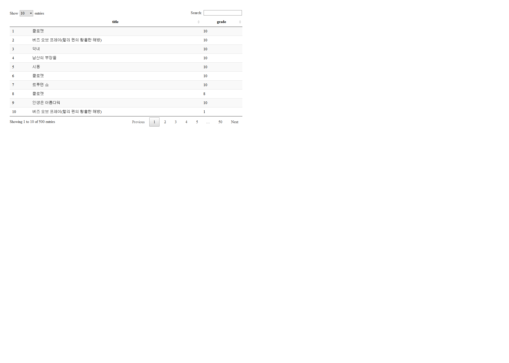

NAVER MOVIE GPA CRAWLING
================
Jae Kwan Koo

-   [Web Scraping](#web-scraping)
    -   [Naver Movie crawling.](#naver-movie-crawling.)
        -   [Example](#example)
        -   [Expansion.](#expansion.)

Web Scraping
============

``` r
library(rvest)
library(dplyr)

library(stringr)
library(data.table)
library(DT)

library(RSQLite)
library(sqldf)
```

Naver Movie crawling.
---------------------

### Example

``` r
url<-"https://movie.naver.com/movie/point/af/list.nhn?&page=1"
```

50페이지까지 뽑기전에 1페이지만 샘플로 잘 동작하는지 확인해보자.

``` r
read_html(url,encoding="CP949") %>% html_nodes(".title a.movie.color_b") %>% html_text()
```

    ##  [1] "클로젯"                                 
    ##  [2] "버즈 오브 프레이(할리 퀸의 황홀한 해방)"
    ##  [3] "악녀"                                   
    ##  [4] "남산의 부장들"                          
    ##  [5] "시동"                                   
    ##  [6] "클로젯"                                 
    ##  [7] "트루먼 쇼"                              
    ##  [8] "클로젯"                                 
    ##  [9] "인생은 아름다워"                        
    ## [10] "버즈 오브 프레이(할리 퀸의 황홀한 해방)"

`ctrl+shift+c`키를 통해 영화제목에 해당하는 상위 클래스를 선택하고 그 밑의 a태그에서 다시 클래스로 경로를 확인했다.
상황마다 방법들이 다르니 경험이 중요한 것 같다.
현재는 1페이지에 해당하는 영화들이 잘 나오는 것을 확인할 수 있다.

``` r
read_html(url,encoding="CP949") %>% html_nodes(".list_netizen_score em") %>% html_text()
```

    ##  [1] "10" "10" "10" "10" "10" "10" "10" "8"  "10" "1"

다음으로 1페이지에 해당하는 평점을 확인해보자.
`list_netizen_score` 클래스 밑에 em이라는 태그에서 평점의 숫자가 있는 것을 확인할 수 있다.
우리는 지금 이제 50페이지까지 최근 영화리뷰와 영화별 평점을 뽑아 평균을 낼 생각이다.

### Expansion.

``` r
url<-"https://movie.naver.com/movie/point/af/list.nhn?&page="
```

페이지별로 다른상황을 취하기 위해 url에서 page num을 뺏다. 차후에 `paste0`로 문자열 연결을 할 수 있다.

``` r
title<-NULL; grade<-NULL

for (i in 1:50){
  new_url<-paste0(url,i)
  
  title<-c(title,read_html(new_url,encoding="CP949") %>% html_nodes(".title a.movie.color_b") %>% html_text())
  grade<-c(grade,read_html(new_url,encoding="CP949") %>% html_nodes(".list_netizen_score em") %>% html_text())
  
  result<-data.table(title,grade)
}
```

euc-kr인코딩은 인자로 `euc-kr`로 넣어줄 때 가끔 안되는 곳이 있다고 한다. 그래서 `CP949`를 encoding옵션의 인자로 선택하였다.
각페이지별로 title, grade변수에 차례차례 들어갈 것이다.
결과를 data.table으로 만들어 확인하자.

``` r
datatable(result)   #use html file
```



``` r
result
```

    ##                                        title grade
    ##   1:                                  클로젯    10
    ##   2: 버즈 오브 프레이(할리 퀸의 황홀한 해방)    10
    ##   3:                                    악녀    10
    ##   4:                           남산의 부장들    10
    ##   5:                                    시동    10
    ##  ---                                              
    ## 496: 버즈 오브 프레이(할리 퀸의 황홀한 해방)    10
    ## 497:                              해치지않아     1
    ## 498: 버즈 오브 프레이(할리 퀸의 황홀한 해방)     3
    ## 499: 버즈 오브 프레이(할리 퀸의 황홀한 해방)    10
    ## 500:                                컨테이젼    10

한 페이지에 10개씩 50페이지까지 500개의 네티즌들의 최근 영화에 대한 리뷰평들이 나타나는 모습이다.

``` r
result$title<-as.character(result$title)
result$grade<-as.numeric(result$grade)


koo<-result %>% group_by(title) %>% 
    summarise(mean_grade= mean(grade),n=n()) %>% 
    filter(n>=3) %>% 
    arrange(desc(mean_grade))
```

이제 이 영화별로 평균을 내보자. 리뷰평이 3개미만인 것들은 의미가 없다생각했고, 3개이상인 것들에 대해서만 확인해보자.

``` r
koo
```

    ## # A tibble: 20 x 3
    ##    title                                   mean_grade     n
    ##    <chr>                                        <dbl> <int>
    ##  1 인사이드 아웃                                10        3
    ##  2 디스트릭트 9                                  9.83     6
    ##  3 시동                                          9.75     4
    ##  4 인셉션                                        9.75     4
    ##  5 조조 래빗                                     9.75    16
    ##  6 천문: 하늘에 묻는다                           9.5      6
    ##  7 호텔 뭄바이                                   9.5      4
    ##  8 컨테이젼                                      9        5
    ##  9 기생충                                        8.75     4
    ## 10 남산의 부장들                                 8.08    24
    ## 11 악녀                                          8        5
    ## 12 히트맨                                        7.5     10
    ## 13 클로젯                                        7.39   105
    ## 14 페인 앤 글로리                                7.33     3
    ## 15 해치지않아                                    6.79    19
    ## 16 존 윅 3: 파라벨룸                             6.67     3
    ## 17 버즈 오브 프레이(할리 퀸의 황홀한 해방)       6.15    85
    ## 18 감기                                          5.8     10
    ## 19 마약왕                                        3.89     9
    ## 20 백두산                                        2.75     4

평균평점이 높은 순서대로 정렬하였다.

``` r
sqldf("select * from koo limit 5", drv="SQLite")
```

    ##           title mean_grade  n
    ## 1 인사이드 아웃  10.000000  3
    ## 2  디스트릭트 9   9.833333  6
    ## 3          시동   9.750000  4
    ## 4        인셉션   9.750000  4
    ## 5     조조 래빗   9.750000 16

sql구문도 잘 먹히는 모습이다. sql에 대해서는 다음에 다루어 보려고 한다.
