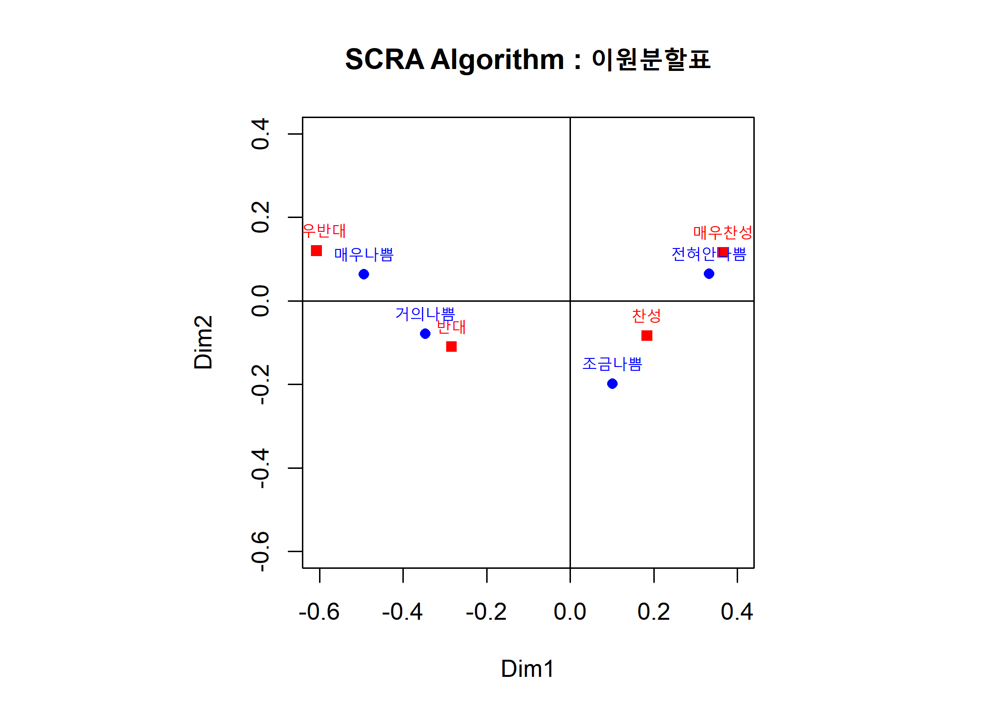
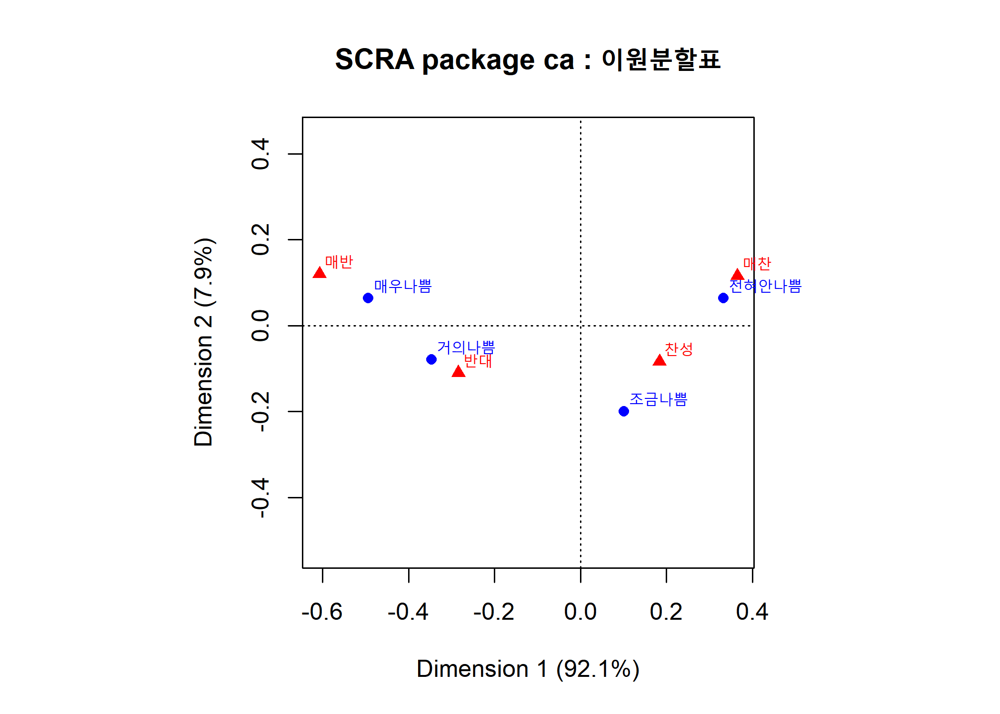
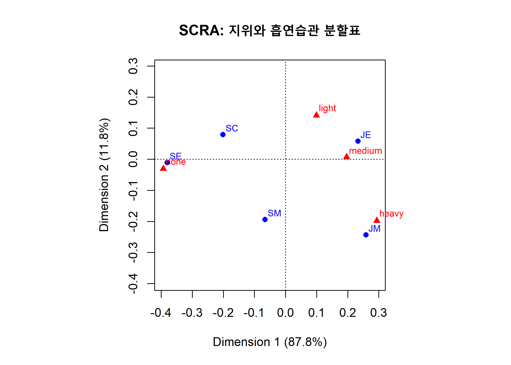

Correspondence Analysis (CRA) - (1)
================
Jae Kwan Koo

-   [EX1)결혼 전 성관계에 대한 반응과 피임허용의 이원분할표의 단순 CRA 수행단계](#ex1결혼-전-성관계에-대한-반응과-피임허용의-이원분할표의-단순-cra-수행단계)
    -   [SVD](#svd)
    -   [A:행좌표점, B:열좌표점](#a행좌표점-b열좌표점)
    -   [고유값과 설명력](#고유값과-설명력)
-   [CRA를 위한 R의 함수 ca()의 활용](#cra를-위한-r의-함수-ca의-활용)
    -   [simple CRA plot](#simple-cra-plot)
    -   [chisq test](#chisq-test)
-   [EX2) 지위에 따른 흡연습관의 이원분할표에 대한 단순 CRA](#ex2-지위에-따른-흡연습관의-이원분할표에-대한-단순-cra)
-   [Chi-square test for Three Ways Table](#chi-square-test-for-three-ways-table)
    -   [Customer Data](#customer-data)
    -   [Driver Injury Data](#driver-injury-data)
    -   [Driver Injury Tabel Data](#driver-injury-tabel-data)

CRA:분할표로 나타내어지는 자료의 행과 열범주를 저차원 공간상(2차원)의점들로 동시에 나타내어, 그들의 관계를 탐구
단순대응분석 : 행과 열범주를 나타내는 변수가 둘뿐인 이원분할표의 대응분석

`Simple CRA` : Two-Way Table

### EX1)결혼 전 성관계에 대한 반응과 피임허용의 이원분할표의 단순 CRA 수행단계

``` r
O<-matrix(c(81, 68, 60, 38,
            24, 26, 29, 14,
            18, 41, 74, 42,
            36, 57, 161, 157), byrow=T, nrow=4)
F <- O/sum(O)

r <- apply(F,1,sum)  # 행에 대한 합
c <- apply(F,2,sum)  # 열에 대한 합

#행과 열의 주변 비율
Dr<- diag(1/sqrt(r))
Dc<- diag(1/sqrt(c))
cF<- F-r%*%t(c)
Y <- Dr%*%(cF)%*%Dc
```

#### SVD

``` r
svd.Y <- svd(Y)
U <- svd.Y$u
V <- svd.Y$v
D <- diag(svd.Y$d)
```

#### A:행좌표점, B:열좌표점

``` r
A <- (Dr%*%U%*%D)[,1:2]
B <- (Dc%*%V%*%D)[,1:2]

rownames(A) <- c("매우나쁨", "거의나쁨", "조금나쁨", "전혀안나쁨")
rownames(B) <- c("매우반대", "반대", "찬성", "매우찬성")

A;B
```

    ##                  [,1]        [,2]
    ## 매우나쁨   -0.4936961  0.06384614
    ## 거의나쁨   -0.3464748 -0.07896714
    ## 조금나쁨    0.1012440 -0.19906842
    ## 전혀안나쁨  0.3319888  0.06426015

    ##                [,1]        [,2]
    ## 매우반대 -0.6071969  0.12012594
    ## 반대     -0.2840350 -0.10959974
    ## 찬성      0.1835685 -0.08357146
    ## 매우찬성  0.3649515  0.11561864

#### 고유값과 설명력

``` r
eig <- (svd.Y$d)^2
per <- eig/sum(eig)*100
gof <- sum(per[1:2])

rbind(round(eig, 3),round(per, 3))
```

    ##        [,1]  [,2]  [,3] [,4]
    ## [1,]  0.128 0.011 0.000    0
    ## [2,] 92.055 7.941 0.004    0

2차원 CRA 그림의 설명력은 약 100(=92.06+7.94)%에 이르며 완벽하게 이원분할표 자료의 행과 열범주의 연관성을 시각적으로 보여주게 된다.

``` r
par(pty="s") # s : 가로, 세로 비율 같도록 지정.

lim <-range(pretty(A))

plot(B[, 1:2], xlab="Dim1",ylab="Dim2", xlim=lim,ylim=lim, pch=15,col=2,
     main="SCRA Algorithm : 이원분할표")
text(B[, 1:2],rownames(B),cex=0.8,col=2,pos=3)
points(A[, 1:2],pch=16, col=4)
text(A[, 1:2],rownames(A),cex=0.8,pos=3, col=4)
abline(v=0,h=0)
```



행좌표점과 열좌표점 사이의 거리는 기하적으로 의미없다. 두 좌표점이 같은 방향에 위치한다면 이들이 나타내는 행범주와 열범주가 대응관계에 있다고 본다.

-   수평축(Dim1)에 대하여 왼편의 행범주(매우나쁨, 거의나쁨)는 열범주(매우반대, 반대)방향으로 놓여져 있다. 이는 혼전 성관계가 나쁘다고 여기는 사람들은 10대에 피임을 반대하는 입장에 있음을 나타낸다.
-   오른편의 행범주(조금나쁨, 전혀안나쁨)는 열범주(찬성, 매우찬성)방향으로 놓여져 있어 이를 서로 대응한다고 한다. 이는 혼전 성관계에 대해 부정적이지 않은 사람들은 10대에 피임을 찬성하고 있다.

따라서 혼전 성경험에 대해서도 관대한 사람들은 10대에게 피임을 허용해야 한다고 좀 더 강하게 느끼는 입장을 보이고 있다.

\[R : pretty funtion\]<https://statisticsglobe.com/pretty-r-function>

### CRA를 위한 R의 함수 ca()의 활용

Simple CRA ca() : Matrix for Two-Way Table

``` r
O<-matrix(c(81, 68, 60, 38,
            24, 26, 29, 14,
            18, 41, 74, 42,
            36, 57, 161, 157), byrow=T, nrow=4)

rownames(O)<-c("매우나쁨", "거의나쁨", "조금나쁨", "전혀안나쁨")
colnames(O)<-c("매반", "반대", "찬성", "매찬")
```

EX1에 대해서 ca함수를 이용해 CRA를 수행하였다.

#### simple CRA plot

``` r
library(ca)
sca<-ca(O)
sca
```

    ## 
    ##  Principal inertias (eigenvalues):
    ##            1        2        3    
    ## Value      0.127926 0.011036 5e-06
    ## Percentage 92.05%   7.94%    0%   
    ## 
    ## 
    ##  Rows:
    ##          매우나쁨  거의나쁨  조금나쁨 전혀안나쁨
    ## Mass     0.266739  0.100432  0.188985   0.443844
    ## ChiDist  0.497810  0.355416  0.223343   0.338151
    ## Inertia  0.066102  0.012687  0.009427   0.050752
    ## Dim. 1  -1.380320 -0.968706  0.283067   0.928204
    ## Dim. 2   0.607768 -0.751709 -1.894986   0.611710
    ## 
    ## 
    ##  Columns:
    ##              매반      반대      찬성     매찬
    ## Mass     0.171706  0.207343  0.349892 0.271058
    ## ChiDist  0.618968  0.304466  0.201710 0.382831
    ## Inertia  0.065784  0.019221  0.014236 0.039726
    ## Dim. 1  -1.697656 -0.794131  0.513237 1.020365
    ## Dim. 2   1.143511 -1.043309 -0.795539 1.100605

``` r
par(pty="s")
plot(sca, main="SCRA package ca : 이원분할표")
```



#### chisq test

``` r
chisq.test(O)
```

    ## 
    ##  Pearson's Chi-squared test
    ## 
    ## data:  O
    ## X-squared = 128.68, df = 9, p-value < 2.2e-16

결혼 전 성관계에 대한 반응과 피임허용의 독립성과 동질성 검정.

H\_0 : 혼전 성관계에 대한 반응과 10대들의 피임에 대한 생각은 서로 연관성이 없다.

### EX2) 지위에 따른 흡연습관의 이원분할표에 대한 단순 CRA

``` r
library(ca)
data(smoke)
O<-smoke

sca=ca(O)
sca
```

    ## 
    ##  Principal inertias (eigenvalues):
    ##            1        2        3       
    ## Value      0.074759 0.010017 0.000414
    ## Percentage 87.76%   11.76%   0.49%   
    ## 
    ## 
    ##  Rows:
    ##                SM        JM        SE       JE        SC
    ## Mass     0.056995  0.093264  0.264249 0.455959  0.129534
    ## ChiDist  0.216559  0.356921  0.380779 0.240025  0.216169
    ## Inertia  0.002673  0.011881  0.038314 0.026269  0.006053
    ## Dim. 1  -0.240539  0.947105 -1.391973 0.851989 -0.735456
    ## Dim. 2  -1.935708 -2.430958 -0.106508 0.576944  0.788435
    ## 
    ## 
    ##  Columns:
    ##              none    light   medium     heavy
    ## Mass     0.316062 0.233161 0.321244  0.129534
    ## ChiDist  0.394490 0.173996 0.198127  0.355109
    ## Inertia  0.049186 0.007059 0.012610  0.016335
    ## Dim. 1  -1.438471 0.363746 0.718017  1.074445
    ## Dim. 2  -0.304659 1.409433 0.073528 -1.975960

``` r
par(pty="s")
plot(sca, main="SCRA: 지위와 흡연습관 분할표")
```



제 1축의 설명력이 87.8%로 매우 높아 이 축으로도 자료의 행과 열범주의 연관성을 충분히 시각적으로 보여줄 수 있다.
\* 제 1축에 대하여 왼편의 SE(상위 고용직)과 SC(비서직)은 오른편의 JM(하위 경영직), JE(하위 고용직)과는 다른 방향으로 상대적으로 멀리 떨어져 있다. 이런 행범주들의 상대적 위치는 지위에 따라 흡연습관의 유사성에 차이점이 있음을 기하적으로 말하고 있다.

-   실제 이들 행범주 SE와 SC는 흡연 습과능ㄹ 나타내는 열범주 none(담배를 전혀 피우지 않는다) 방향으로 대응하고, 원점에 가까우나 SM도 이 방향으로 대응하고 있다.

-   이와는 반대로 행범주 JE는 열범주 median(하루에 담배를 11-20개비 피운다)과 light(하루에 담배를 1-10개비 피운다)와 대응하며 JM은 열범주 heavy(하루에 담배를 1갑 이상 피운다)와 대응하고 있다.

-   전반적으로 행범주인 지위에 따라 열범주인 흡연습관의 차이를 보여주고 있다.

### Chi-square test for Three Ways Table

3-ways 이상부터는 mantelhaen.test를 사용한다.

#### Customer Data

``` r
customer <-array(c(1,1,2,1,3,2,1,1),    
                 dim=c(2, 2, 2), 
                 dimnames=list(sex=c("male", "female"),
                               age =c("Old", "Young"),
                               response =c("Tall", "Short")))

customer
```

    ## , , response = Tall
    ## 
    ##         age
    ## sex      Old Young
    ##   male     1     2
    ##   female   1     1
    ## 
    ## , , response = Short
    ## 
    ##         age
    ## sex      Old Young
    ##   male     3     1
    ##   female   2     1

``` r
mantelhaen.test(customer)  # 3-ways 
```

    ## 
    ##  Mantel-Haenszel chi-squared test without continuity correction
    ## 
    ## data:  customer
    ## Mantel-Haenszel X-squared = 0.0042508, df = 1, p-value = 0.948
    ## alternative hypothesis: true common odds ratio is not equal to 1
    ## 95 percent confidence interval:
    ##   0.0815554 10.3031532
    ## sample estimates:
    ## common odds ratio 
    ##         0.9166667

#### Driver Injury Data

``` r
driver<-array(c(12500, 313, 61971, 3992,
                604, 43, 3519, 481,
                344, 15, 2272, 370,
                38, 4, 237,66), dim=c(2, 2, 4),
              dimnames=list(condition=c("Normal", "Drinking"),
                            Belt =c("Yes", "No"),
                            response =c("None", "Minimal", "Minor", "Major")))


driver
```

    ## , , response = None
    ## 
    ##           Belt
    ## condition    Yes    No
    ##   Normal   12500 61971
    ##   Drinking   313  3992
    ## 
    ## , , response = Minimal
    ## 
    ##           Belt
    ## condition  Yes   No
    ##   Normal   604 3519
    ##   Drinking  43  481
    ## 
    ## , , response = Minor
    ## 
    ##           Belt
    ## condition  Yes   No
    ##   Normal   344 2272
    ##   Drinking  15  370
    ## 
    ## , , response = Major
    ## 
    ##           Belt
    ## condition  Yes  No
    ##   Normal    38 237
    ##   Drinking   4  66

``` r
mantelhaen.test(driver)
```

    ## 
    ##  Mantel-Haenszel chi-squared test with continuity correction
    ## 
    ## data:  driver
    ## Mantel-Haenszel X-squared = 314, df = 1, p-value < 2.2e-16
    ## alternative hypothesis: true common odds ratio is not equal to 1
    ## 95 percent confidence interval:
    ##  2.287835 2.832774
    ## sample estimates:
    ## common odds ratio 
    ##          2.545765

#### Driver Injury Tabel Data

``` r
setwd("D:\\Jae Kwan\\R프로그래밍\\Multivariate Analysis")
acdtable<-read.table("accidenttable.txt", header=T)

table<-xtabs(빈도 ~ 운전 + 벨트 + 부상, data=acdtable)

table
```

    ## , , 부상 = 경상
    ## 
    ##       벨트
    ## 운전   미착용  착용
    ##   음주    481    43
    ##   정상   3519   604
    ## 
    ## , , 부상 = 없음
    ## 
    ##       벨트
    ## 운전   미착용  착용
    ##   음주   3992   313
    ##   정상  61971 12500
    ## 
    ## , , 부상 = 중경상
    ## 
    ##       벨트
    ## 운전   미착용  착용
    ##   음주    370    15
    ##   정상   2272   344
    ## 
    ## , , 부상 = 중상
    ## 
    ##       벨트
    ## 운전   미착용  착용
    ##   음주     66     4
    ##   정상    237    38

``` r
mantelhaen.test(driver)
```

    ## 
    ##  Mantel-Haenszel chi-squared test with continuity correction
    ## 
    ## data:  driver
    ## Mantel-Haenszel X-squared = 314, df = 1, p-value < 2.2e-16
    ## alternative hypothesis: true common odds ratio is not equal to 1
    ## 95 percent confidence interval:
    ##  2.287835 2.832774
    ## sample estimates:
    ## common odds ratio 
    ##          2.545765
