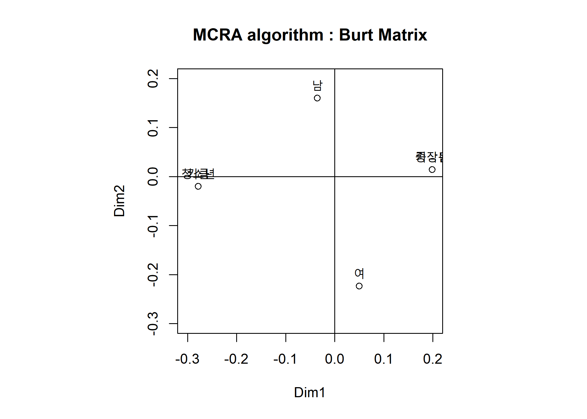
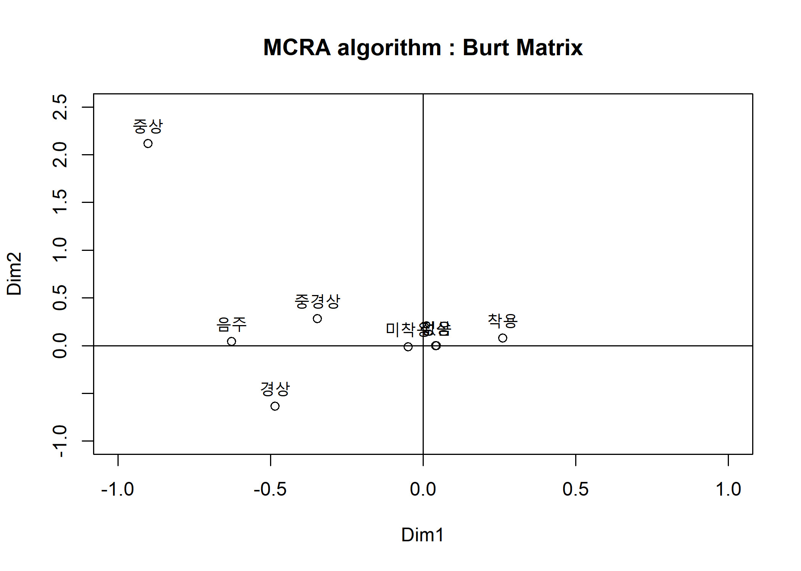
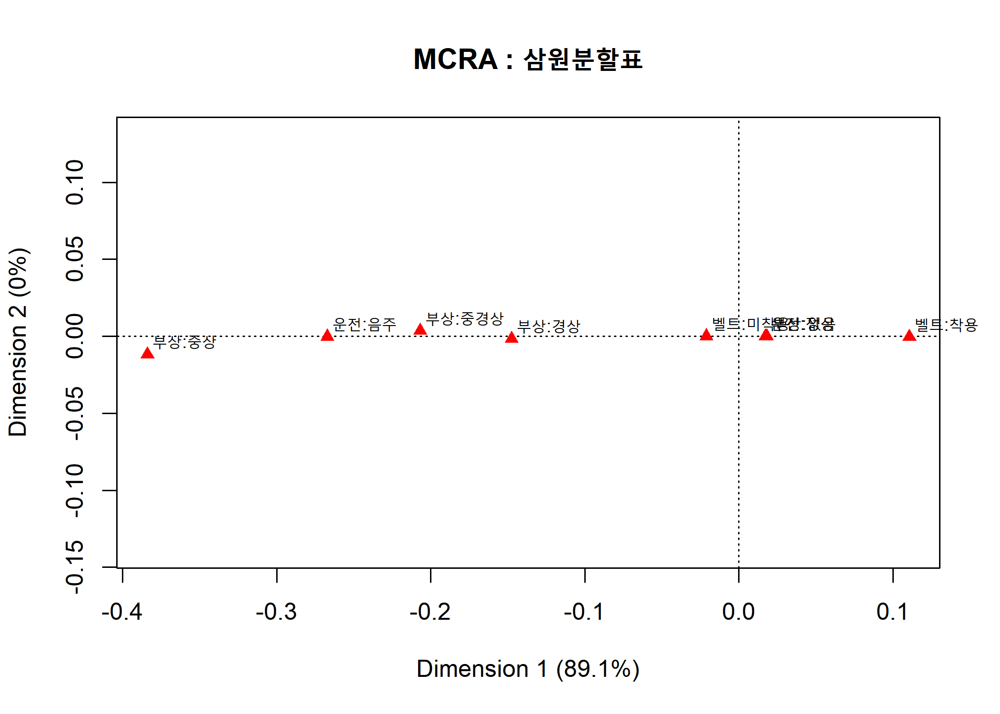
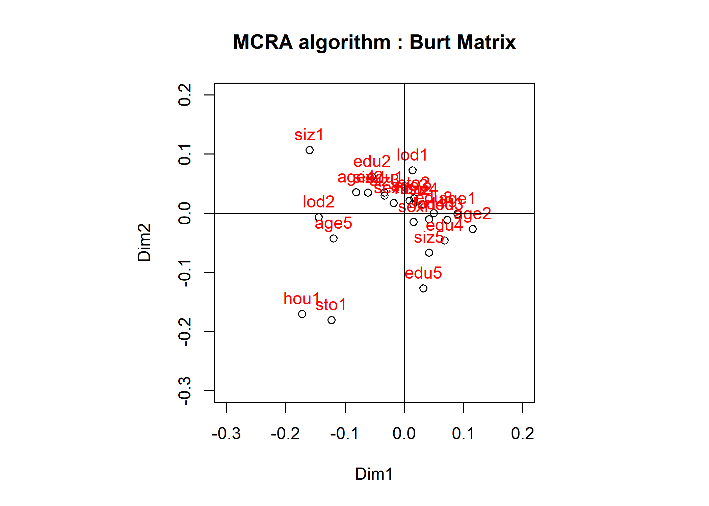

Multiple Correspondence Analysis (2)
================
Jae Kwan Koo

-   [성별, 나이, 키에 따른 삼원분할표의 다중 CRA.](#성별-나이-키에-따른-삼원분할표의-다중-cra.)
-   [사고운전자 부상정도의 삼원분할표에 대한 다중 CRA 알고리즘.](#사고운전자-부상정도의-삼원분할표에-대한-다중-cra-알고리즘.)
    -   [삼원분할표 사고운전자 부상정도 입력자료에 대한 다중CRA.](#삼원분할표-사고운전자-부상정도-입력자료에-대한-다중cra.)
-   [인구통계적 변인과 사회경제적 변인에 의한 버트표.](#인구통계적-변인과-사회경제적-변인에-의한-버트표.)

CRA:분할표로 나타내어지는 자료의 행과 열범주를 저차원 공간상(2차원)의 점들로 동시에 나타내어, 그들의 관계를 탐구.
다중대응분석 : 다원분할표를과로 나타낸 표시행렬(indicator matrix)나 Burt행렬 의 대응분석.
nxq표시행렬 -&gt; q\*q버트행렬 -&gt; 대응행렬 -&gt; 잔차행렬의 비정칙값분해 -&gt; 다중cra그림의 좌표점,설명력 MCRA : Burt Table from Indicator Matrix.

### 성별, 나이, 키에 따른 삼원분할표의 다중 CRA.

``` r
Z<-matrix(c(1, 0, 1, 0, 1, 0,
            1, 0, 1, 0, 0, 1,
            1, 0, 1, 0, 0, 1,
            1, 0, 1, 0, 0, 1,
            1, 0, 0, 1, 1, 0,
            1, 0, 0, 1, 1, 0,
            1, 0, 0, 1, 0, 1,
            0, 1, 1, 0, 1, 0,
            0, 1, 1, 0, 0, 1,
            0, 1, 1, 0, 0, 1,
            0, 1, 0, 1, 1, 0,
            0, 1, 0, 1, 0, 1), byrow=T, nrow=12)
colnames(Z)<-c("남", "여", "중장년", "청소년", "키큼", "키작음")
Z
```

    ##       남 여 중장년 청소년 키큼 키작음
    ##  [1,]  1  0      1      0    1      0
    ##  [2,]  1  0      1      0    0      1
    ##  [3,]  1  0      1      0    0      1
    ##  [4,]  1  0      1      0    0      1
    ##  [5,]  1  0      0      1    1      0
    ##  [6,]  1  0      0      1    1      0
    ##  [7,]  1  0      0      1    0      1
    ##  [8,]  0  1      1      0    1      0
    ##  [9,]  0  1      1      0    0      1
    ## [10,]  0  1      1      0    0      1
    ## [11,]  0  1      0      1    1      0
    ## [12,]  0  1      0      1    0      1

``` r
B <- t(Z) %*% Z 
B 
```

    ##        남 여 중장년 청소년 키큼 키작음
    ## 남      7  0      4      3    3      4
    ## 여      0  5      3      2    2      3
    ## 중장년  4  3      7      0    2      5
    ## 청소년  3  2      0      5    3      2
    ## 키큼    3  2      2      3    5      0
    ## 키작음  4  3      5      2    0      7

각각 표시(Indicator)행렬 Z와 버트(Burt)행렬 B이다.

``` r
P <- B / sum(B)
cm <- apply(P, 2, sum)  #apply(object, direction, function)#
Dc<-diag(1/sqrt(cm))    #direction: 1(행방향), 2(열방향)#
eP <- cm %*% t(cm)
Y <- (P - eP) / sqrt(eP)


# Singular Value Decomposition
svd.Y<-svd(Y)
V<-svd.Y$v
Dl<-diag((svd.Y$d)^2)

lam<-(svd.Y$d)^2
fit<-lam/sum(lam)*100
rbind(round(lam, 3),round(fit, 3))
```

    ##        [,1]   [,2]   [,3] [,4] [,5] [,6]
    ## [1,]  0.193  0.110  0.052    0    0    0
    ## [2,] 54.386 30.923 14.690    0    0    0

``` r
Cb<- Dc%*%V%*%Dl
rownames(Cb)<-colnames(Z)

Cb2=Cb[, 1:2]
Cb2
```

    ##               [,1]        [,2]
    ## 남     -0.03553638  0.15971843
    ## 여      0.04975093 -0.22360581
    ## 중장년  0.19862898  0.01428748
    ## 청소년 -0.27808057 -0.02000247
    ## 키큼   -0.27808057 -0.02000247
    ## 키작음  0.19862898  0.01428748

-   다중 CRA 그림의 dim1과 dim2은 각각 54.39%와 30.92%를 설명하며 2차원의 다중 CRA 그림의 설명력은 85.31%이다.

``` r
par(pty="s")
lim<-range(pretty(Cb))

plot(Cb2, xlab="Dim1", ylab="Dim2", xlim=lim, ylim=lim, main="MCRA algorithm : Burt Matrix")
text(Cb2, colnames(Z), pos=3, col=1)
abline(v=0, h=0)
```



다중cra에서는 열좌표점만 제공한다.

-   그림상 좌표가 겹쳐 있어 결과의 좌표를 참고한다면 수평축인 제1축에 대하여 왼편의 청소년 고객은 키가 크며 오른편의 중장년 고객은 키가 작음에 대응하고 있다.
-   제 2축에서는 남과 여가 서로 반대쪽에 놓여 있어 기하적으로 이들 범주의 이질성을 나타내고 있다.
-   고객들의 경향은 남자 고객은 청소년과 키가 크며 여자 고객은 그 반대의 경향과 대응하고 있다.

### 사고운전자 부상정도의 삼원분할표에 대한 다중 CRA 알고리즘.

``` r
setwd("D:\\Jae Kwan\\3학년2학기\\다변량2\\191128 다변량실습\\Rdata")
accident<-read.table("accident.txt", head=T)

B<-as.matrix(accident)
rownames(B)<-colnames(B)
B
```

    ##        음주  정상 미착용  착용 중상 중경상 경상  없음
    ## 음주   5284     0   4909   375   70    524  385  4305
    ## 정상      0 81485  67999 13486  275   4123 2616 74471
    ## 미착용 4909 67999  72908     0  303   4000 2642 65963
    ## 착용    375 13486      0 13861   42    647  359 12813
    ## 중상     70   275    303    42  345      0    0     0
    ## 중경상  524  4123   4000   647    0   4647    0     0
    ## 경상    385  2616   2642   359    0      0 3001     0
    ## 없음   4305 74471  65963 12813    0      0    0 78776

다음은 입력자료인 버트행렬의 다중 CRA를 위한 알고리즘이다.

``` r
P <- B / sum(B)
cm <- apply(P, 2, sum)
Dc<-diag(1/sqrt(cm))
eP <- cm %*% t(cm)
Y <- (P - eP) / sqrt(eP)

## Singular Value Decomposition
svd.Y<-svd(Y)
V<-svd.Y$v
Dl<-diag((svd.Y$d)^2)
lam<-(svd.Y$d)^2
fit<-lam/sum(lam)*100
rbind(round(lam, 3),round(fit, 3))
```

    ##        [,1]   [,2]   [,3]   [,4]   [,5] [,6] [,7] [,8]
    ## [1,]  0.139  0.111  0.111  0.106  0.091    0    0    0
    ## [2,] 24.895 19.956 19.906 18.921 16.322    0    0    0

``` r
Cb<-Dc%*%V%*%Dl
rownames(Cb)<-colnames(B)
Cb2<-Cb[, 1:2]
Cb2
```

    ##               [,1]         [,2]
    ## 음주   -0.62768463  0.040612277
    ## 정상    0.04070302 -0.002633555
    ## 미착용 -0.04947265 -0.014749590
    ## 착용    0.26022305  0.077581927
    ## 중상   -0.90174945  2.116345970
    ## 중경상 -0.34671784  0.280312505
    ## 경상   -0.48577017 -0.635121524
    ## 없음    0.04290771 -0.001609016

dim1과 dim2은 각각 24.895%과 19.956%를 설명하며 2차원 다중 CRA 그림의 설명력은 그렇게 높지는 않다.
일반적으로 다중 CRA의 설명력은 높지 않은 것이 특징이다.

``` r
limy<-range(pretty(Cb2))
limx<-c(-1, 1)

plot(Cb2, xlab="Dim1", ylab="Dim2", xlim=limx, ylim=limy, main="MCRA algorithm : Burt Matrix")
text(Cb2, rownames(Cb), col=1,  pos=3)
abline(v=0, h=0)
```



수평축인 제1축에 대하여 왼편의 음주를 했을 경우 안전띠를 미착용하며 따라서 사고가 나면 운전자의 부상 정도가 중상, 중경상, 경상에 대응한다. 이와 반대로 오른편에는 운전자가 음주를 하지 않은 정상상태라면 안전띠를 착용하게 되고 사고가 나도 부상자가 없음을 보여주고 있다.

#### 삼원분할표 사고운전자 부상정도 입력자료에 대한 다중CRA.

``` r
setwd("D:\\Jae Kwan\\3학년2학기\\다변량2\\191128 다변량실습\\Rdata")
acdtable<-read.table("accidenttable.txt", header=T)

library(ca)
table<-xtabs(빈도 ~ 벨트 +  부상 + 운전,data=acdtable)

mjca(table)
```

    ## 
    ##  Eigenvalues:
    ##            1        2     3 
    ## Value      0.003499 0     0 
    ## Percentage 89.13%   0.01% 0%
    ## 
    ## 
    ##  Columns:
    ##         벨트:미착용 벨트:착용 부상:경상 부상:없음 부상:중경상  부상:중상
    ## Mass       0.280085  0.053249  0.017852  0.302627    0.011529   0.001325
    ## ChiDist    0.252303  1.327097  2.430515  0.184581    3.055311   9.144538
    ## Inertia    0.017829  0.093781  0.105459  0.010311    0.107619   0.110830
    ## Dim. 1    -0.356030  1.872694 -2.495154  0.308785   -3.495844  -6.489437
    ## Dim. 2     0.132417 -0.696504 -2.516550  0.014445    5.701904 -18.999831
    ##         운전:음주 운전:정상
    ## Mass     0.020299  0.313034
    ## ChiDist  2.279779  0.147835
    ## Inertia  0.105502  0.006841
    ## Dim. 1  -4.517131  0.292919
    ## Dim. 2  -0.364603  0.023643

``` r
plot(mjca(table), main="MCRA : 삼원분할표")
```



다중 CRA 그림의 제1축의 설명력이 89.1%로 매우 높아 제1축만으로도 범주들의 대응관계를 충분히 파악할 수 있다.
수평축인 제1축에 대하여 왼편의 음주를 했을 경우(운전 : 음주)에 안전띠를 미착용(벨트 : 미착용)하며 따라서 사고가 나면 운전자의 부상 정도가 중상, 중경상, 경상에 대응한다. 오른편은 이와 반대의 대응관계를 보여주고 있다.

### 인구통계적 변인과 사회경제적 변인에 의한 버트표.

``` r
setwd("D:\\Jae Kwan\\3학년2학기\\다변량2\\191128 다변량실습\\Rdata")
sociecono<-read.table("sociecono.txt", head=T)

B<-as.matrix(sociecono)
colnames<-colnames(B)
B
```

    ##       sexm sexf edu1 edu2 edu3 edu4 edu5 lod1 lod2 lod3 lod4 sto1 sto2
    ##  [1,]  469    0  102  164   69   65   69   62  151  224   32   54  415
    ##  [2,]    0  531   94  163   91  102   81   58  142  302   29   67  464
    ##  [3,]  102   94  196    0    0    0    0   17   59  105   15   12  184
    ##  [4,]  164  163    0  327    0    0    0   45  116  151   15   26  301
    ##  [5,]   69   91    0    0  160    0    0   16   37   98    9   19  141
    ##  [6,]   65  102    0    0    0  167    0   27   39   87   14   27  140
    ##  [7,]   69   81    0    0    0    0  150   15   42   85    8   37  113
    ##  [8,]   62   58   17   45   16   27   15  120    0    0    0   11  109
    ##  [9,]  151  142   59  116   37   39   42    0  293    0    0   60  233
    ## [10,]  224  302  105  151   98   87   85    0    0  526    0   45  481
    ## [11,]   32   29   15   15    9   14    8    0    0    0   61    5   56
    ## [12,]   54   67   12   26   19   27   37   11   60   45    5  121    0
    ## [13,]  415  464  184  301  141  140  113  109  233  481   56    0  879
    ## [14,]   35   47   11   21   14   19   17    7   48   23    4   39   43
    ## [15,]  434  484  185  306  146  148  133  113  245  503   57   82  836
    ## [16,]   18   22    9    0   14   16    1    3    9   22    6    2   38
    ## [17,]  111  136   27   55   47   62   56   23   24  180   20   18  229
    ## [18,]  169  187   54  125   60   63   54   68   91  182   15   35  321
    ## [19,]   84  104   47   84   27   16   14   20   80   79    9   27  161
    ## [20,]   87   82   59   63   12   10   25    6   89   63   11   39  130
    ## [21,]   42   41   19   43   12    8    1    7   59   11    6    4   79
    ## [22,]   40   47   17   34   13   15    8   20   33   29    5    9   78
    ## [23,]   81   94   35   67   34   21   18   27   62   80    6   22  153
    ## [24,]  161  168   70  110   52   57   40   48   72  191   18   36  293
    ## [25,]  145  181   55   73   49   66   83   18   67  215   26   50  276
    ##       hou1 hou2 age1 age2 age3 age4 age5 siz1 siz2 siz3 siz4 siz5
    ##  [1,]   35  434   18  111  169   84   87   42   40   81  161  145
    ##  [2,]   47  484   22  136  187  104   82   41   47   94  168  181
    ##  [3,]   11  185    9   27   54   47   59   19   17   35   70   55
    ##  [4,]   21  306    0   55  125   84   63   43   34   67  110   73
    ##  [5,]   14  146   14   47   60   27   12   12   13   34   52   49
    ##  [6,]   19  148   16   62   63   16   10    8   15   21   57   66
    ##  [7,]   17  133    1   56   54   14   25    1    8   18   40   83
    ##  [8,]    7  113    3   23   68   20    6    7   20   27   48   18
    ##  [9,]   48  245    9   24   91   80   89   59   33   62   72   67
    ## [10,]   23  503   22  180  182   79   63   11   29   80  191  215
    ## [11,]    4   57    6   20   15    9   11    6    5    6   18   26
    ## [12,]   39   82    2   18   35   27   39    4    9   22   36   50
    ## [13,]   43  836   38  229  321  161  130   79   78  153  293  276
    ## [14,]   82    0    3   11   27   20   21    7   12   12   25   26
    ## [15,]    0  918   37  236  329  168  148   76   75  163  304  300
    ## [16,]    3   37   40    0    0    0    0    2    4    8   15   11
    ## [17,]   11  236    0  247    0    0    0   13   16   34  102   82
    ## [18,]   27  329    0    0  356    0    0   31   34   71  100  120
    ## [19,]   20  168    0    0    0  188    0   25   20   26   60   57
    ## [20,]   21  148    0    0    0    0  169   12   13   36   52   56
    ## [21,]    7   76    2   13   31   25   12   83    0    0    0    0
    ## [22,]   12   75    4   16   34   20   13    0   87    0    0    0
    ## [23,]   12  163    8   34   71   26   36    0    0  175    0    0
    ## [24,]   25  304   15  102  100   60   52    0    0    0  329    0
    ## [25,]   26  300   11   82  120   57   56    0    0    0    0  326

교육수준, 나이, 거주지역의 규모 등 인구통계적 변인과 사회경제적 변인 간의 관계를 통해 얻어진 버트행렬이다. 분석을 통해 연관성이 높은 범주의 대응을 살피려 한다.
전체적으로 범주변수가 7개이고 분류변수는 총 25개로 이와 같은 경우 7-ways contingency table에 해당한다. 삼원분할표를 넘는 다원분할표의 경우에는 이와 같이 버트행렬을 활용하여 다중 CRA를 적용할 수 있다.

``` r
P <- B / sum(B)
cm <- apply(P, 2, sum)
Dc<-diag(1/sqrt(cm))
eP <- cm %*% t(cm)
Y <- (P - eP) / sqrt(eP)

## Singular Value Decomposition
svd.Y<-svd(Y)
V<-svd.Y$v
Dl<-diag((svd.Y$d)^2)
lam<-(svd.Y$d)^2
fit<-lam[1:2]/sum(lam)*100
rbind(round(lam[1:2], 3),round(fit, 3))
```

    ##        [,1]   [,2]
    ## [1,]  0.063  0.048
    ## [2,] 15.544 11.857

``` r
Cb<-Dc%*%V%*%Dl
Cb2<-Cb[, 1:2]
rownames(Cb2)<-colnames
round(Cb2, 3)
```

    ##        [,1]   [,2]
    ## sexm -0.018  0.017
    ## sexf  0.016 -0.015
    ## edu1 -0.033  0.035
    ## edu2 -0.054  0.061
    ## edu3  0.050  0.000
    ## edu4  0.068 -0.047
    ## edu5  0.032 -0.127
    ## lod1  0.014  0.072
    ## lod2 -0.145 -0.007
    ## lod3  0.072 -0.011
    ## lod4  0.042 -0.010
    ## sto1 -0.123 -0.181
    ## sto2  0.017  0.025
    ## hou1 -0.172 -0.171
    ## hou2  0.015  0.015
    ## age1  0.090 -0.002
    ## age2  0.115 -0.027
    ## age3  0.009  0.021
    ## age4 -0.081  0.035
    ## age5 -0.119 -0.043
    ## siz1 -0.160  0.106
    ## siz2 -0.061  0.035
    ## siz3 -0.033  0.030
    ## siz4  0.032  0.015
    ## siz5  0.042 -0.067

다중 CRA 그림의 제1축(dim1)과 제2축(dim2)은 각각 15.544%와 11.857%를 설명하고 있다.

``` r
par(pty="s")
lim<-range(pretty(Cb))

plot(Cb2, xlab="Dim1", ylab="Dim2", xlim=lim, ylim=lim, main="MCRA algorithm : Burt Matrix")
text(Cb2, colnames, col=2,  pos=3)
abline(v=0, h=0)
```



-   수평축인 제1축에 대하여 나이(age1-age5)와 거주지역규모(siz1-siz5)사이의 대응관계를 보여준다. 오른편의 나이가 적은(age1-age3) 젊은 사람은 거주지역규모가 큰 지역(siz3-siz5)에서 살고 있다.
-   주식소유는 그림의 제1축 왼편 sto1(소유)와 오른편 sto2(무소유)로 나뉘어져 있고 특히, 여성(sexf)들이 sto2(무소유)와 대응하고 있어 주식을 소유하지 않고 있으며 나이가 적은(age1-age3)젊은 사람과 높은 교육수준(edu3-edu5)과도 관계가 있으며 거주지규모도 큰 지역(siz3-siz5)에 살고 있다.
-   주거상태(lod1(대출), lod2(소유), lod3(전세), lod4(기숙))의 경우는 제 1축에 대하여 왼편의 남성(sexm)들이 lod2(소유와 대응하고 있어 주거를 주로 소유하고 있으며 이들은 동산도 소유(hou1)하고 연령이 높고(age4,age5), 거주지규모도 작은지역(siz1,siz2)에 살며 교육수준은 낮다(edu1,edu2).
