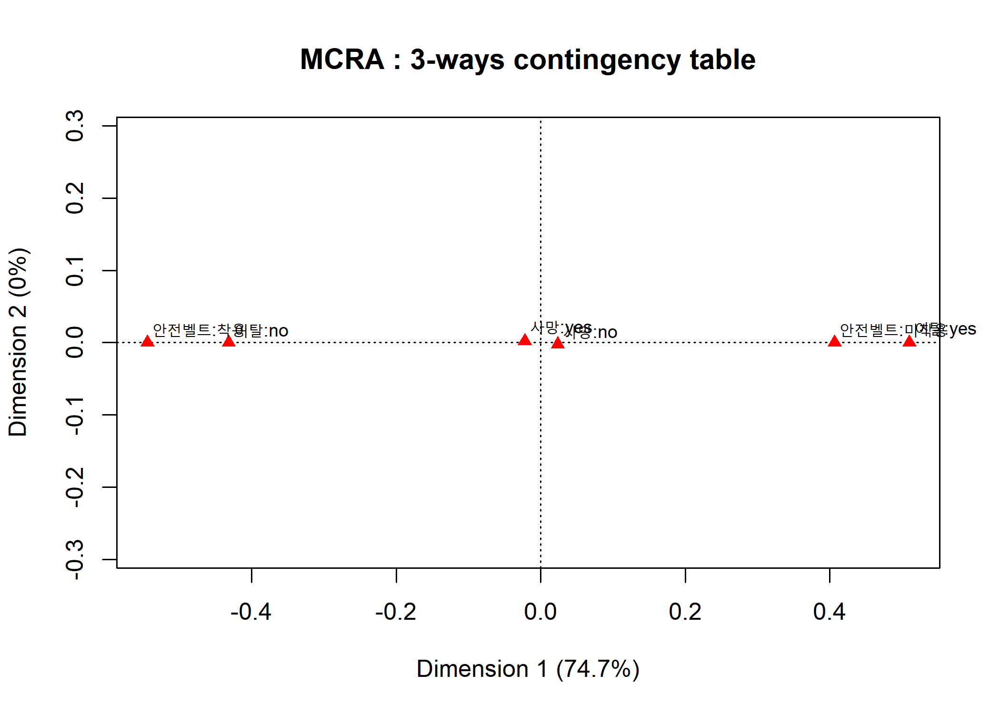
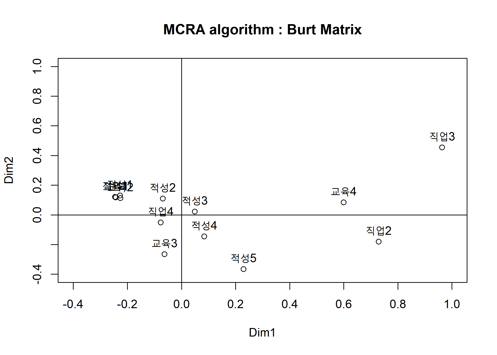
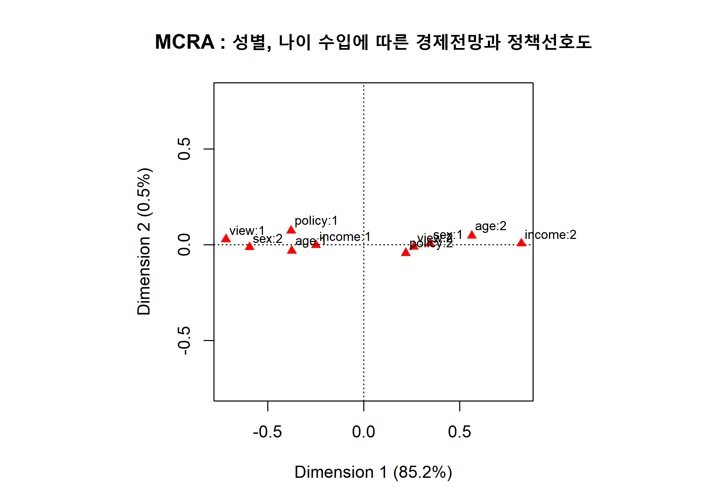

Multiple Correspondence Analysis practice
================
Jae Kwan Koo

-   [Correspondence Analysis(CRA) : Multiple CRA](#correspondence-analysiscra-multiple-cra)
    -   [1. The following data are the three-way table for the car accident record on the highway depending on whether the safety belt is worn.](#the-following-data-are-the-three-way-table-for-the-car-accident-record-on-the-highway-depending-on-whether-the-safety-belt-is-worn.)
        -   [(1) Explain category variables and classification variables in \[Table 1\].](#explain-category-variables-and-classification-variables-in-table-1.)
        -   [(2) Make a data form of classification variables from \[Table 1\].](#make-a-data-form-of-classification-variables-from-table-1.)
        -   [(3) Apply multiple CRA to the data in (2).](#apply-multiple-cra-to-the-data-in-2.)
        -   [(4) Describe some associations between categorical variables in the multiple CRA map.](#describe-some-associations-between-categorical-variables-in-the-multiple-cra-map.)
    -   [apitude.txt](#apitude.txt)
        -   [MCRA](#mcra)
        -   [CRA map.](#cra-map.)
    -   [3. Consider the \[Data 8.5.1\] (view.txt) Economic Outlook and Economic Policy Preference Survey Data.](#consider-the-data-8.5.1-view.txt-economic-outlook-and-economic-policy-preference-survey-data.)
        -   [(1) Apply multiple CRA to the data](#apply-multiple-cra-to-the-data)
        -   [(2) Describe some associations between categorical variables in the multiple CRA map.](#describe-some-associations-between-categorical-variables-in-the-multiple-cra-map.-1)

Correspondence Analysis(CRA) : Multiple CRA
-------------------------------------------

### 1. The following data are the three-way table for the car accident record on the highway depending on whether the safety belt is worn.

#### (1) Explain category variables and classification variables in \[Table 1\].

-   categorical variables : 안전벨트, 이탈, 사망
-   classification variables : 착용/미착용, 예/아니오, 예/아니오

#### (2) Make a data form of classification variables from \[Table 1\].

``` r
accident <-array(c(14,497,483,100,1,462,411,157),    
                 dim=c(2, 2, 2), 
                 dimnames=list(안전벨트 = c("착용", "미착용"),
                               이탈 = c("yes", "no"),
                               사망 = c("yes", "no")))

accident
```

    ## , , 사망 = yes
    ## 
    ##         이탈
    ## 안전벨트 yes  no
    ##   착용    14 483
    ##   미착용 497 100
    ## 
    ## , , 사망 = no
    ## 
    ##         이탈
    ## 안전벨트 yes  no
    ##   착용     1 411
    ##   미착용 462 157

3-ways contingency table을 형성하였다.

#### (3) Apply multiple CRA to the data in (2).

``` r
library(ca)
mjca(accident)
```

    ## 
    ##  Eigenvalues:
    ##            1        2    
    ## Value      0.147308 2e-06
    ## Percentage 74.75%   0%   
    ## 
    ## 
    ##  Columns:
    ##         안전벨트:미착용 안전벨트:착용   이탈:no 이탈:yes   사망:no
    ## Mass           0.190745      0.142588  0.180549 0.152784  0.161725
    ## ChiDist        0.629616      0.842259  0.669315 0.790946  0.595732
    ## Inertia        0.075615      0.101152  0.080883 0.095581  0.057396
    ## Dim. 1         1.059518     -1.417352 -1.124677 1.329058  0.061194
    ## Dim. 2        -0.034830      0.046593 -0.114342 0.135121 -1.779101
    ##          사망:yes
    ## Mass     0.171608
    ## ChiDist  0.561426
    ## Inertia  0.054091
    ## Dim. 1  -0.057670
    ## Dim. 2   1.676648

제1축과 제2축의 설명력은 각각 74.75%과 0%이다.
제1축으로도 충분히 범주변수의 대응관계를 보여줄 수 있다.

#### (4) Describe some associations between categorical variables in the multiple CRA map.

``` r
plot(mjca(accident),main="MCRA : 3-ways contingency table")
```



제 1축의 왼편에 안전벨트를 착용한 경우 이탈이 일어나지 않았고, 오른편에 안전벨트를 미착용했을시 이탈은 일어났다. 사망에 대한 범주변수는 여기서 정확히 설명하기 힘들다.

### apitude.txt

#### MCRA

``` r
setwd("D:\\Jae Kwan\\3학년2학기\\다변량2\\191128 다변량실습\\Rdata")
apitude_burt<-read.table("apitude.txt",header=T)

B<-as.matrix(apitude_burt)

P <- B / sum(B)
cm <- apply(P, 2, sum)  #apply(object, direction, function)#
Dc<-diag(1/sqrt(cm))    #direction: 1(행방향), 2(열방향)#
eP <- cm %*% t(cm)
Y <- (P - eP) / sqrt(eP)


# Singular Value Decomposition
svd.Y<-svd(Y)
V<-svd.Y$v
Dl<-diag((svd.Y$d)^2)

lam<-(svd.Y$d)^2
fit<-lam/sum(lam)*100
rbind(round(lam, 3),round(fit, 3))
```

    ##        [,1]   [,2]   [,3]  [,4]  [,5]  [,6]  [,7]  [,8]  [,9] [,10] [,11]
    ## [1,]  0.273  0.148  0.126 0.116 0.112 0.109 0.104 0.093 0.082 0.024     0
    ## [2,] 23.039 12.500 10.620 9.779 9.425 9.160 8.799 7.810 6.885 1.983     0
    ##      [,12] [,13]
    ## [1,]     0     0
    ## [2,]     0     0

``` r
Cb<- Dc%*%V%*%Dl
rownames(Cb)<-colnames(apitude_burt)

Cb2<-Cb[, 1:2]
Cb2
```

    ##              [,1]        [,2]
    ## 교육1 -0.24275450  0.11799191
    ## 교육2 -0.22574360  0.11321747
    ## 교육3 -0.06306682 -0.26602887
    ## 교육4  0.59979570  0.08359625
    ## 적성1 -0.22720684  0.13062126
    ## 적성2 -0.06906785  0.10974704
    ## 적성3  0.04903160  0.02106607
    ## 적성4  0.08463271 -0.14601324
    ## 적성5  0.22930848 -0.36580175
    ## 직업1 -0.24599999  0.12024326
    ## 직업2  0.72887452 -0.18158516
    ## 직업3  0.96369167  0.45393605
    ## 직업4 -0.07663831 -0.05170930

이 데이터는 2차 세계대전 중 미국공군 지원자들이 치룬 적성시험 결과와 10년간 추적을 통하여 교육수준과 직업을 조사한 자료에 대한 버트행렬이다.
세 개의 범주변수는 버트표의 열에 따라 교육수준(1=낮음, 2, 3, 4=높음), 적성수준(1=낮음, 2, 3, 4, 5=높음), 직업수준(1=자영업, 2=전문직, 3=교육직, 4=월급직)을 갖는다.

dim1과 dim2는 각각 23.039%, 12.5%의 설명력을 갖는다.

#### CRA map.

``` r
lim<-range(pretty(Cb))

plot(Cb2, xlab="Dim1", ylab="Dim2", xlim=lim, ylim=lim, main="MCRA algorithm : Burt Matrix")
text(Cb2, colnames(apitude_burt), pos=3, col=1)
abline(v=0, h=0)
```



dim1을 기준으로 오른편에는 (적성5,교육4,직업2~3)이 대응된다. 이는 적성수준이 높은 범주와 교육수준이 높은 범주, 직업이 전문직, 교육직인 범주에 대응한다. 또한, 교육수준이 3으로 중간정도인 경우 적성수준도 중간정도이고 직업은 월급직에 대응되었다.

### 3. Consider the \[Data 8.5.1\] (view.txt) Economic Outlook and Economic Policy Preference Survey Data.

#### (1) Apply multiple CRA to the data

``` r
setwd("D:\\Jae Kwan\\3학년2학기\\다변량2\\191128 다변량실습\\Rdata")
view<-read.table("view.txt",header=T)

view<-view[,-1]
head(view)
```

    ##   sex age income view policy
    ## 1   1   2      2    2      2
    ## 2   1   1      1    1      2
    ## 3   2   1      1    1      1
    ## 4   1   2      2    2      2
    ## 5   2   1      1    2      2
    ## 6   1   2      1    2      1

``` r
library(ca)
mjca(view)
```

    ## 
    ##  Eigenvalues:
    ##            1        2       
    ## Value      0.178447 0.001018
    ## Percentage 85.18%   0.49%   
    ## 
    ## 
    ##  Columns:
    ##            sex:1     sex:2     age:1    age:2  income:1 income:2    view:1
    ## Mass    0.126667  0.073333  0.120000 0.080000  0.153333 0.046667  0.053333
    ## ChiDist 0.465567  0.804162  0.528152 0.792229  0.341826 1.123143  0.998656
    ## Inertia 0.027455  0.047423  0.033473 0.050210  0.017916 0.058868  0.053190
    ## Dim. 1  0.815374 -1.408374 -0.888077 1.332115 -0.591738 1.944283 -1.701435
    ## Dim. 2  0.230783 -0.398625 -0.984092 1.476138 -0.068827 0.226146  0.906130
    ##            view:2  policy:1  policy:2
    ## Mass     0.146667  0.073333  0.126667
    ## ChiDist  0.363147  0.718208  0.415804
    ## Inertia  0.019342  0.037827  0.021900
    ## Dim. 1   0.618704 -0.896624  0.519098
    ## Dim. 2  -0.329502  2.329320 -1.348553

dim1과 dim2는 각각 85.18%와 0.49%의 설명력을 가지고 있다. dim1으로도 충분히 범주변수들을 설명할 수 있다.

#### (2) Describe some associations between categorical variables in the multiple CRA map.

``` r
par(pty="s")
plot(mjca(view), main="MCRA : 성별, 나이 수입에 따른 경제전망과 정책선호도")
```



-   제1축과 2축의 설명력은 각각 85.2%와 0.5%이다. 제1축만으로도 충분히 범주변수의 대응관계를 보여줄 수 있다.
-   제1축의 왼편에 연령(age:1)과 수입(income:1)이 낮은 여성(sex:2)들이 경제전망을 낙관(view:1)하고 정부의 경제정책을 찬성(policy:1)하고 있다.
-   제1축의 오른편에는 연령(age:2)과 수입(income:2)이 높은 남성(sex:1)들이 경제전망을 비판(view:2)하고 경제정책을 반대(policy:2)하고 있음을 보여주고 있다.
