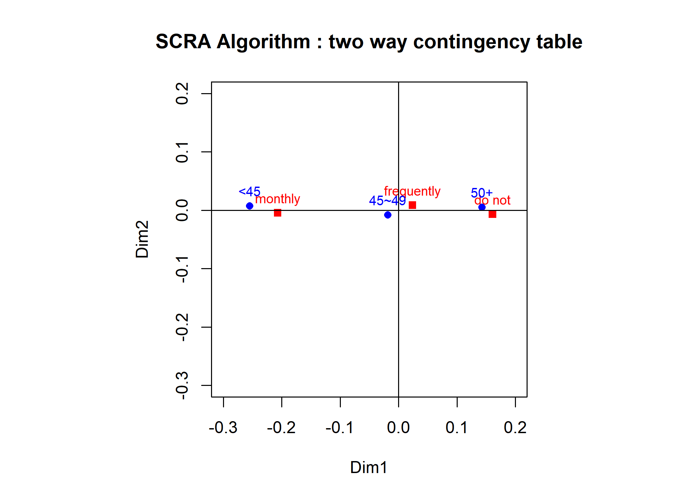
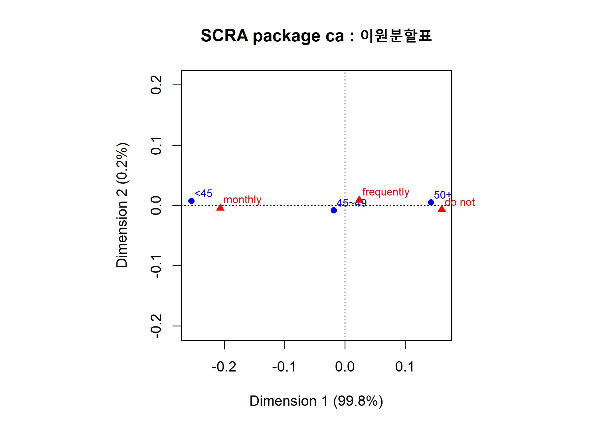
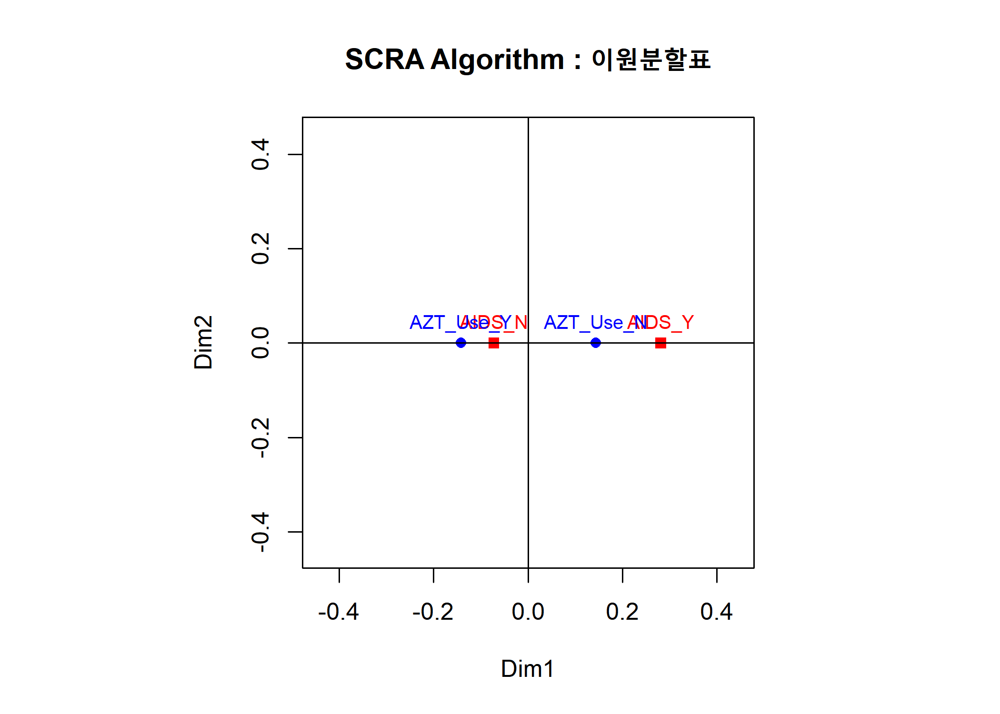

Simple Correspondence Analysis practice
================
Jae Kwan Koo

-   [Correspondence Analysis(CRA)](#correspondence-analysiscra)
    -   [1. two-way table of the frequency and age of women's breast diagnosis](#two-way-table-of-the-frequency-and-age-of-womens-breast-diagnosis)
        -   [(1) Make a null hypothesis for \[Table 1\] and apply the Chi-square test for this null hypothesis.](#make-a-null-hypothesis-for-table-1-and-apply-the-chi-square-test-for-this-null-hypothesis.)
        -   [(2) Apply the simple CRA according to the Simple CRA algorithm](#apply-the-simple-cra-according-to-the-simple-cra-algorithm)
        -   [(3) Obtain and interpret the simple CRA Plot.](#obtain-and-interpret-the-simple-cra-plot.)
        -   [(4) Apply the simple CRA using the function ca() of R's library(ca).](#apply-the-simple-cra-using-the-function-ca-of-rs-libraryca.)
    -   [2. Consider a three-way table for AIDS Symptoms by AZT Use and Race.](#consider-a-three-way-table-for-aids-symptoms-by-azt-use-and-race.)
        -   [(1) Make a null hypothesis for \[Table 2\] and test this null hypothesis.](#make-a-null-hypothesis-for-table-2-and-test-this-null-hypothesis.)
        -   [(2) Consider a 2-ways table from \[Table 2\].](#consider-a-2-ways-table-from-table-2.)
        -   [(3) Make a null hypothesis and apply the Chi-square test.](#make-a-null-hypothesis-and-apply-the-chi-square-test.)
        -   [(4) Obtain and interpret the simple CRA Plot.](#obtain-and-interpret-the-simple-cra-plot.-1)

Correspondence Analysis(CRA)
============================

1. two-way table of the frequency and age of women's breast diagnosis
---------------------------------------------------------------------

### (1) Make a null hypothesis for \[Table 1\] and apply the Chi-square test for this null hypothesis.

``` r
O<-matrix(c(91, 90, 51, 
            150, 200, 155,            
            109, 198, 172), byrow=T, nrow=3)
O<-data.frame(O)

colnames(O) <- c("monthly", "frequently", "do not")
rownames(O) <- c("~44", "45~49", "50~")

O
```

    ##       monthly frequently do not
    ## ~44        91         90     51
    ## 45~49     150        200    155
    ## 50~       109        198    172

위의 표는 table1에 해당하는 2-way contingency table이다.

``` r
chisq.test(O)
```

    ## 
    ##  Pearson's Chi-squared test
    ## 
    ## data:  O
    ## X-squared = 25.086, df = 4, p-value = 4.835e-05

H0 : 두 범주형 변수는 독립이다.
유의확률이 거의 0이므로 매우작은 유의수준에 대해서도 귀무가설을 기각할 수 있다. 따라서, 유방 자가 진단 빈도와 나이는 서로 독립이 아니다.

### (2) Apply the simple CRA according to the Simple CRA algorithm

``` r
f <- O/sum(O)

#행과 열의 주변 합
r <- apply(f,1,sum)  
c <- apply(f,2,sum)  

#행과 열의 주변 비율
Dr<- diag(1/sqrt(r))
Dc<- diag(1/sqrt(c))

cF<- f-r%*%t(c) 
cF<-as.matrix(cF); str(cF)
```

    ##  num [1:3, 1:3] 0.01992 0.00382 -0.02374 -0.00255 -0.00219 ...
    ##  - attr(*, "dimnames")=List of 2
    ##   ..$ : chr [1:3] "~44" "45~49" "50~"
    ##   ..$ : chr [1:3] "monthly" "frequently" "do not"

``` r
Y <- Dr%*%(cF)%*%Dc

svd.Y <- svd(Y)
U <- svd.Y$u
V <- svd.Y$v
D <- diag(svd.Y$d)


options("scipen" = 100)
eig <- (svd.Y$d)^2
per <- eig/sum(eig)*100
gof <- sum(per[1:2])  #2dimensional goodness of fit

data.frame(per=round(per, 3),eig=round(eig, 3))
```

    ##      per   eig
    ## 1 99.759 0.021
    ## 2  0.241 0.000
    ## 3  0.000 0.000

dim 1축만으로 이미 거의 대부분을 설명할 수 있을 정도의 설명력을 가지고 있다.
dim1의 설명력은 99.759, dim2의 설명력은 0.241이다.

### (3) Obtain and interpret the simple CRA Plot.

``` r
A <- (Dr%*%U%*%D)[,1:2]
B <- (Dc%*%V%*%D)[,1:2]
rownames(A) <- c("<45", "45~49", "50+")
rownames(B) <- c("monthly", "frequently", "do not")

par(pty="s") # s : 가로, 세로 비율 같도록 지정.
lim <-range(pretty(A))

plot(B[, 1:2], xlab="Dim1",ylab="Dim2", xlim=lim,ylim=lim, pch=15,col=2,
     main="SCRA Algorithm : two way contingency table")
text(B[, 1:2],rownames(B),cex=0.8,col=2,pos=3)
points(A[, 1:2],pch=16, col=4)
text(A[, 1:2],rownames(A),cex=0.8,pos=3, col=4)
abline(v=0,h=0)
```



45세 미만의 사람들은 매달 검진, 45~49세는 주기적으로 검진 50세 이상은 하지 않음과 서로 대응한다. 따라서 45세 미만일수록 검진을 자주하는 것 같다.

### (4) Apply the simple CRA using the function ca() of R's library(ca).

``` r
O<-matrix(c(91, 90, 51, 
            150, 200, 155,            
            109, 198, 172), byrow=T, nrow=3)
O<-data.frame(O)
rownames(O)<-c("<45", "45~49", "50+")
colnames(O)<-c("monthly", "frequently", "do not")


library(ca)
sca<-ca(O)
sca
```

    ## 
    ##  Principal inertias (eigenvalues):
    ##            1       2      
    ## Value      0.02058 0.00005
    ## Percentage 99.76%  0.24%  
    ## 
    ## 
    ##  Rows:
    ##               <45     45~49      50+
    ## Mass     0.190789  0.415296 0.393914
    ## ChiDist  0.254909  0.020323 0.143053
    ## Inertia  0.012397  0.000172 0.008061
    ## Dim. 1  -1.776152 -0.129238 0.996519
    ## Dim. 2   1.042431 -1.179499 0.738629
    ## 
    ## 
    ##  Columns:
    ##           monthly frequently    do not
    ## Mass     0.287829   0.401316  0.310855
    ## ChiDist  0.206890   0.025276  0.160957
    ## Inertia  0.012320   0.000256  0.008053
    ## Dim. 1  -1.441839   0.165831  1.120947
    ## Dim. 2  -0.628797   1.210084 -0.980005

simple correspondence analysis는 R함수 `ca()`를 활용할 수 있다.
앞선 결과와 마찬가지로 1축으로 대부분을 설명가능하다.

``` r
par(pty="s")
plot(sca, main="SCRA package ca : 이원분할표")
```



2. Consider a three-way table for AIDS Symptoms by AZT Use and Race.
--------------------------------------------------------------------

### (1) Make a null hypothesis for \[Table 2\] and test this null hypothesis.

``` r
data <-array(c(14,32,93,81,11,12,52,43),    
                 dim=c(2, 2, 2), 
                 dimnames=list(race=c("white", "black"),
                               AIDS_Symptoms =c("yes", "no"),
                               AZT_Use =c("yes", "no")))
data
```

    ## , , AZT_Use = yes
    ## 
    ##        AIDS_Symptoms
    ## race    yes no
    ##   white  14 93
    ##   black  32 81
    ## 
    ## , , AZT_Use = no
    ## 
    ##        AIDS_Symptoms
    ## race    yes no
    ##   white  11 52
    ##   black  12 43

``` r
mantelhaen.test(data)  # 3-ways 
```

    ## 
    ##  Mantel-Haenszel chi-squared test with continuity correction
    ## 
    ## data:  data
    ## Mantel-Haenszel X-squared = 6.0799, df = 1, p-value = 0.01367
    ## alternative hypothesis: true common odds ratio is not equal to 1
    ## 95 percent confidence interval:
    ##  0.2818621 0.8414208
    ## sample estimates:
    ## common odds ratio 
    ##         0.4869955

유의수준 0.05에서 3개의 범주형 변수들은 독립이 아니다.
즉, AZT\_USE, AIDS\_SYMPTOMS, RACE변수는 연관이 있다.

### (2) Consider a 2-ways table from \[Table 2\].

``` r
data2<-array(c(25,44,145,124),    
             dim=c(2, 2), 
             dimnames=list(AZT_Use =c("yes", "no"),
                           AIDS_Symptoms =c("yes", "no")))


data2<-matrix(c(25,44,145,124),byrow=F,ncol=2)
rownames(data2)<-c("AZT_Use_Y","AZT_Use_N")
colnames(data2)<-c("AIDS_Y","AIDS_N")

data2
```

    ##           AIDS_Y AIDS_N
    ## AZT_Use_Y     25    145
    ## AZT_Use_N     44    124

race변수를 제외한 2-way만 생각해보자.

### (3) Make a null hypothesis and apply the Chi-square test.

``` r
chisq.test(data2)
```

    ## 
    ##  Pearson's Chi-squared test with Yates' continuity correction
    ## 
    ## data:  data2
    ## X-squared = 6.171, df = 1, p-value = 0.01299

유의수준 0.05에서 귀무가설을 기각한다. 즉, AZT\_USE와 AIDS는 연관이 있다.

### (4) Obtain and interpret the simple CRA Plot.

``` r
O<-matrix(c(25,44,145,124),byrow=F,ncol=2)
O<-data.frame(O)
rownames(O)<-c("AZT_Use_Y","AZT_Use_N")
colnames(O)<-c("AIDS_Y","AIDS_N")

f <- O/sum(O)

#행과 열의 주변 합
r <- apply(f,1,sum)  
c <- apply(f,2,sum)  

#행과 열의 주변 비율
Dr<- diag(1/sqrt(r))
Dc<- diag(1/sqrt(c))


cF<- f-r%*%t(c) 
cF<-as.matrix(cF); str(cF)
```

    ##  num [1:2, 1:2] -0.0287 0.0287 0.0287 -0.0287
    ##  - attr(*, "dimnames")=List of 2
    ##   ..$ : chr [1:2] "AZT_Use_Y" "AZT_Use_N"
    ##   ..$ : chr [1:2] "AIDS_Y" "AIDS_N"

``` r
Y <- Dr%*%(cF)%*%Dc

svd.Y <- svd(Y)
U <- svd.Y$u
V <- svd.Y$v
D <- diag(svd.Y$d)


options("scipen" = 100)
eig <- (svd.Y$d)^2
per <- eig/sum(eig)*100
gof <- sum(per[1:2])  #2차원 gof

data.frame(per=round(per, 3),eig=round(eig, 3))
```

    ##   per  eig
    ## 1 100 0.02
    ## 2   0 0.00

``` r
A <- (Dr%*%U%*%D)[,1:2]
B <- (Dc%*%V%*%D)[,1:2]
rownames(A) <-c("AZT_Use_Y","AZT_Use_N")
rownames(B) <-c("AIDS_Y","AIDS_N")


par(pty="s") # s : 가로, 세로 비율 같도록 지정.

lim <-c(min(A)-0.3,max(A)+0.3)

plot(B[, 1:2], xlab="Dim1",ylab="Dim2", xlim=lim,ylim=lim, pch=15,col=2,
     main="SCRA Algorithm : 이원분할표")
text(B[, 1:2],rownames(B),cex=0.8,col=2,pos=3)
points(A[, 1:2],pch=16, col=4)
text(A[, 1:2],rownames(A),cex=0.8,pos=3, col=4)
abline(v=0,h=0)
```



(AZT\_USE가 NO, AIDS가 YES), (AZT\_USE가 YES, AIDS가 NO)로 대응이 가능하다.
1축의 설명력이 100으로 한 축으로만으로도 완벽하게 설명이 가능하다.
AZT\_USE를 하지않는 사람들은 AIDS를 한 것으로 생각할 수 있다.
