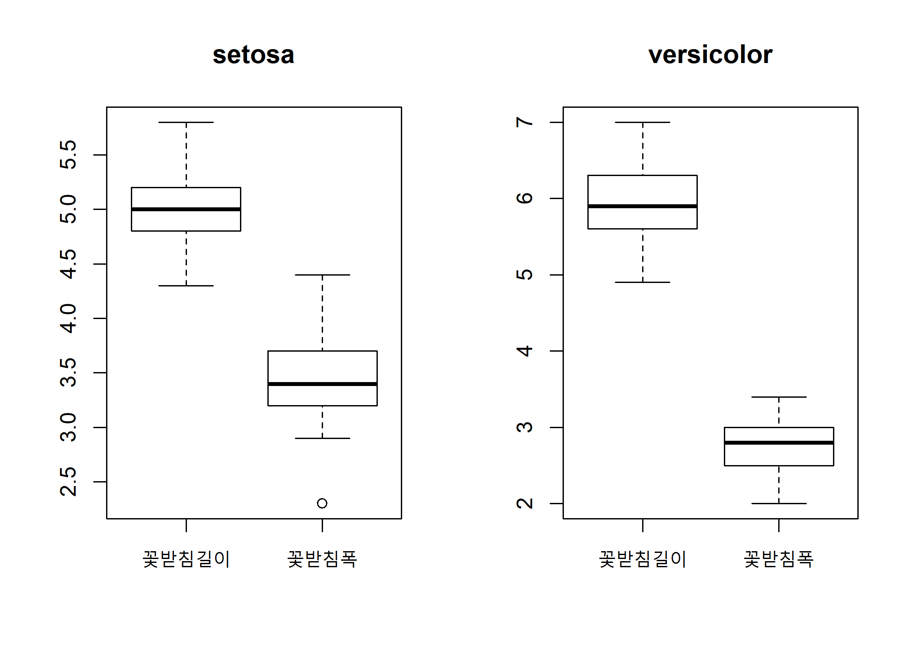
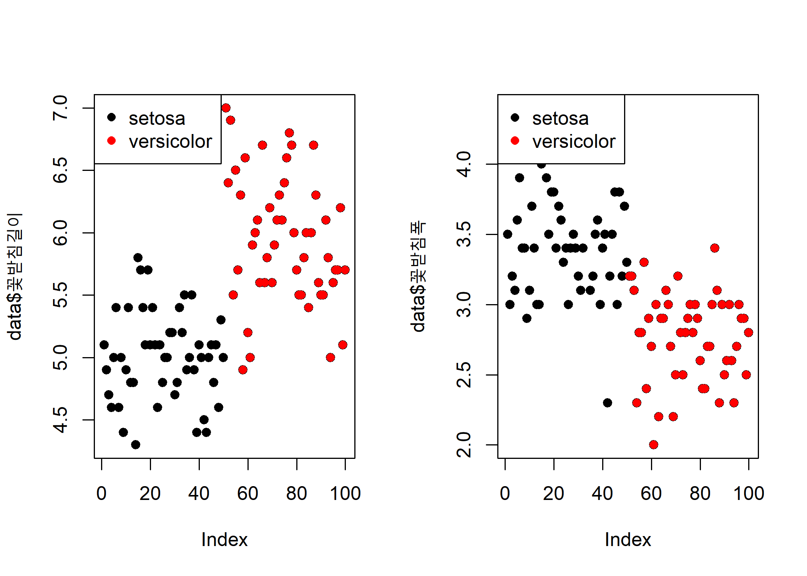
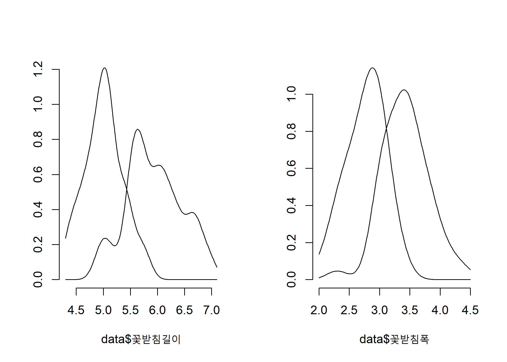

Discriminant and Classification analysis(DCA) - (1)
================
Jae Kwan Koo

-   [Ready for analysis](#ready-for-analysis)
    -   [library](#library)
    -   [Set the working directory](#set-the-working-directory)
    -   [Import the data](#import-the-data)
-   [EDA](#eda)
-   [MVN](#mvn)
-   [setosa, versicolor 다중 산점도.](#setosa-versicolor-다중-산점도.)
-   [변수별 확률밀도함수](#변수별-확률밀도함수)
-   [두 군집 공분산행렬의 동질성](#두-군집-공분산행렬의-동질성)
-   [QDA](#qda)

### Ready for analysis

#### library

``` r
library(tidyverse) # for data handling
library(MASS) # for ldahist() function
library(MVN) # for multivariate normality test
```

#### Set the working directory

``` r
getwd()
```

    ## [1] "D:/Jae Kwan/R프로그래밍/Multivariate analysis"

``` r
setwd("D:\\Jae Kwan\\R프로그래밍\\Multivariate Analysis")
```

#### Import the data

``` r
data<-read.table("setosaversicolor.txt",header=T)
head(data)
```

    ##   꽃받침길이 꽃받침폭   종류
    ## 1        5.1      3.5 setosa
    ## 2        4.9      3.0 setosa
    ## 3        4.7      3.2 setosa
    ## 4        4.6      3.1 setosa
    ## 5        5.0      3.6 setosa
    ## 6        5.4      3.9 setosa

setosa와 versicolor가 있는 꽃에 대한 데이터셋이다.

### EDA

``` r
str(data)
```

    ## 'data.frame':    100 obs. of  3 variables:
    ##  $ 꽃받침길이: num  5.1 4.9 4.7 4.6 5 5.4 4.6 5 4.4 4.9 ...
    ##  $ 꽃받침폭  : num  3.5 3 3.2 3.1 3.6 3.9 3.4 3.4 2.9 3.1 ...
    ##  $ 종류      : Factor w/ 2 levels "setosa","versicolor": 1 1 1 1 1 1 1 1 1 1 ...

데이터의 구조와 변수들의 type, levels 등을 알 수 있다.

``` r
summary(data)
```

    ##    꽃받침길이       꽃받침폭             종류   
    ##  Min.   :4.300   Min.   :2.000   setosa    :50  
    ##  1st Qu.:5.000   1st Qu.:2.800   versicolor:50  
    ##  Median :5.400   Median :3.050                  
    ##  Mean   :5.471   Mean   :3.099                  
    ##  3rd Qu.:5.900   3rd Qu.:3.400                  
    ##  Max.   :7.000   Max.   :4.400

요약정보는 위와 같다.

``` r
setosa<-subset(data,data$종류=='setosa',select=c("꽃받침길이","꽃받침폭"))
versicolor<-subset(data,data$종류=='versicolor',select=c("꽃받침길이","꽃받침폭"))
```

분석을 위해 종류별로 데이터를 분리하였고, 종류 column을 제외한 변수들만 선택하였다.

``` r
par(mfrow=c(1,2))
boxplot(setosa, main="setosa"); boxplot(versicolor, main="versicolor")
```



versicolor가 setosa보다는 꽃받침길이가 길지만, 꽃받침폭은 좁다.

### MVN

``` r
(result_setosa<-mvn(setosa))
```

    ## $multivariateNormality
    ##              Test          Statistic           p value Result
    ## 1 Mardia Skewness  0.759503524380438 0.943793240544741    YES
    ## 2 Mardia Kurtosis 0.0934600553610254 0.925538081956867    YES
    ## 3             MVN               <NA>              <NA>    YES
    ## 
    ## $univariateNormality
    ##           Test   Variable Statistic   p value Normality
    ## 1 Shapiro-Wilk 꽃받침길이    0.9777    0.4595    YES   
    ## 2 Shapiro-Wilk  꽃받침폭     0.9717    0.2715    YES   
    ## 
    ## $Descriptives
    ##             n  Mean   Std.Dev Median Min Max 25th  75th       Skew
    ## 꽃받침길이 50 5.006 0.3524897    5.0 4.3 5.8  4.8 5.200 0.11297784
    ## 꽃받침폭   50 3.428 0.3790644    3.4 2.3 4.4  3.2 3.675 0.03872946
    ##              Kurtosis
    ## 꽃받침길이 -0.4508724
    ## 꽃받침폭    0.5959507

첨도와 왜도로부터 다변량정규성 검정을 실행했을 시, setosa는 다변량 정규성을 만족한다.

``` r
(result_versicolor<-mvn(versicolor))
```

    ## $multivariateNormality
    ##              Test         Statistic           p value Result
    ## 1 Mardia Skewness  1.76081423820927 0.779643267719773    YES
    ## 2 Mardia Kurtosis -0.90648685799867 0.364678217772254    YES
    ## 3             MVN              <NA>              <NA>    YES
    ## 
    ## $univariateNormality
    ##           Test   Variable Statistic   p value Normality
    ## 1 Shapiro-Wilk 꽃받침길이    0.9778    0.4647    YES   
    ## 2 Shapiro-Wilk  꽃받침폭     0.9741    0.3380    YES   
    ## 
    ## $Descriptives
    ##             n  Mean   Std.Dev Median Min Max  25th 75th        Skew
    ## 꽃받침길이 50 5.936 0.5161711    5.9 4.9 7.0 5.600  6.3  0.09913926
    ## 꽃받침폭   50 2.770 0.3137983    2.8 2.0 3.4 2.525  3.0 -0.34136443
    ##              Kurtosis
    ## 꽃받침길이 -0.6939138
    ## 꽃받침폭   -0.5493203

위와 마찬가지이다.

### setosa, versicolor 다중 산점도.

``` r
par(mfrow=c(1,2))

plot(data$꽃받침길이)
points(data$꽃받침길이,pch=16,col=as.numeric(data$종류))
legend("topleft",pch=16, col=1:2, legend=unique(data$종류))


plot(data$꽃받침폭)
points(data$꽃받침폭,pch=16,col=as.numeric(data$종류))
legend("topleft",pch=16, col=1:2, legend=unique(data$종류))
```



boxplot과 같이 versicolor는 setosa보다 꽃받침길이는 길지만, 꼭받침폭은 좁은 모습을 보인다.

### 변수별 확률밀도함수

``` r
par(mfrow=c(1,2))

ldahist(data=data$꽃받침길이,g=data$종류,type='density')   # MASS package for ldahist
ldahist(data=data$꽃받침폭,g=data$종류,type='density')
```



일변량 관점에서 각 변수별 확률밀도함수를 보면 군집 간에 중심이 차이를 보이며 분산은 변수 꽃받침의 길이에서 두 군집 간에 큰 차이를 보이고 있다.

### 두 군집 공분산행렬의 동질성

``` r
library(biotools)
```

    ## ---
    ## biotools version 3.1

``` r
group<-data$종류
biotools::boxM(data[,1:2],group)
```

    ## 
    ##  Box's M-test for Homogeneity of Covariance Matrices
    ## 
    ## data:  data[, 1:2]
    ## Chi-Sq (approx.) = 19.749, df = 3, p-value = 0.0001913

``` r
boxM
```

    ## function (data, grouping) 
    ## {
    ##     if (!inherits(data, c("data.frame", "matrix"))) 
    ##         stop("'data' must be a numeric data.frame or matrix!")
    ##     if (length(grouping) != nrow(data)) 
    ##         stop("incompatible dimensions!")
    ##     dname <- deparse(substitute(data))
    ##     data <- as.matrix(data)
    ##     grouping <- as.factor(as.character(grouping))
    ##     p <- ncol(data)
    ##     nlev <- nlevels(grouping)
    ##     lev <- levels(grouping)
    ##     dfs <- tapply(grouping, grouping, length) - 1
    ##     if (any(dfs < p)) 
    ##         warning("there are one or more levels with less observations than variables!")
    ##     mats <- aux <- list()
    ##     for (i in 1:nlev) {
    ##         mats[[i]] <- cov(data[grouping == lev[i], ])
    ##         aux[[i]] <- mats[[i]] * dfs[i]
    ##     }
    ##     names(mats) <- lev
    ##     pooled <- Reduce("+", aux)/sum(dfs)
    ##     logdet <- log(unlist(lapply(mats, det)))
    ##     minus2logM <- sum(dfs) * log(det(pooled)) - sum(logdet * 
    ##         dfs)
    ##     sum1 <- sum(1/dfs)
    ##     Co <- (((2 * p^2) + (3 * p) - 1)/(6 * (p + 1) * (nlev - 1))) * 
    ##         (sum1 - (1/sum(dfs)))
    ##     X2 <- minus2logM * (1 - Co)
    ##     dfchi <- (choose(p, 2) + p) * (nlev - 1)
    ##     pval <- pchisq(X2, dfchi, lower.tail = FALSE)
    ##     out <- structure(list(statistic = c(`Chi-Sq (approx.)` = X2), 
    ##         parameter = c(df = dfchi), p.value = pval, cov = mats, 
    ##         pooled = pooled, logDet = logdet, data.name = dname, 
    ##         method = " Box's M-test for Homogeneity of Covariance Matrices"), 
    ##         class = c("htest", "boxM"))
    ##     return(out)
    ## }
    ## <bytecode: 0x0000000027edb010>
    ## <environment: namespace:biotools>

p-value는 유의수준 0.05보다 훨씬 작다. 따라서, 두 집단의 분산이 동일하다는 귀무가설을 기각한다. 즉, 두 집단의 공분산은 같지 않다고 말할 수 있다.
두 군집의 공분산행렬이 서로 다른 경우에는 분류규칙은 두 군집의 정규확률밀도함수의 비에서 각 군집의 공분산행렬이 존재하게 되어 매우 복잡한 형태의 분류규칙이 유도된다.

### QDA

``` r
QDA<-qda(종류~꽃받침길이+꽃받침폭, data=data,prior=c(1,1)/2)

QDA
```

    ## Call:
    ## qda(종류 ~ 꽃받침길이 + 꽃받침폭, data = data, prior = c(1, 1)/2)
    ## 
    ## Prior probabilities of groups:
    ##     setosa versicolor 
    ##        0.5        0.5 
    ## 
    ## Group means:
    ##            꽃받침길이 꽃받침폭
    ## setosa          5.006    3.428
    ## versicolor      5.936    2.770

공분산행렬의 동질성이 만족되지 않으므로 이차판별함수를 이용한다.
사전확률은 여기선 같게 두겠다.

이차분류규칙은 자료의 크기와 다변량 정규분포의 가정에 매우 민감하다는 단점을 가지고 있다.
특히, 자료의 크기가 작은 경우 공분산행렬의 추정에 영향을 주게 되어 이차분류규칙을 적용할 때, 주의가 따른다.

더불어 정규분포를 따르지 않는 자료의 경우에는 다음 세 가지 방법이 가능하다.

-   변환을 통해 자료를 정규분포를 따르도록 한후 공분산행렬의 동질성 검정을 통해 선형분류규칙또는 이차분류규칙을 적용

-   모집단의 정규성 여부에 무관하게 선형분류규칙 또는 이차분류규칙을 적용한 후, 이들이 자료의 분류에 잘 들어맞는지를 검토

-   자료의 크기가 충분히 큰 경우 train, validation으로 나누어 전자로 판별함수를 만들고 후자로 이것의 분류규칙의 정도를 평가하는 cross-validation방법 고려.

``` r
pre<-predict(QDA,data[,1:2])$class

(contin_table<-table(group, pre))
```

    ##             pre
    ## group        setosa versicolor
    ##   setosa         49          1
    ##   versicolor      0         50

actual과 prediction에 대한 table이다. 1개만 분류가 잘 못 되어있음을 볼 수 있다.

``` r
cat("정분류율 : ",sum(diag(contin_table))/sum(contin_table) * 100,"%")
```

    ## 정분류율 :  99 %
