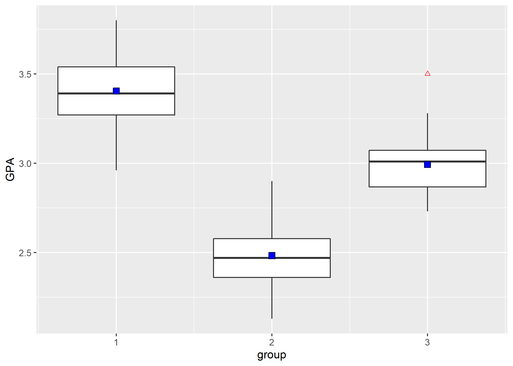
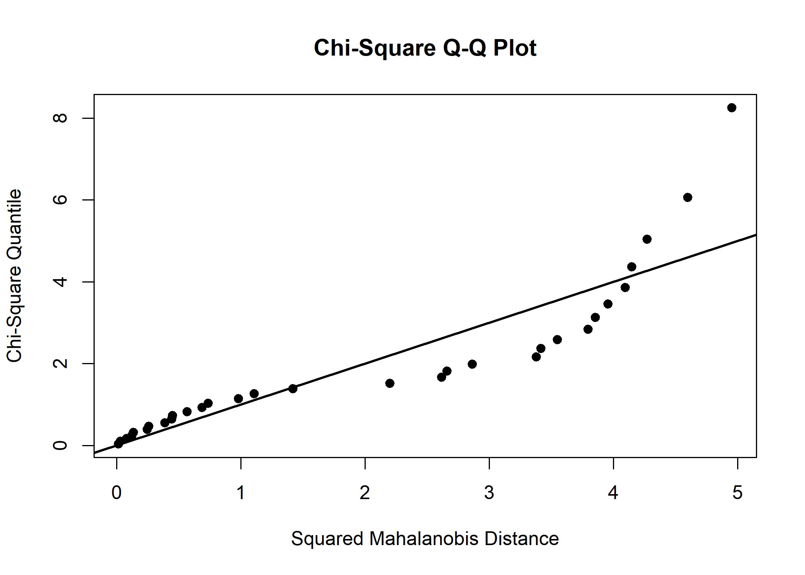
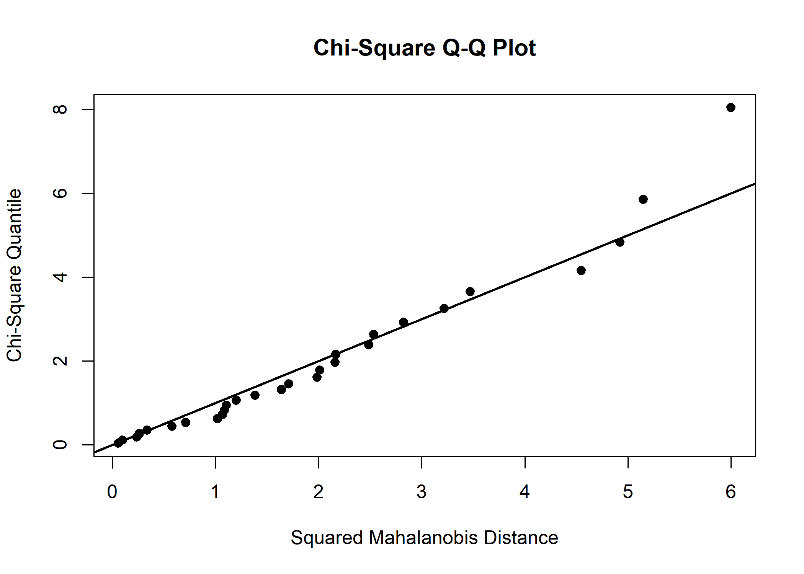
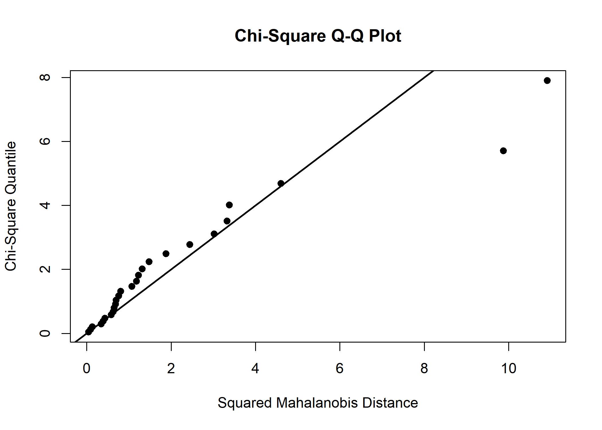

Discriminant and Classification analysis(DCA) - (1)
================
Jae Kwan Koo

-   [Import library, Set working directory](#import-library-set-working-directory)
-   [import the data.](#import-the-data.)
-   [1. In Data 6.12.2 (admission.txt) is the admission data for graduate school of business. The data are the GPA and GMAT scores of the three communities classified as acceptance, rejection, and boundary.](#in-data-6.12.2-admission.txt-is-the-admission-data-for-graduate-school-of-business.-the-data-are-the-gpa-and-gmat-scores-of-the-three-communities-classified-as-acceptance-rejection-and-boundary.)
    -   [(1) Compute the mean vector, covariance matrix, and joint covariance matrix of the three clusters.](#compute-the-mean-vector-covariance-matrix-and-joint-covariance-matrix-of-the-three-clusters.)
        -   [mean vector](#mean-vector)
        -   [covariance matrix](#covariance-matrix)
        -   [joint covariance matrix](#joint-covariance-matrix)
    -   [(2) Consider the homogeneity of the multivariate normal distribution and the covariance matrix of the three clustesr.](#consider-the-homogeneity-of-the-multivariate-normal-distribution-and-the-covariance-matrix-of-the-three-clustesr.)
        -   [multivariate normality](#multivariate-normality)
    -   [(3) (2) whether the joint covariance matrix obtained in (1) is necessary.](#whether-the-joint-covariance-matrix-obtained-in-1-is-necessary.)
        -   [box-M test](#box-m-test)
    -   [(4) Select LDA and QDA according to the results of (2).](#select-lda-and-qda-according-to-the-results-of-2.)

#### Import library, Set working directory

``` r
library(MASS)
library(MVN)
library(biotools)
```

    ## ---
    ## biotools version 3.1

다변량 정규성 검정을 위해 MVN패키지, 등분산검정을 위해 biotools패키지를 불러왔다.

``` r
setwd("D:\\Jae Kwan\\R프로그래밍\\Multivariate Analysis")
getwd()
```

    ## [1] "D:/Jae Kwan/R프로그래밍/Multivariate Analysis"

#### import the data.

``` r
data<-read.table("admission.txt",header = T)
head(data); tail(data)
```

    ##    GPA GMAT group
    ## 1 2.96  596     1
    ## 2 3.14  473     1
    ## 3 3.22  482     1
    ## 4 3.29  527     1
    ## 5 3.69  505     1
    ## 6 3.46  693     1

    ##     GPA GMAT group
    ## 80 3.03  438     3
    ## 81 3.05  399     3
    ## 82 2.85  483     3
    ## 83 3.01  453     3
    ## 84 3.03  414     3
    ## 85 3.04  446     3

그룹별로 GPA, GMAT이 열로 들어가 있는 모습이다.

``` r
g1<-subset(data,data$group==1,select = c("GPA","GMAT"))
g2<-subset(data,data$group==2,select = c("GPA","GMAT"))
g3<-subset(data,data$group==3,select = c("GPA","GMAT"))
```

그룹별로 데이터를 분리, 분류를 위해 select를 이용해 group변수는 제외하고 할당하였다.

1. In Data 6.12.2 (admission.txt) is the admission data for graduate school of business. The data are the GPA and GMAT scores of the three communities classified as acceptance, rejection, and boundary.
---------------------------------------------------------------------------------------------------------------------------------------------------------------------------------------------------------

### (1) Compute the mean vector, covariance matrix, and joint covariance matrix of the three clusters.

#### mean vector

``` r
tapply(data$GPA,data$group,mean)
```

    ##        1        2        3 
    ## 3.403871 2.482500 2.992692

``` r
tapply(data$GMAT,data$group,mean)
```

    ##        1        2        3 
    ## 561.2258 447.0714 446.2308

``` r
# same result
aggregate(data$GPA~data$group,data,mean)
```

    ##   data$group data$GPA
    ## 1          1 3.403871
    ## 2          2 2.482500
    ## 3          3 2.992692

``` r
aggregate(data$GMAT~data$group,data,mean)
```

    ##   data$group data$GMAT
    ## 1          1  561.2258
    ## 2          2  447.0714
    ## 3          3  446.2308

tapply또는 aggregate 함수 등으로 그룹별 평균벡터를 계산할 수 있다.
1 그룹의 GPA, GMAT평균이 다른 그룹보다 높음을 알 수 있다.

``` r
library(tidyverse)

data %>% ggplot(aes(x=group,y=GPA,group=group)) + 
  geom_boxplot(outlier.color = 'red',outlier.shape = 2)+
  stat_summary(fun.y="mean", geom="point", shape=22, size=3, fill="blue")
```



group별 GPA에 대한 boxplot이다. 평균과 이상치도 확인할 수 있다.

#### covariance matrix

``` r
S1<-cov(g1); S2<-cov(g2); S3<-cov(g3)
S1; S2; S3
```

    ##             GPA         GMAT
    ## GPA  0.04355785 5.809677e-02
    ## GMAT 0.05809677 4.618247e+03

    ##              GPA        GMAT
    ## GPA   0.03364907   -1.192037
    ## GMAT -1.19203704 3891.253968

    ##              GPA        GMAT
    ## GPA   0.02969246   -5.403846
    ## GMAT -5.40384615 2246.904615

#### joint covariance matrix

``` r
Sp<-((nrow(g1)-1)*S1+(nrow(g2)-1)*S2+(nrow(g3)-1)*S3)/(nrow(g1)+nrow(g2)+nrow(g3)-3)
Sp
```

    ##              GPA        GMAT
    ## GPA   0.03606795   -2.018759
    ## GMAT -2.01875915 3655.901121

### (2) Consider the homogeneity of the multivariate normal distribution and the covariance matrix of the three clustesr.

#### multivariate normality

``` r
mvn(g1,multivariatePlot = 'qq')
```



    ## $multivariateNormality
    ##              Test          Statistic           p value Result
    ## 1 Mardia Skewness  0.471893695626844 0.976178819071029    YES
    ## 2 Mardia Kurtosis -0.816146237736216 0.414416501338956    YES
    ## 3             MVN               <NA>              <NA>    YES
    ## 
    ## $univariateNormality
    ##           Test  Variable Statistic   p value Normality
    ## 1 Shapiro-Wilk    GPA       0.9819    0.8640    YES   
    ## 2 Shapiro-Wilk   GMAT       0.9775    0.7403    YES   
    ## 
    ## $Descriptives
    ##       n       Mean    Std.Dev Median    Min   Max   25th   75th       Skew
    ## GPA  31   3.403871  0.2087052   3.39   2.96   3.8   3.27   3.54 0.08149089
    ## GMAT 31 561.225806 67.9576877 559.00 431.00 693.0 522.00 600.50 0.16697063
    ##        Kurtosis
    ## GPA  -0.5619888
    ## GMAT -0.6530970

왜도, 첨도를 이용한 다변량 정규성 검정을 실시하였다. p-value가 유의수준 0.05보다 크므로 귀무가설을 기각할 수 없다. 1그룹 데이터는 다변량 정규성을 만족하는 데이터라고 할 수 있다.

``` r
mvn(g2,multivariatePlot = 'qq')
```



    ## $multivariateNormality
    ##              Test          Statistic           p value Result
    ## 1 Mardia Skewness   3.80540534067133 0.432981441551754    YES
    ## 2 Mardia Kurtosis -0.982183466405841 0.326009471362912    YES
    ## 3             MVN               <NA>              <NA>    YES
    ## 
    ## $univariateNormality
    ##           Test  Variable Statistic   p value Normality
    ## 1 Shapiro-Wilk    GPA       0.9800    0.8496    YES   
    ## 2 Shapiro-Wilk   GMAT       0.9463    0.1595    YES   
    ## 
    ## $Descriptives
    ##       n     Mean    Std.Dev Median    Min   Max   25th     75th
    ## GPA  28   2.4825  0.1834368   2.47   2.13   2.9   2.36   2.5775
    ## GMAT 28 447.0714 62.3799164 435.50 321.00 542.0 404.25 504.2500
    ##             Skew   Kurtosis
    ## GPA   0.27646115 -0.2726122
    ## GMAT -0.06529132 -1.0963701

왜도, 첨도를 이용한 다변량 정규성 검정을 실시하였다. p-value가 유의수준 0.05보다 크므로 귀무가설을 기각할 수 없다. 2그룹 데이터는 다변량 정규성을 만족하는 데이터라고 할 수 있다.

``` r
mvn(g3,multivariatePlot = 'qq')
```



    ## $multivariateNormality
    ##              Test        Statistic            p value Result
    ## 1 Mardia Skewness 8.04014244073601 0.0901187440943936    YES
    ## 2 Mardia Kurtosis  2.0318152423983 0.0421723635318061     NO
    ## 3             MVN             <NA>               <NA>     NO
    ## 
    ## $univariateNormality
    ##           Test  Variable Statistic   p value Normality
    ## 1 Shapiro-Wilk    GPA       0.9370    0.1136    YES   
    ## 2 Shapiro-Wilk   GMAT       0.9685    0.5847    YES   
    ## 
    ## $Descriptives
    ##       n       Mean   Std.Dev Median    Min   Max     25th     75th
    ## GPA  26   2.992692  0.172315   3.01   2.73   3.5   2.8675   3.0725
    ## GMAT 26 446.230769 47.401525 446.00 313.00 546.0 419.0000 480.0000
    ##            Skew  Kurtosis
    ## GPA   0.8064393 0.8235922
    ## GMAT -0.5036574 0.7583619

왜도, 첨도를 이용한 다변량 정규성 검정을 실시하였다. 첨도 부분에서 p-value가 유의수준 0.05보다 작다.
하지만 그림에서 보이는 오른쪽 이상치를 제외한다면, 그리고 일변량 정규성은 모든 변수가 만족하므로 3그룹 데이터는 다변량 정규성을 만족하는 데이터라고 하고 넘어가겠다.

### (3) (2) whether the joint covariance matrix obtained in (1) is necessary.

#### box-M test

``` r
biotools::boxM(data[,1:2],data$group)
```

    ## 
    ##  Box's M-test for Homogeneity of Covariance Matrices
    ## 
    ## data:  data[, 1:2]
    ## Chi-Sq (approx.) = 16.074, df = 6, p-value = 0.01336

분산의 동질성 검정을 위해 box-M 검정을 실시하였다. p-value가 alpha(=0.05)보다 작으므로 귀무가설을 기각한다.
즉, 세 집단의 공분산행렬이 동일하지 않다고 할 수 있다.
따라서 joint covariance matrix는 필요하지 않다.

### (4) Select LDA and QDA according to the results of (2).

``` r
attach(data)
QDA<-qda(group~GPA+GMAT, data=data,prior=c(1,1,1)/3)
QDA
```

    ## Call:
    ## qda(group ~ GPA + GMAT, data = data, prior = c(1, 1, 1)/3)
    ## 
    ## Prior probabilities of groups:
    ##         1         2         3 
    ## 0.3333333 0.3333333 0.3333333 
    ## 
    ## Group means:
    ##        GPA     GMAT
    ## 1 3.403871 561.2258
    ## 2 2.482500 447.0714
    ## 3 2.992692 446.2308

세 군집은 다변량 정규성이 만족되며, 공분산행렬의 동질성이 성립하지 않으므로 이차분류규칙을 적용할 수 있다.
이를 위해 이차판별분석 QDA를 위해 qda()함수를 활용하였다.

``` r
qcluster<-predict(QDA,data)$class
qct<-table(data$group,qcluster)
qct
```

    ##    qcluster
    ##      1  2  3
    ##   1 30  0  1
    ##   2  0 27  1
    ##   3  1  0 25

행 index는 군집이고, 열 index는 이차판별함수에 의한 분류군집이다.
여기서 1그룹으로 되어있을 때, 3그룹으로 분류된 것이 1개,
2그룹으로 되어있는데 3그룹으로 된 것이 1개,
3그룹으로 되어있는데 1그룹으로 이차판별함수에 의해 분류가 된 것이 1개가 있다.
이것들은 오분류된 것이 있음을 보여준다.
