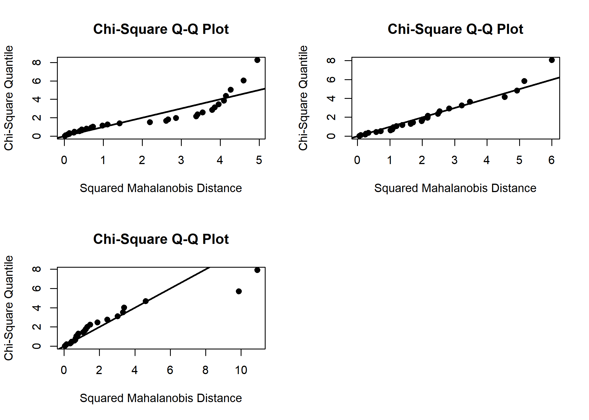
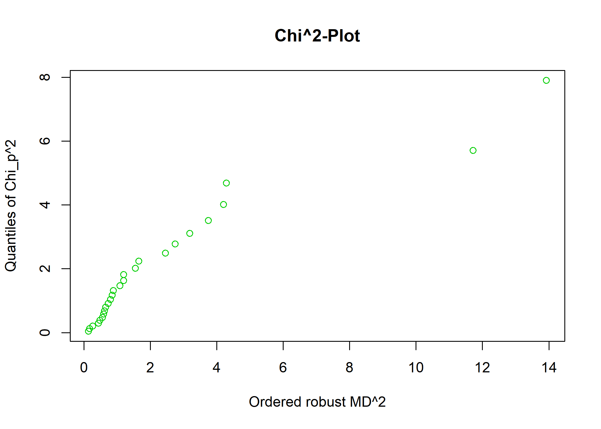
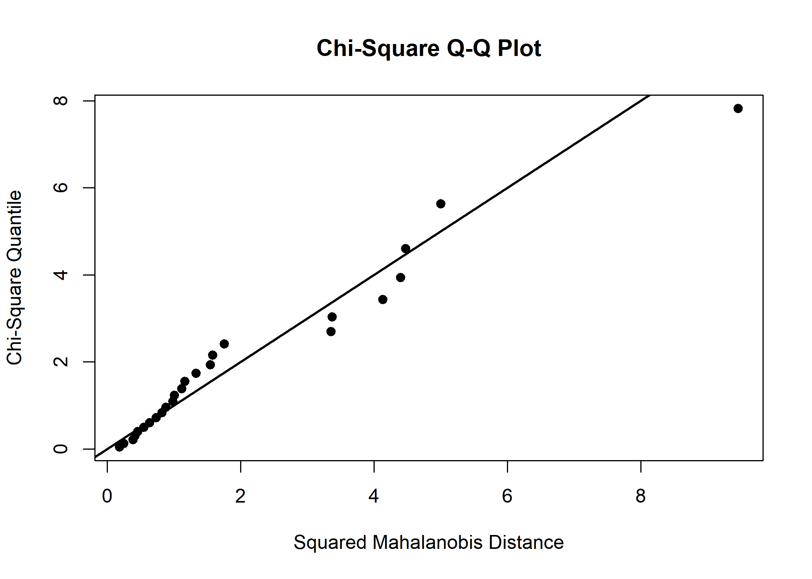

Discriminant and Classification analysis(DCA) - (3)
================
Jae Kwan Koo

-   [Ready for analysis](#ready-for-analysis)
-   [합동공분산행렬 및 그룹 별 평균](#합동공분산행렬-및-그룹-별-평균)
-   [MVN](#mvn)
    -   [delete the obs](#delete-the-obs)
-   [QDA](#qda)
    -   [APER](#aper)
-   [QDA - CV](#qda---cv)

#### Ready for analysis

``` r
library("MVN")
library(biotools)
```

    ## ---
    ## biotools version 3.1

``` r
library(tidyverse)
```

``` r
setwd("D:\\Jae Kwan\\3학년2학기\\다변량2\\191010 다변량 실습\\Rdata")
getwd()
```

    ## [1] "D:/Jae Kwan/3학년2학기/다변량2/191010 다변량 실습/Rdata"

``` r
data<-read.table("admission.txt",header=T)
head(data); tail(data)
```

    ##    GPA GMAT group
    ## 1 2.96  596     1
    ## 2 3.14  473     1
    ## 3 3.22  482     1
    ## 4 3.29  527     1
    ## 5 3.69  505     1
    ## 6 3.46  693     1

    ##     GPA GMAT group
    ## 80 3.03  438     3
    ## 81 3.05  399     3
    ## 82 2.85  483     3
    ## 83 3.01  453     3
    ## 84 3.03  414     3
    ## 85 3.04  446     3

group별로 GPA, GMAT변수가 존재.

``` r
c1<-data[data$group==1,1:2]
c2<-data[data$group==2,1:2]
c3<-data[data$group==3,1:2]
```

group별로 데이터를 분리

### 합동공분산행렬 및 그룹 별 평균

``` r
S1<-cov(c1); S2<-cov(c2); S3<-cov(c3)
(Sp<-((nrow(c1)-1)*S1+(nrow(c2)-1)*S2+(nrow(c3)-1)*S3)/(nrow(c1)+nrow(c2)+nrow(c3)-3))
```

    ##              GPA        GMAT
    ## GPA   0.03606795   -2.018759
    ## GMAT -2.01875915 3655.901121

``` r
data.frame(group1=colMeans(c1),group2=colMeans(c2),group3=colMeans(c3))
```

    ##          group1   group2     group3
    ## GPA    3.403871   2.4825   2.992692
    ## GMAT 561.225806 447.0714 446.230769

### MVN

``` r
result_c1 <- mvn(c1)
result_c2 <- mvn(c2)
result_c3 <- mvn(c3)
list(result_c1, result_c2, result_c3)
```

    ## [[1]]
    ## [[1]]$multivariateNormality
    ##              Test          Statistic           p value Result
    ## 1 Mardia Skewness  0.471893695626844 0.976178819071029    YES
    ## 2 Mardia Kurtosis -0.816146237736216 0.414416501338956    YES
    ## 3             MVN               <NA>              <NA>    YES
    ## 
    ## [[1]]$univariateNormality
    ##           Test  Variable Statistic   p value Normality
    ## 1 Shapiro-Wilk    GPA       0.9819    0.8640    YES   
    ## 2 Shapiro-Wilk   GMAT       0.9775    0.7403    YES   
    ## 
    ## [[1]]$Descriptives
    ##       n       Mean    Std.Dev Median    Min   Max   25th   75th       Skew
    ## GPA  31   3.403871  0.2087052   3.39   2.96   3.8   3.27   3.54 0.08149089
    ## GMAT 31 561.225806 67.9576877 559.00 431.00 693.0 522.00 600.50 0.16697063
    ##        Kurtosis
    ## GPA  -0.5619888
    ## GMAT -0.6530970
    ## 
    ## 
    ## [[2]]
    ## [[2]]$multivariateNormality
    ##              Test          Statistic           p value Result
    ## 1 Mardia Skewness   3.80540534067133 0.432981441551754    YES
    ## 2 Mardia Kurtosis -0.982183466405841 0.326009471362912    YES
    ## 3             MVN               <NA>              <NA>    YES
    ## 
    ## [[2]]$univariateNormality
    ##           Test  Variable Statistic   p value Normality
    ## 1 Shapiro-Wilk    GPA       0.9800    0.8496    YES   
    ## 2 Shapiro-Wilk   GMAT       0.9463    0.1595    YES   
    ## 
    ## [[2]]$Descriptives
    ##       n     Mean    Std.Dev Median    Min   Max   25th     75th
    ## GPA  28   2.4825  0.1834368   2.47   2.13   2.9   2.36   2.5775
    ## GMAT 28 447.0714 62.3799164 435.50 321.00 542.0 404.25 504.2500
    ##             Skew   Kurtosis
    ## GPA   0.27646115 -0.2726122
    ## GMAT -0.06529132 -1.0963701
    ## 
    ## 
    ## [[3]]
    ## [[3]]$multivariateNormality
    ##              Test        Statistic            p value Result
    ## 1 Mardia Skewness 8.04014244073601 0.0901187440943936    YES
    ## 2 Mardia Kurtosis  2.0318152423983 0.0421723635318061     NO
    ## 3             MVN             <NA>               <NA>     NO
    ## 
    ## [[3]]$univariateNormality
    ##           Test  Variable Statistic   p value Normality
    ## 1 Shapiro-Wilk    GPA       0.9370    0.1136    YES   
    ## 2 Shapiro-Wilk   GMAT       0.9685    0.5847    YES   
    ## 
    ## [[3]]$Descriptives
    ##       n       Mean   Std.Dev Median    Min   Max     25th     75th
    ## GPA  26   2.992692  0.172315   3.01   2.73   3.5   2.8675   3.0725
    ## GMAT 26 446.230769 47.401525 446.00 313.00 546.0 419.0000 480.0000
    ##            Skew  Kurtosis
    ## GPA   0.8064393 0.8235922
    ## GMAT -0.5036574 0.7583619

``` r
par(mfrow=c(2,2))
mvn(c1, multivariatePlot = 'qq')
```

    ## $multivariateNormality
    ##              Test          Statistic           p value Result
    ## 1 Mardia Skewness  0.471893695626844 0.976178819071029    YES
    ## 2 Mardia Kurtosis -0.816146237736216 0.414416501338956    YES
    ## 3             MVN               <NA>              <NA>    YES
    ## 
    ## $univariateNormality
    ##           Test  Variable Statistic   p value Normality
    ## 1 Shapiro-Wilk    GPA       0.9819    0.8640    YES   
    ## 2 Shapiro-Wilk   GMAT       0.9775    0.7403    YES   
    ## 
    ## $Descriptives
    ##       n       Mean    Std.Dev Median    Min   Max   25th   75th       Skew
    ## GPA  31   3.403871  0.2087052   3.39   2.96   3.8   3.27   3.54 0.08149089
    ## GMAT 31 561.225806 67.9576877 559.00 431.00 693.0 522.00 600.50 0.16697063
    ##        Kurtosis
    ## GPA  -0.5619888
    ## GMAT -0.6530970

``` r
mvn(c2, multivariatePlot = 'qq')
```

    ## $multivariateNormality
    ##              Test          Statistic           p value Result
    ## 1 Mardia Skewness   3.80540534067133 0.432981441551754    YES
    ## 2 Mardia Kurtosis -0.982183466405841 0.326009471362912    YES
    ## 3             MVN               <NA>              <NA>    YES
    ## 
    ## $univariateNormality
    ##           Test  Variable Statistic   p value Normality
    ## 1 Shapiro-Wilk    GPA       0.9800    0.8496    YES   
    ## 2 Shapiro-Wilk   GMAT       0.9463    0.1595    YES   
    ## 
    ## $Descriptives
    ##       n     Mean    Std.Dev Median    Min   Max   25th     75th
    ## GPA  28   2.4825  0.1834368   2.47   2.13   2.9   2.36   2.5775
    ## GMAT 28 447.0714 62.3799164 435.50 321.00 542.0 404.25 504.2500
    ##             Skew   Kurtosis
    ## GPA   0.27646115 -0.2726122
    ## GMAT -0.06529132 -1.0963701

``` r
mvn(c3, multivariatePlot = 'qq')
```

    ## $multivariateNormality
    ##              Test        Statistic            p value Result
    ## 1 Mardia Skewness 8.04014244073601 0.0901187440943936    YES
    ## 2 Mardia Kurtosis  2.0318152423983 0.0421723635318061     NO
    ## 3             MVN             <NA>               <NA>     NO
    ## 
    ## $univariateNormality
    ##           Test  Variable Statistic   p value Normality
    ## 1 Shapiro-Wilk    GPA       0.9370    0.1136    YES   
    ## 2 Shapiro-Wilk   GMAT       0.9685    0.5847    YES   
    ## 
    ## $Descriptives
    ##       n       Mean   Std.Dev Median    Min   Max     25th     75th
    ## GPA  26   2.992692  0.172315   3.01   2.73   3.5   2.8675   3.0725
    ## GMAT 26 446.230769 47.401525 446.00 313.00 546.0 419.0000 480.0000
    ##            Skew  Kurtosis
    ## GPA   0.8064393 0.8235922
    ## GMAT -0.5036574 0.7583619



이전에 그룹3의 다변량정규성을 만족한다고 가정하고 넘어갔지만 outlier을 찾아 제거 후 분석해보자.

#### delete the obs

``` r
mvoutlier::chisq.plot(c3)
```



    ## Remove outliers with left-click, stop with right-click on plotting device

    ## $outliers
    ## NULL

mvoutlier패키지 chisq.plot함수를 사용하였다. chisq plot에서 정규성에 벗어나는 점을 눈으로 확인 후 직접 obs를 선택하여 그림에서 바로 제거할 수 있다. 그리고 ESC를 눌러 창에서 나오게 되면 제거된 obs의 number도 확인 가능하다.

``` r
mvn(c3[-7,],multivariatePlot = 'qq')
```



    ## $multivariateNormality
    ##              Test         Statistic           p value Result
    ## 1 Mardia Skewness  2.06115094229846 0.724512521117741    YES
    ## 2 Mardia Kurtosis 0.282436641689554 0.777608722140321    YES
    ## 3             MVN              <NA>              <NA>    YES
    ## 
    ## $univariateNormality
    ##           Test  Variable Statistic   p value Normality
    ## 1 Shapiro-Wilk    GPA       0.9668    0.5649    YES   
    ## 2 Shapiro-Wilk   GMAT       0.9603    0.4204    YES   
    ## 
    ## $Descriptives
    ##       n     Mean    Std.Dev Median    Min    Max   25th   75th        Skew
    ## GPA  25   2.9724  0.1406319   3.01   2.73   3.28   2.86   3.05  0.08373179
    ## GMAT 25 448.0000 47.4947366 446.00 313.00 546.00 419.00 483.00 -0.59575353
    ##        Kurtosis
    ## GPA  -0.8823144
    ## GMAT  0.9287908

7번째 obs를 제거한 후 다시 MVN을 실시하였다.
이제는 다변량 정규성을 만족한다.

``` r
c3<-c3[-7,]
data2<-rbind(c1,c2,c3)

new_data<-inner_join(data,data2,by=c("GPA","GMAT"))

boxM(new_data[,-3], new_data[,3]) # group에 대해 공분산 동질성 검정 -> QDA사용
```

    ## 
    ##  Box's M-test for Homogeneity of Covariance Matrices
    ## 
    ## data:  new_data[, -3]
    ## Chi-Sq (approx.) = 20.707, df = 6, p-value = 0.00207

데이터도 7번 obs는 제거 후, 다시 공분산동질성 검정을 실시하였고, 그 결과 동질하지 않다고 판단하였고 분석을 위해서 QDA를 사용해야 한다.

### QDA

``` r
QDA<-qda(group~GPA+GMAT, data=new_data, prior=c(1,1,1)/3)

qcluster<-predict(QDA,new_data)$class
qct<-table(new_data$group,qcluster)

qct
```

    ##    qcluster
    ##      1  2  3
    ##   1 30  0  1
    ##   2  0 27  1
    ##   3  0  1 24

#### APER

``` r
APER<-(1-sum(diag(prop.table(qct))))*100

cat("오분류율 : ",APER)
```

    ## 오분류율 :  3.571429

### QDA - CV

``` r
QDA<-qda(group~GPA+GMAT, data=new_data, prior=c(1,1,1)/3, CV=T)


(confusion_data<-table(new_data$group, QDA$class))
```

    ##    
    ##      1  2  3
    ##   1 30  0  1
    ##   2  0 27  1
    ##   3  0  1 24

``` r
EAER<-(1-sum(diag(confusion_data))/sum(confusion_data) )*100 # (1-sum(diag(prop.table(confusion_data))))*100  

cat("오분류율은 : ",EAER)
```

    ## 오분류율은 :  3.571429

일반적으로 겉보기오류율 APER는 계산이 쉽고 직관적으로 명확하지만, 최적오류율 AER을 실제보다 작게 추정하는 경향이 있다. 이는 표본크기가 큰 경우에도 변하지 않는데 본질적인 원인은 판별함수를 만드는 데에 사용된 자료를 판별함수의 평가에 그대로 이용하는 재대입법 RSM 때문이다.
재대입법의 대안으로 전체 표본을 training과 validation으로 나누어 전자로 판별함수를 만들고 후자로 이것의 분류규칙의 정도를 평가하는 `교차타당성 방법(cross-validation method, CVM)`도 고려할 수 있다.
이 방법은 오류율에 대한 불편추정치를 제공하지만 표본크기가 비교적 커야 하며, 또한 분류함수를 구할 때 훈련표본을 사용하여 모든 표본을 다 이용하는 것이 아니기 때문에 구해진 분류함수가 실제 우리가 구하고자 하는 것이 아닐 수 있다.

위의 오분류율은 교차타당성방법 CVM에 의해 구해졌다.
APER(apparent error rate)과 EAER은 이 예제에서는 같다.
