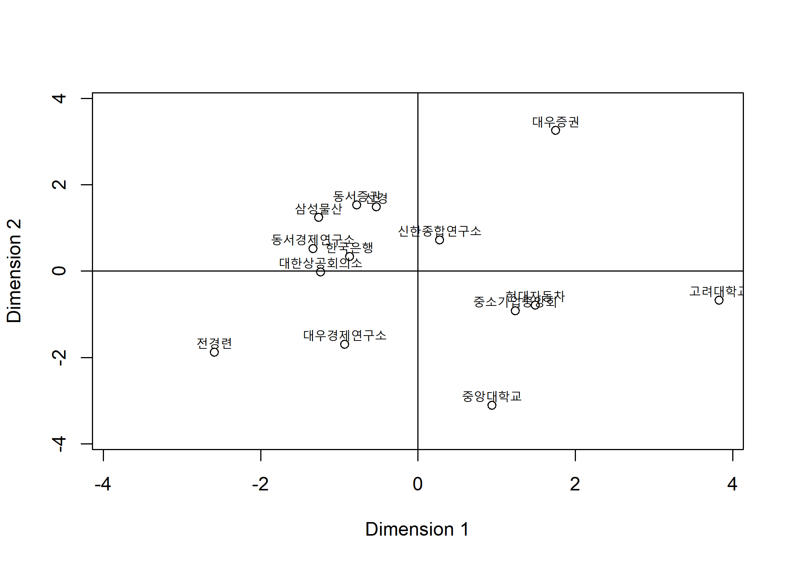
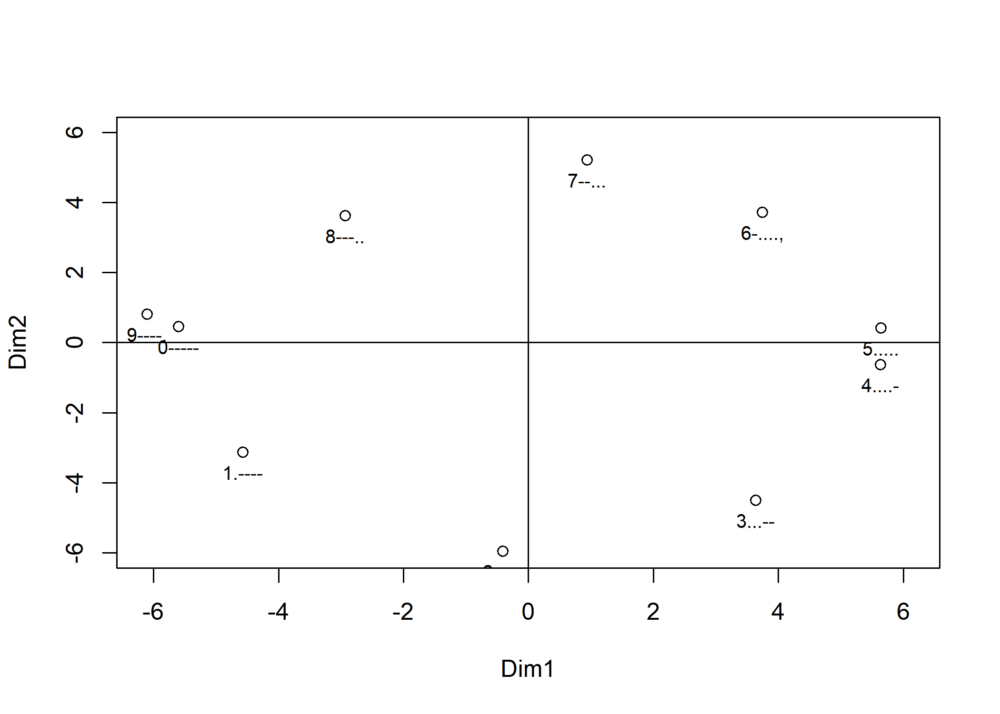
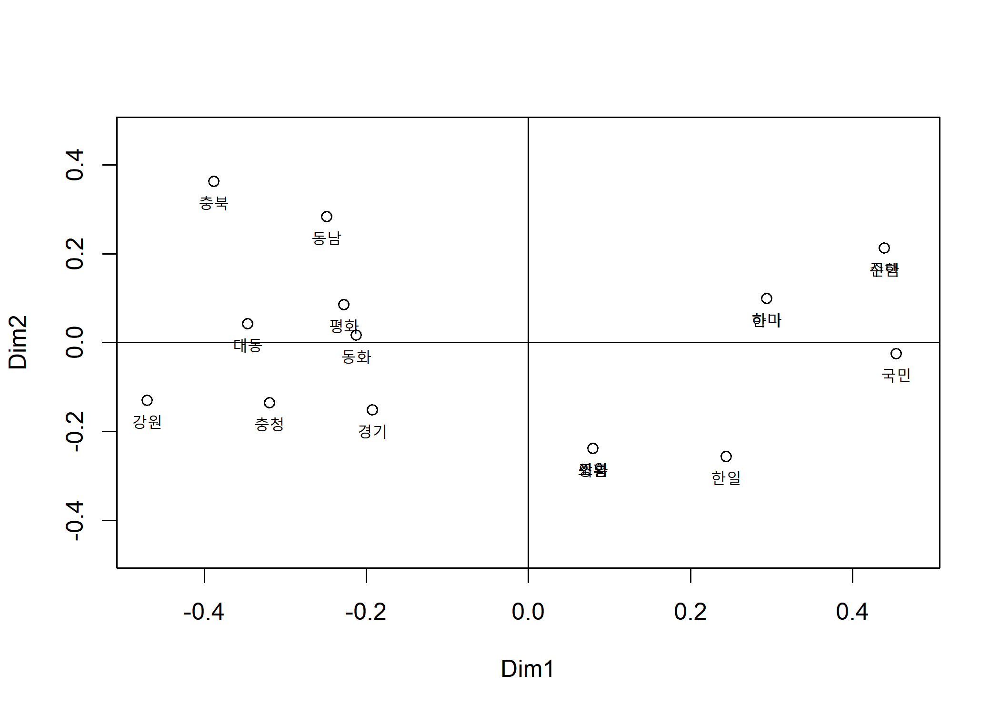

Multidimensional Scaling(MDS) - (1)
================
Jae Kwan Koo

-   [economicview.txt data](#economicview.txt-data)
    -   [Dissimilarity Matrix from Raw Data](#dissimilarity-matrix-from-raw-data)
    -   [Metric MDS](#metric-mds)
-   [morse.txt data.](#morse.txt-data.)
    -   [Dissimilarity Matrix from Similarity Matrix](#dissimilarity-matrix-from-similarity-matrix)
    -   [Standard Transformation : cij(similarity) to dij(dissimilarity)](#standard-transformation-cijsimilarity-to-dijdissimilarity)
    -   [Metric MDS](#metric-mds-1)
    -   [MDS plot](#mds-plot)
-   [bankbinary.txt data](#bankbinary.txt-data)
    -   [은행 경영평가 자료의 계량형 MDS](#은행-경영평가-자료의-계량형-mds)
    -   [Dissimilarity Matrix from Binary Data](#dissimilarity-matrix-from-binary-data)
    -   [Metric MDS](#metric-mds-2)

다차원 척도법 : 개체들 사이의 유사성/비유사성을 측정하여 2차원 이상의 공간상에 점으로 표현
개체들간의 거리계산은 주로 `유클리드거리 행렬` 사용

-   계량형 mds : cmdscale, 비계량형 : isoMDS

-   `계량형 MDS` : 데이터가 연속형 변수(구간척도, 비율척도)인 경우사용.

-   `비계량형 MDS` : 데이터가 순서척도인 경우 사용. 거리가 특별한 단위의미를 가지지 않는 경우이다.

economicview.txt data
---------------------

``` r
setwd("D:\\Jae Kwan\\R프로그래밍\\Multivariate Analysis")
getwd()
```

    ## [1] "D:/Jae Kwan/R프로그래밍/Multivariate Analysis"

``` r
data<-read.table("economicview.txt", header=T)
head(data)
```

    ##             기관 성장률  GNP 수출 수입 국제흑자 연말외채 연말환율 실업률
    ## 1       한국은행    8.2 1950  698  650       98      280      630    3.0
    ## 2       대우증권    9.5 2100  710  620      110      270      640    2.7
    ## 3       동서증권    9.0 2000  690  630      100      290      630    2.6
    ## 4         전경련    7.8 1850  668  660       88      280      620    3.0
    ## 5 대한상공회의소    8.5 1928  710  670       90      290      620    3.0
    ## 6 중소기업중앙회    9.0 1958  710  615       95      280      603    4.0
    ##   소비물가 임금상승
    ## 1      5.7     12.0
    ## 2      4.5     12.0
    ## 3      6.0     12.0
    ## 4      6.4     13.8
    ## 5      6.0     10.0
    ## 6      6.0     10.0

기관의 이름을 rowname으로 옮기는 것이 나아보인다.

``` r
X<-data[,-1]; rownames(X)<-data[,1]
head(X)
```

    ##                성장률  GNP 수출 수입 국제흑자 연말외채 연말환율 실업률
    ## 한국은행          8.2 1950  698  650       98      280      630    3.0
    ## 대우증권          9.5 2100  710  620      110      270      640    2.7
    ## 동서증권          9.0 2000  690  630      100      290      630    2.6
    ## 전경련            7.8 1850  668  660       88      280      620    3.0
    ## 대한상공회의소    8.5 1928  710  670       90      290      620    3.0
    ## 중소기업중앙회    9.0 1958  710  615       95      280      603    4.0
    ##                소비물가 임금상승
    ## 한국은행            5.7     12.0
    ## 대우증권            4.5     12.0
    ## 동서증권            6.0     12.0
    ## 전경련              6.4     13.8
    ## 대한상공회의소      6.0     10.0
    ## 중소기업중앙회      6.0     10.0

### Dissimilarity Matrix from Raw Data

``` r
X<-scale(as.matrix(X))  #표준화

m <-as.matrix(dist(X, method="euclidean"))
d<-round(m, 3)

d
```

    ##                한국은행 대우증권 동서증권 전경련 대한상공회의소
    ## 한국은행          0.000    4.166    2.293  3.269          2.390
    ## 대우증권          4.166    0.000    3.672  6.925          5.476
    ## 동서증권          2.293    3.672    0.000  4.110          3.496
    ## 전경련            3.269    6.925    4.110  0.000          4.157
    ## 대한상공회의소    2.390    5.476    3.496  4.157          0.000
    ## 중소기업중앙회    4.410    5.723    4.635  5.837          4.316
    ## 현대자동차        3.573    4.432    4.084  4.812          5.177
    ## 삼성물산          1.846    4.197    2.839  4.322          3.182
    ## 선경              3.700    5.189    2.854  5.207          4.631
    ## 대우경제연구소    3.131    6.345    3.800  2.789          3.820
    ## 신한종합연구소    3.118    4.344    2.363  4.653          4.265
    ## 동서경제연구소    1.784    4.443    1.515  3.291          3.061
    ## 고려대학교        5.362    5.571    5.684  6.926          5.856
    ## 중앙대학교        4.343    6.693    5.425  4.474          5.124
    ##                중소기업중앙회 현대자동차 삼성물산  선경 대우경제연구소
    ## 한국은행                4.410      3.573    1.846 3.700          3.131
    ## 대우증권                5.723      4.432    4.197 5.189          6.345
    ## 동서증권                4.635      4.084    2.839 2.854          3.800
    ## 전경련                  5.837      4.812    4.322 5.207          2.789
    ## 대한상공회의소          4.316      5.177    3.182 4.631          3.820
    ## 중소기업중앙회          0.000      4.231    5.220 5.231          4.796
    ## 현대자동차              4.231      0.000    4.233 5.088          3.928
    ## 삼성물산                5.220      4.233    0.000 3.880          4.468
    ## 선경                    5.231      5.088    3.880 0.000          4.159
    ## 대우경제연구소          4.796      3.928    4.468 4.159          0.000
    ## 신한종합연구소          4.260      3.592    3.920 2.990          3.549
    ## 동서경제연구소          4.263      3.820    2.469 3.401          3.278
    ## 고려대학교              5.563      4.699    6.336 5.696          5.349
    ## 중앙대학교              4.407      3.336    5.114 6.064          4.192
    ##                신한종합연구소 동서경제연구소 고려대학교 중앙대학교
    ## 한국은행                3.118          1.784      5.362      4.343
    ## 대우증권                4.344          4.443      5.571      6.693
    ## 동서증권                2.363          1.515      5.684      5.425
    ## 전경련                  4.653          3.291      6.926      4.474
    ## 대한상공회의소          4.265          3.061      5.856      5.124
    ## 중소기업중앙회          4.260          4.263      5.563      4.407
    ## 현대자동차              3.592          3.820      4.699      3.336
    ## 삼성물산                3.920          2.469      6.336      5.114
    ## 선경                    2.990          3.401      5.696      6.064
    ## 대우경제연구소          3.549          3.278      5.349      4.192
    ## 신한종합연구소          0.000          2.648      4.994      4.934
    ## 동서경제연구소          2.648          0.000      6.088      4.568
    ## 고려대학교              4.994          6.088      0.000      5.176
    ## 중앙대학교              4.934          4.568      5.176      0.000

유클리드거리를 이용해 비유사성 행렬을 만들었다.

### Metric MDS

``` r
con<-cmdscale(d, k=2, eig=T)
con
```

    ## $points
    ##                      [,1]       [,2]
    ## 한국은행       -0.8682494  0.3363693
    ## 대우증권        1.7491397  3.2539924
    ## 동서증권       -0.7771212  1.5267045
    ## 전경련         -2.5847429 -1.8777658
    ## 대한상공회의소 -1.2362815 -0.0206574
    ## 중소기업중앙회  1.2360989 -0.9184113
    ## 현대자동차      1.4917387 -0.7916779
    ## 삼성물산       -1.2626152  1.2397887
    ## 선경           -0.5285398  1.4840276
    ## 대우경제연구소 -0.9311924 -1.6937696
    ## 신한종합연구소  0.2768839  0.7233996
    ## 동서경제연구소 -1.3340450  0.5219238
    ## 고려대학교      3.8287646 -0.6750898
    ## 중앙대학교      0.9401615 -3.1088340
    ## 
    ## $eig
    ##  [1]  3.652013e+01  3.555368e+01  1.726201e+01  1.482298e+01  1.237430e+01
    ##  [6]  6.237069e+00  3.305420e+00  2.334289e+00  1.018928e+00  5.692192e-01
    ## [11]  2.322324e-03  1.273166e-03 -2.583003e-15 -3.191564e-03
    ## 
    ## $x
    ## NULL
    ## 
    ## $ac
    ## [1] 0
    ## 
    ## $GOF
    ## [1] 0.5543934 0.5544070

경제전망 자료의 표준화 유클리드 거리에 대한 계량형 MDS이다.
k는 max dimension을 의미한다.
cmdsclae : matrix 데이터들의 값을 거리로 생각하고, 2차원상으로 나타내었다.

``` r
round(con$eig,3)
```

    ##  [1] 36.520 35.554 17.262 14.823 12.374  6.237  3.305  2.334  1.019  0.569
    ## [11]  0.002  0.001  0.000 -0.003

고유치들을 나타낸다.

``` r
con$GOF 
```

    ## [1] 0.5543934 0.5544070

둘 다 2차원에 대한 GOF이다.
두 번째(0.5544070)인 경우 고유값의 절댓값으로 계산한 차이이다. 지금은 두 값이 별로 차이가 나지 않는다.

``` r
x<-con$points[,1]; y<-con$points[,2]
lim<-c(-max(abs(con$points)), max(abs(con$points)))

plot(x,y, xlab="Dimension 1", ylab="Dimension 2", xlim=lim, ylim=lim)
text(x,y+0.6, rownames(d), cex=0.8, pos=1)
abline(v=0, h=0)
```



비슷한 거리면 비슷한 경제 예측을 한 기관이라고 해석할 수 있을 것.

morse.txt data.
---------------

### Dissimilarity Matrix from Similarity Matrix

``` r
setwd("D:\\Jae Kwan\\R프로그래밍\\Multivariate Analysis")
data2<-read.table("morse.txt", header=T, check.names=F)

C<-as.matrix(data2)
sign<-colnames(C)
```

Morse data의 계량형 MDS :유사성행렬이므로 비유사성행렬로 변환
단위가 자료에서 유효하다 보는 것이다.

### Standard Transformation : cij(similarity) to dij(dissimilarity)

``` r
n<-nrow(C); J<-matrix(1,n,n)

cii<-diag(diag(C))%*%J
cij<-C
cjj<-J%*%diag(diag(C))

D<-sqrt(cii-2*cij+cjj)
D
```

    ##          1.----    2..---    3...--    4....-    5.....   6-....,
    ##  [1,]  0.000000  7.000000 11.747340 12.688578 13.038405 12.083046
    ##  [2,]  7.000000  0.000000  7.549834 11.489125 12.767145 12.124356
    ##  [3,] 11.747340  7.549834  0.000000  9.949874 11.045361 10.295630
    ##  [4,] 12.688578 11.489125  9.949874  0.000000  8.185353 10.344080
    ##  [5,] 13.038405 12.767145 11.045361  8.185353  0.000000 10.770330
    ##  [6,] 12.083046 12.124356 10.295630 10.344080 10.770330  0.000000
    ##  [7,] 11.357817 11.135529 11.704700 11.224972 11.789826  6.403124
    ##  [8,]  9.899495 11.269428 11.916375 12.288206 12.569805 11.401754
    ##  [9,]  7.810250 11.135529 12.609520 12.884099 13.076697 12.688578
    ## [10,]  8.602325 12.124356 12.727922 13.000000 13.190906 12.000000
    ##          7--...    8---..    9----.    0-----
    ##  [1,] 11.357817  9.899495  7.810250  8.602325
    ##  [2,] 11.135529 11.269428 11.135529 12.124356
    ##  [3,] 11.704700 11.916375 12.609520 12.727922
    ##  [4,] 11.224972 12.288206 12.884099 13.000000
    ##  [5,] 11.789826 12.569805 13.076697 13.190906
    ##  [6,]  6.403124 11.401754 12.688578 12.000000
    ##  [7,]  0.000000  6.557439 10.677078 12.206556
    ##  [8,]  6.557439  0.000000  7.937254 10.198039
    ##  [9,] 10.677078  7.937254  0.000000  5.196152
    ## [10,] 12.206556 10.198039  5.196152  0.000000

### Metric MDS

``` r
con<-cmdscale(D, k=2, eig=T)
con
```

    ## $points
    ##             [,1]       [,2]
    ##  [1,] -4.5683272 -3.1377040
    ##  [2,] -0.4079107 -5.9626237
    ##  [3,]  3.6389106 -4.4990989
    ##  [4,]  5.6363286 -0.6275020
    ##  [5,]  5.6464513  0.4205213
    ##  [6,]  3.7426401  3.7170866
    ##  [7,]  0.9389537  5.2143848
    ##  [8,] -2.9284754  3.6160868
    ##  [9,] -6.0970041  0.8048214
    ## [10,] -5.6015668  0.4540277
    ## 
    ## $eig
    ##  [1]  1.899443e+02  1.211471e+02  9.587057e+01  5.525586e+01  4.330632e+01
    ##  [6]  3.208281e+01  1.027168e+01  5.448245e+00 -1.687539e-14 -3.926795e+00
    ## 
    ## $x
    ## NULL
    ## 
    ## $ac
    ## [1] 0
    ## 
    ## $GOF
    ## [1] 0.5582581 0.5622199

위의 결과는 계량형 MDS의 형상좌표와 적합도가 56.2%임을 나타낸다.

### MDS plot

``` r
x<-con$points[,1]
y<-con$points[,2]
lim1<-c(-max(abs(x)), max(abs(x)))
lim2<-c(-max(abs(y)), max(abs(y)))

plot(x,y, xlab="Dim1", ylab="Dim2", xlim=lim1, ylim=lim2)

text(x,y,sign, cex=0.8, pos=1)
abline(v=0,h=0)
```



적합도가 56.2%인 MDS 그림이다.

9번0번 모스부호가 사람이 비슷하게 느꼈다. 비슷한 소리로 인식했다는 것이다. 6번 7번은 살짝 거리가 있지만 9번 0번에 비해서는 약간 거리가 있는 편이다. 실제로 모스부호가 다른만큼 사람들이 다르게 판단한 것이라고 볼 수 있다.

bankbinary.txt data
-------------------

### 은행 경영평가 자료의 계량형 MDS

``` r
setwd("D:\\Jae Kwan\\R프로그래밍\\Multivariate Analysis")
data3<-read.table("bankbinary.txt", header=T) 
X<-data3[, -1]

bank<-data3[, 1] 
n<-nrow(X); p<-ncol(X) 
```

### Dissimilarity Matrix from Binary Data

``` r
m <-as.matrix(dist(X, method="euclidean", diag=T)) 
D<-round(m^2, 3)/p 
```

자료 특징이 binary이면 단위가 의미없고, 단위가 없으므로 nonmetric이나 metric이나 차이 없다.

### Metric MDS

``` r
con<-cmdscale(D, k=2, eig=T) 
con
```

    ## $points
    ##           [,1]        [,2]
    ## 1  -0.21234463  0.01631285
    ## 2  -0.24888495  0.28314522
    ## 3  -0.34642089  0.04248459
    ## 4  -0.31994190 -0.13614291
    ## 5  -0.19276609 -0.15124818
    ## 6   0.43989603  0.21331867
    ## 7   0.43989603  0.21331867
    ## 8   0.45432894 -0.02547142
    ## 9   0.29464889  0.09919277
    ## 10  0.29464889  0.09919277
    ## 11  0.07979117 -0.23814584
    ## 12  0.07979117 -0.23814584
    ## 13  0.24420302 -0.25686623
    ## 14  0.07979117 -0.23814584
    ## 15 -0.22772240  0.08480493
    ## 16 -0.47050394 -0.13023282
    ## 17 -0.38841049  0.36262863
    ## 
    ## $eig
    ##  [1]  1.636460e+00  6.267627e-01  2.944498e-01  1.127491e-01  6.344355e-02
    ##  [6]  1.896358e-02  1.376622e-16  9.842283e-18 -9.735369e-19 -2.717419e-18
    ## [11] -2.225375e-16 -2.276691e-02 -3.089351e-02 -4.384661e-02 -5.200380e-02
    ## [16] -1.197163e-01 -2.924250e-01
    ## 
    ## $x
    ## NULL
    ## 
    ## $ac
    ## [1] 0
    ## 
    ## $GOF
    ## [1] 0.6828287 0.8221444

계량형 MDS의 형상좌표와 적합도가 82.21%을 나타낸다.

미리 주어진 자료에 따르면

-   인수되는 은행 : 동화, 동남, 대동, 충청, 경기
-   은수하는 은행 : 신한, 주택, 국민, 하나, 한미
-   경영평가 대상은행 : 조흥, 상업, 한일, 외환, 평화, 강원, 충북

으로 군집화되있어 MDS를 통해 이들의 군집화의 타당성을 살펴보게 된다.

``` r
x<-con$points[, 1] 
y<-con$points[, 2] 
lim<-c(-max(abs(con$points)), max(abs(con$points)))

plot(x, y, xlab="Dim1", ylab="Dim2", xlim=lim, ylim=lim) 

text(x, y, bank, cex=0.8, pos=1) 
abline(v=0, h=0)
```



위의 그림은 적합도가 82.21%인 MDS 그림이다.

범주형이라 동일한 점이 몇 개 찍히는 것을 볼 수 있다.
연속형 변수별로 이항적 기준에 의해 이진수자료로 변환하다 보면 개체 간에 동일한 자료 값을 가지는 경우가 많이 발생되기 때문이다.

<은행 경영평가 잘에 대한 MDS 그림의 군집 및 특성>

-   1사분면 : 주택, 신한, 하나, 한미
    -   인수하는 은행
-   2,3사분면 : 충북, 동남, 대동, 평화, 동화, 강원, 충청, 경기
    -   인수되는 은행
-   4사분면 : 조흥, 상업, 외환, 한일, 국민
    -   경영평가 대상

MDS 그림에 나타난 은행들의 경영평가 결과에서 특이한 점은 제2와 제3사분면의 인수되는 은행으로 분류되어 퇴출되어야 할 충북, 평화, 강원 은행이 실제로는 경영평가 대상으로 되어 있었다.
