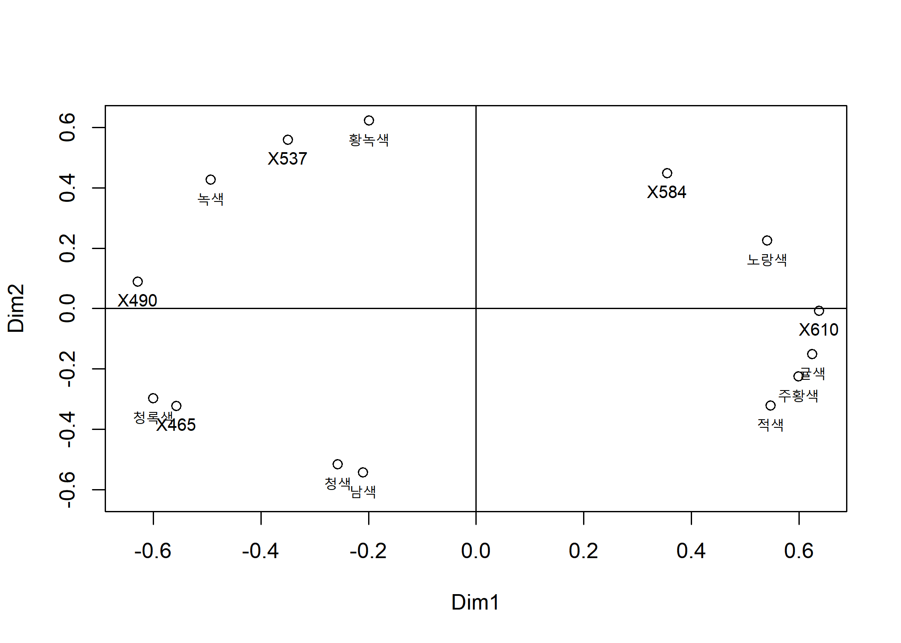
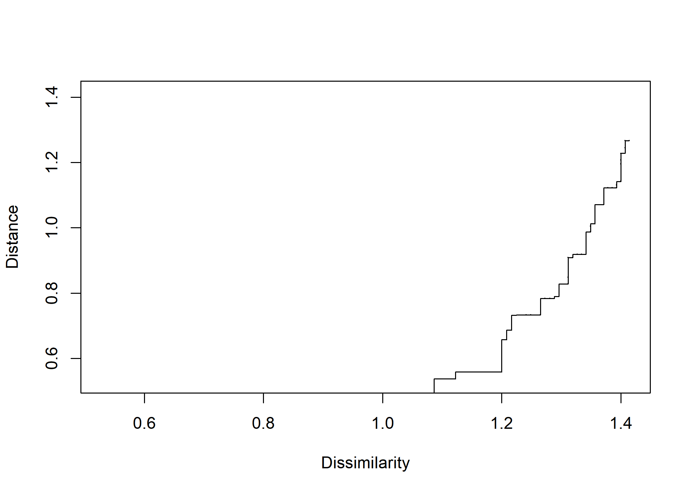
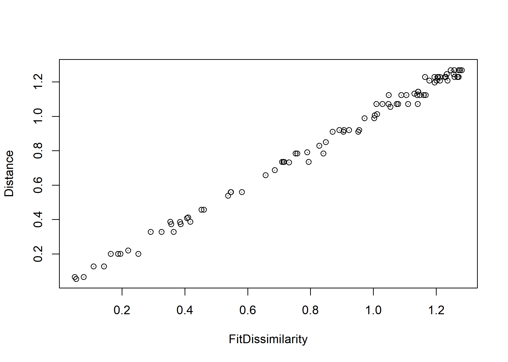
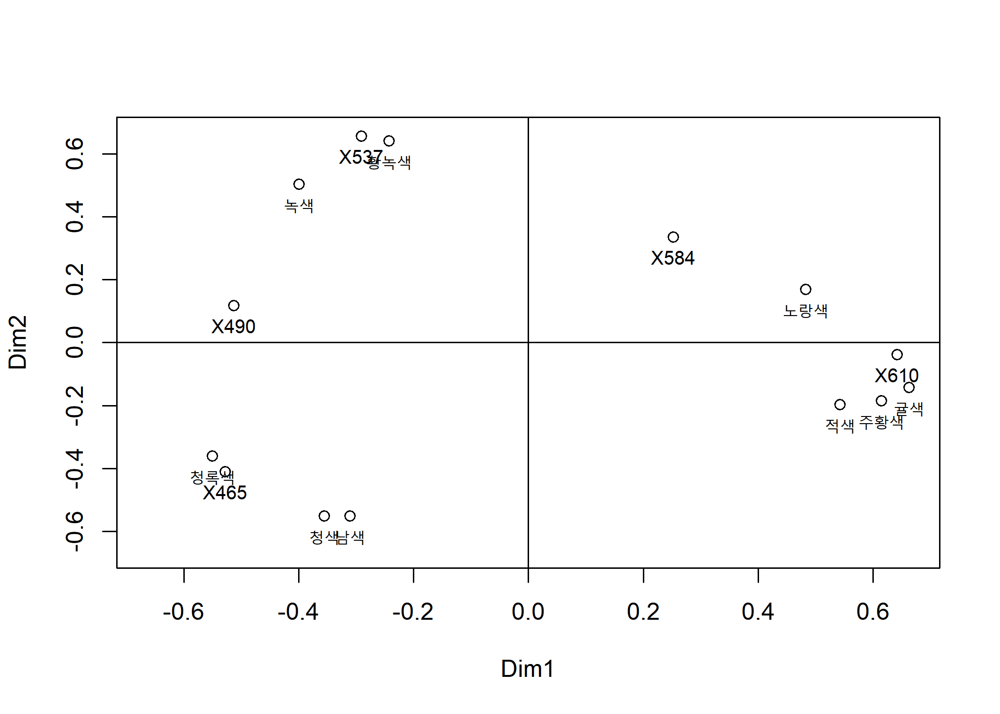
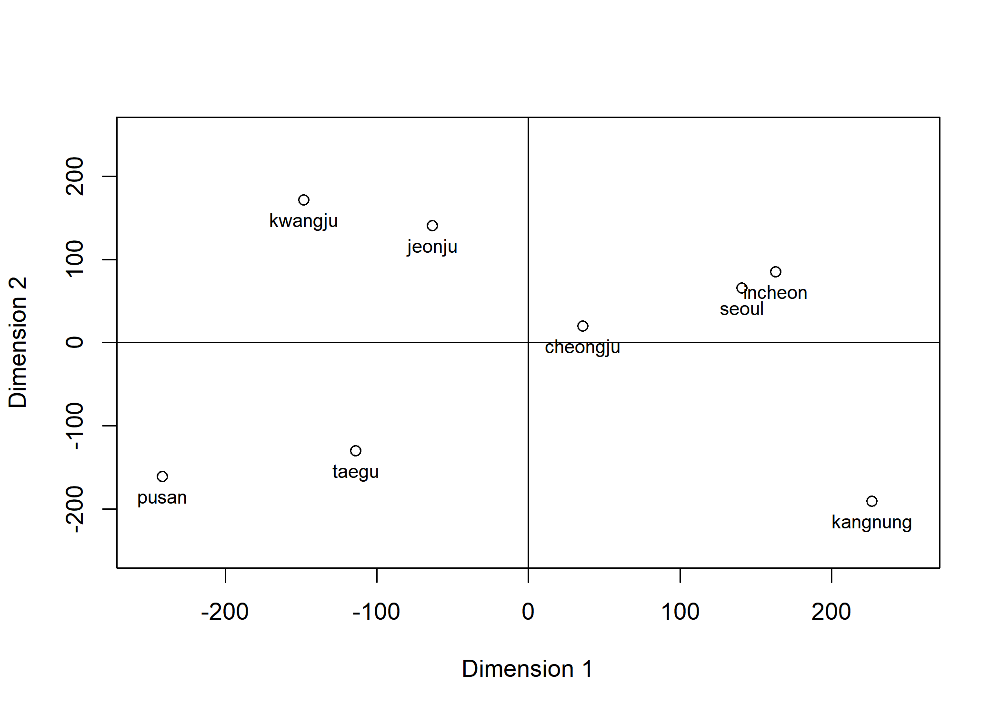
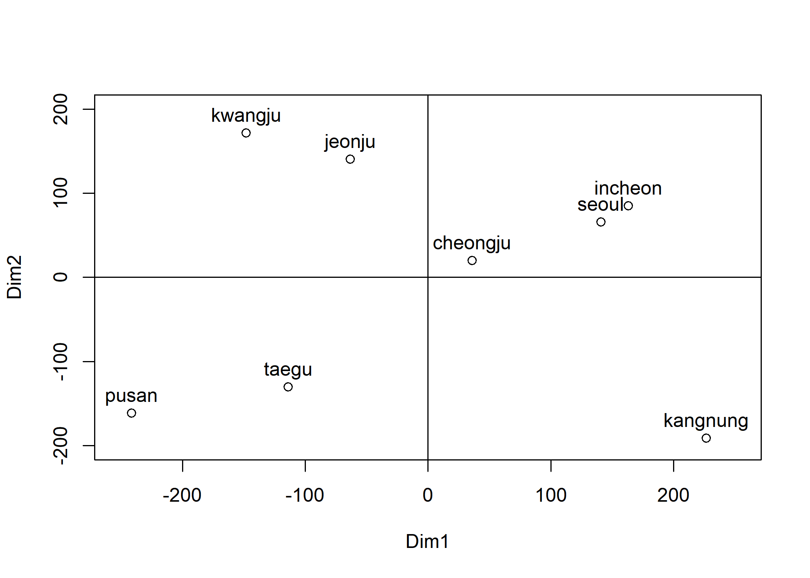
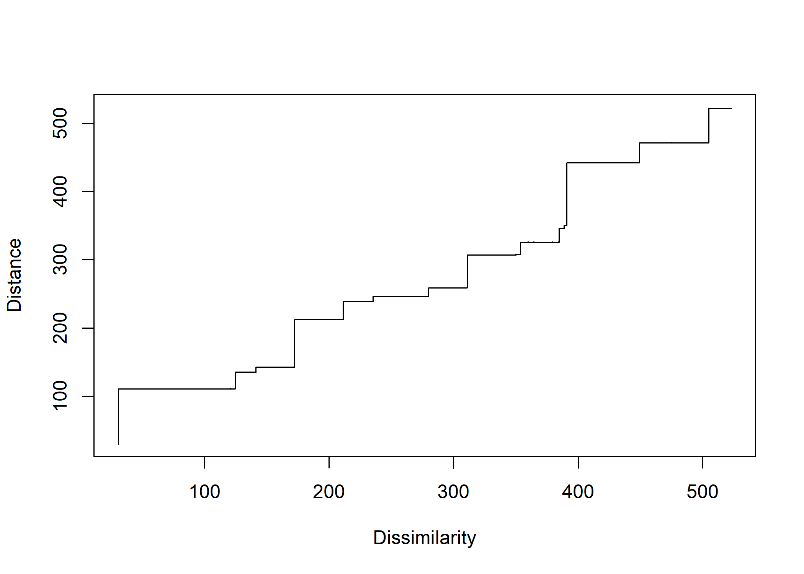
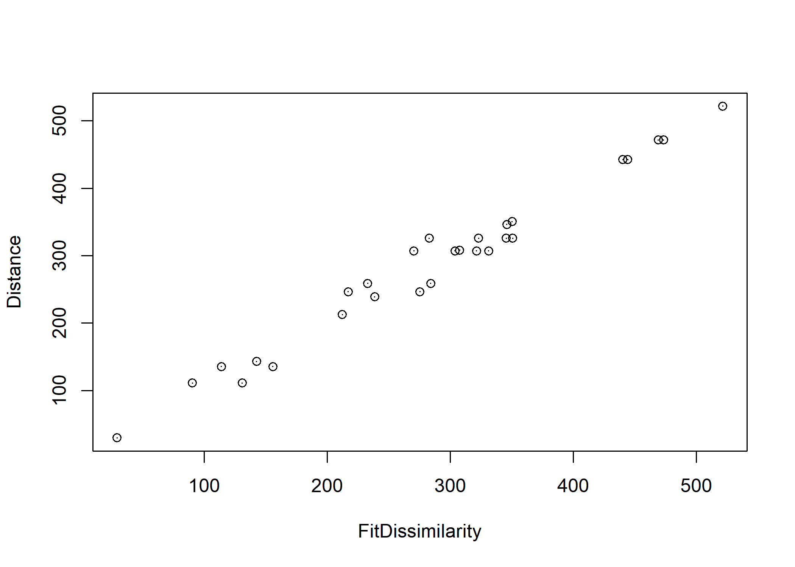

Multidimensional Scaling(MDS) - (3)
================
Jae Kwan Koo

-   [1.](#section)
    -   [(1) Explain whether data is a similarity matrix or a dissimilarity matrix.](#explain-whether-data-is-a-similarity-matrix-or-a-dissimilarity-matrix.)
    -   [(2) In the non-metric MDS, show that the MDS Map provides a color circle.](#in-the-non-metric-mds-show-that-the-mds-map-provides-a-color-circle.)
        -   [Dissimilarity Matrix from Similarity Matrix](#dissimilarity-matrix-from-similarity-matrix)
        -   [Standard Transformation : cij(similarity) to dij(dissimilarity)](#standard-transformation-cijsimilarity-to-dijdissimilarity)
        -   [Nonmetric MDS](#nonmetric-mds)
        -   [MDS plot](#mds-plot)
        -   [Shepard Diagram of non-metric MDS](#shepard-diagram-of-non-metric-mds)
    -   [(3) Compare the results of non-metric MDS and metric MDS.](#compare-the-results-of-non-metric-mds-and-metric-mds.)
        -   [non-metric MDS](#non-metric-mds)
            -   [Image Diagram](#image-diagram)
            -   [metric MDS](#metric-mds)
            -   [MDS plot](#mds-plot-1)
    -   [(4) Compare the Goodness-of-fits of MDS MAPs of (3).](#compare-the-goodness-of-fits-of-mds-maps-of-3.)
-   [2. Consider the railway distance \[Data 7.7.1\] (railroad2.txt) between cities in Korea.](#consider-the-railway-distance-data-7.7.1-railroad2.txt-between-cities-in-korea.)
    -   [(1) Perform metric MDS and non-metric MDS and interpret the axis of the MDS MAPs.](#perform-metric-mds-and-non-metric-mds-and-interpret-the-axis-of-the-mds-maps.)
        -   [Dissimilarity Matrix](#dissimilarity-matrix)
        -   [Metric MDS](#metric-mds-1)
        -   [MDS plot](#mds-plot-2)
        -   [Non-metric MDS](#non-metric-mds-1)
        -   [Shepard Diagram](#shepard-diagram)
        -   [Image Diagram](#image-diagram-1)
    -   [(2) Compare the Goodness-of-fits of two MDS MAPs.](#compare-the-goodness-of-fits-of-two-mds-maps.)

``` r
setwd("D:\\Jae Kwan\\R프로그래밍\\Multivariate Analysis")
data<-read.table("color3.txt", header=T)

colnames(data)<-c("남색","청색","X465","청록색","X490","녹색","X537","황녹색","X584","노랑색","X610","귤색","주황색","적색")
```

색 컬럼에 대해 보기 편하게 색 이름을 변수이름으로 대체하였다.

1.
==

(1) Explain whether data is a similarity matrix or a dissimilarity matrix.
--------------------------------------------------------------------------

일반적으로 다변량 자료행렬 X로부터 두 개체 r, s 간의 거리로 나타낸 비유사성 가 크면 두 개체 간의 유사성 는 작아지며, 반대로 비유사성이 작아지면 유사성은 크게 된다.
비유사성과 유사성의 사이의 가장 큰 차이점은 거리를 나타내는 비유사성은 양의 값을 나타내는 반면 유사성은 0과 1사이의 값을 나타낸다.
가장 잘 알려진 비유사성에서 유사성으로의 변환은 *C*<sub>*r**s*</sub> = 1/(1 + *d*<sub>*r**s*</sub>) 이며, 0 ≤ *C*<sub>*r**s*</sub> ≤ 1 을 만족한다.
따라서, 위의 행렬은 유사성행렬이다.

(2) In the non-metric MDS, show that the MDS Map provides a color circle.
-------------------------------------------------------------------------

### Dissimilarity Matrix from Similarity Matrix

``` r
C<-as.matrix(data)

color_name<-colnames(C); n<-nrow(C)
```

### Standard Transformation : cij(similarity) to dij(dissimilarity)

``` r
J<-matrix(1,n,n)
cii<-diag(diag(C))%*%J
cij<-C
cjj<-J%*%diag(diag(C))

D<-sqrt(cii-2*cij+cjj)
round(D,3)
```

    ##        남색  청색  X465 청록색  X490  녹색  X537 황녹색  X584 노랑색  X610
    ##  [1,] 0.000 0.529 1.077  1.077 1.281 1.371 1.364  1.386 1.400  1.364 1.349
    ##  [2,] 0.529 0.000 1.000  1.058 1.249 1.349 1.364  1.364 1.400  1.386 1.364
    ##  [3,] 1.077 1.000 0.000  0.616 1.086 1.311 1.342  1.356 1.400  1.407 1.400
    ##  [4,] 1.077 1.058 0.616  0.000 0.959 1.225 1.342  1.349 1.400  1.407 1.414
    ##  [5,] 1.281 1.249 1.030  0.959 0.000 0.883 1.175  1.217 1.364  1.400 1.400
    ##  [6,] 1.371 1.349 1.288  1.225 0.883 0.000 0.872  1.049 1.311  1.356 1.400
    ##  [7,] 1.364 1.364 1.342  1.342 1.175 0.872 0.000  0.735 1.249  1.311 1.378
    ##  [8,] 1.386 1.364 1.356  1.349 1.217 1.049 0.735  0.000 1.158  1.273 1.386
    ##  [9,] 1.400 1.400 1.400  1.400 1.364 1.311 1.249  1.158 0.000  0.917 1.122
    ## [10,] 1.364 1.386 1.407  1.407 1.400 1.356 1.311  1.273 0.917  0.000 0.721
    ## [11,] 1.349 1.364 1.400  1.414 1.400 1.400 1.378  1.386 1.122  0.721 0.000
    ## [12,] 1.327 1.334 1.407  1.407 1.407 1.400 1.400  1.393 1.208  1.000 0.693
    ## [13,] 1.319 1.319 1.378  1.400 1.400 1.400 1.400  1.400 1.265  1.086 0.872
    ## [14,] 1.296 1.311 1.393  1.386 1.414 1.407 1.414  1.400 1.241  1.200 0.949
    ##        귤색 주황색  적색
    ##  [1,] 1.327  1.319 1.296
    ##  [2,] 1.334  1.319 1.311
    ##  [3,] 1.407  1.378 1.393
    ##  [4,] 1.407  1.400 1.386
    ##  [5,] 1.407  1.400 1.414
    ##  [6,] 1.400  1.400 1.407
    ##  [7,] 1.400  1.400 1.265
    ##  [8,] 1.393  1.400 1.400
    ##  [9,] 1.208  1.265 1.241
    ## [10,] 1.000  1.086 1.200
    ## [11,] 0.693  0.872 0.949
    ## [12,] 0.000  0.548 0.800
    ## [13,] 0.548  0.000 0.693
    ## [14,] 0.800  0.693 0.000

유사성 행렬을 비유사성 행렬로 변환하는 과정에 의해서 비유사성 행렬을 D라고 두어 구하였다.

### Nonmetric MDS

``` r
library(MASS)
con<-isoMDS(D, k=2)
```

    ## initial  value 8.261558 
    ## iter   5 value 3.034416
    ## iter  10 value 2.998310
    ## iter  15 value 2.950279
    ## final  value 2.924940 
    ## converged

``` r
con
```

    ## $points
    ##             [,1]         [,2]
    ##  [1,] -0.2105054 -0.543262570
    ##  [2,] -0.2572935 -0.516221314
    ##  [3,] -0.5573630 -0.323428434
    ##  [4,] -0.6002278 -0.297529505
    ##  [5,] -0.6291550  0.088391368
    ##  [6,] -0.4933075  0.426426710
    ##  [7,] -0.3502059  0.558884009
    ##  [8,] -0.1992573  0.623464641
    ##  [9,]  0.3553991  0.448696362
    ## [10,]  0.5413890  0.224624229
    ## [11,]  0.6381938 -0.008451818
    ## [12,]  0.6248672 -0.150728044
    ## [13,]  0.5993453 -0.224716023
    ## [14,]  0.5477104 -0.321800498
    ## 
    ## $stress
    ## [1] 2.92494

stress가 2.92%(0.0292)이므로 크루스칼 판별기준에 의해 적합도는 뛰어남(excellent)에 해당한다.

### MDS plot

``` r
x<-con$points[,1]; y<-con$points[,2]
lim1<-c(-max(abs(x)), max(abs(x))); lim2<-c(-max(abs(y)), max(abs(y)))

plot(x,y, xlab="Dim1", ylab="Dim2", xlim=lim1, ylim=lim2)
text(x,y,color_name, cex=0.8, pos=1)
abline(v=0, h=0)
```



MDS map은 원형태를 형성하는 모습을 보이고 있다.
여기서 제 1축을 기준으로 왼쪽에는 녹색계열의 색들이, 오른쪽에는 노란색계열의 색들이 위치하고 있다. 또한, 제 2축을 기준으로는 위쪽에는 밝은색들이 아래쪽에는 상대적으로 진한색들이 그룹을 이루고 있다.

### Shepard Diagram of non-metric MDS

``` r
data_sh <- Shepard(D[lower.tri(D)], con$points)

plot(data_sh$x,data_sh$yf, pch = ".", xlab = "Dissimilarity", ylab = "Distance", 
     xlim = range(data_sh$x), ylim = range(data_sh$x))
lines(data_sh$x, data_sh$yf, type = "S")
```



세퍼드그림은 수직축에 순위상과 수평축에 실제 비유사성에 대한 산점도로 비계량형 MDS에서 가정한 f(⦁)의 단조성이 만족됨을 보이고 있다. 위에서의 뛰어난 적합도는 세퍼드그림에서 매우 돋보이는 단조성을 통해서도 짐작할 수 있다.

(3) Compare the results of non-metric MDS and metric MDS.
---------------------------------------------------------

### non-metric MDS

#### Image Diagram

``` r
plot(data_sh$y,data_sh$yf, pch = ".", xlab="FitDissimilarity", ylab="Distance", 
  xlim=range(data_sh$y), ylim=range(data_sh$y))
lines(data_sh$y, data_sh$yf, type="p")
```



상그림은 수직축에 순위상과 수평축에 2차원의 형상좌표로부터 얻어지는 비유사성에 대한 산점도로 원점을 지나는 직선상에 잘 놓여 있어 비계량형 MDS가 잘 적합되었다고 여겨진다.
또한, 위의 stress에 대한 결과처럼 적합정도는 뛰어남(excellent)에 속한다.

#### metric MDS

``` r
con<-cmdscale(D, k=2, eig=T) 
con
```

    ## $points
    ##             [,1]        [,2]
    ##  [1,] -0.3101855 -0.55045611
    ##  [2,] -0.3553803 -0.55037008
    ##  [3,] -0.5279452 -0.41012571
    ##  [4,] -0.5503163 -0.36052523
    ##  [5,] -0.5128399  0.11725946
    ##  [6,] -0.3988954  0.50303889
    ##  [7,] -0.2905171  0.65580899
    ##  [8,] -0.2426751  0.63996589
    ##  [9,]  0.2520936  0.33544473
    ## [10,]  0.4833546  0.16889700
    ## [11,]  0.6419235 -0.03882865
    ## [12,]  0.6633622 -0.14233568
    ## [13,]  0.6150147 -0.18571739
    ## [14,]  0.5425954 -0.19770698
    ## 
    ## $eig
    ##  [1] 3.191448955 2.246925843 1.140005643 1.042208426 0.631524254
    ##  [6] 0.533523075 0.317146887 0.267548219 0.215838029 0.198364540
    ## [11] 0.189887045 0.117545980 0.086827996 0.001919393
    ## 
    ## $x
    ## NULL
    ## 
    ## $ac
    ## [1] 0
    ## 
    ## $GOF
    ## [1] 0.534184 0.534184

2차원 MDS 그림의 GOF는 53.4%로 높은 적합률을 보이지 않는다.

#### MDS plot

``` r
x<-con$points[,1] ; y<-con$points[,2] 
lim<-c(-max(abs(con$points)), max(abs(con$points)))

plot(x, y, xlab="Dim1", ylab="Dim2", xlim=lim, ylim=lim) 
text(x, y, color_name, cex=0.8, pos=1) 
abline(v=0, h=0)
```



non-metric MDS, metric MDS 방법을 통해 살펴본 MDS 그림은 둘 다 비슷한 패턴을 보인다.

(4) Compare the Goodness-of-fits of MDS MAPs of (3).
----------------------------------------------------

(3)의 결과에서 non-metric MDS는 뛰어남(excellent)를 보였고, metric MDS는 58.4%로 GOF가 높지 않았다. 따라서 non-metric MDS가 주어진 예제에서는 더 타당하다고 볼 수 있다.

2. Consider the railway distance \[Data 7.7.1\] (railroad2.txt) between cities in Korea.
========================================================================================

``` r
setwd("D:\\Jae Kwan\\R프로그래밍\\Multivariate Analysis")
data2<-read.table("railroad2.txt", header=T)
data2
```

    ##   seoul pusan kwangju taegu incheon kangnung cheongju jeonju
    ## 1   0.0 444.5   353.8 323.9    30.9    348.5    141.2  279.9
    ## 2 444.5   0.0   364.7 120.6   475.4    505.0    326.1  391.0
    ## 3 353.8 364.7     0.0 350.0   384.7    523.0    235.4  124.6
    ## 4 323.9 120.6   350.0   0.0   359.9    388.8    211.4  276.4
    ## 5  30.9 475.4   384.7 359.9     0.0    379.4    172.1  310.8
    ## 6 348.5 505.0   523.0 388.8   379.4      0.0    288.6  449.4
    ## 7 141.2 326.1   235.4 211.4   172.1    288.6      0.0  136.3
    ## 8 279.9 391.0   124.6 276.4   310.8    449.4    136.3    0.0

비유사성 행렬임을 알 수 있다.

(1) Perform metric MDS and non-metric MDS and interpret the axis of the MDS MAPs.
---------------------------------------------------------------------------------

### Dissimilarity Matrix

``` r
D<-as.matrix(data2)
rail_name<-colnames(D)
```

### Metric MDS

``` r
con<-cmdscale(D, k=2, eig=T) 
con
```

    ## $points
    ##            [,1]       [,2]
    ## [1,]  140.75771   65.60058
    ## [2,] -241.34975 -161.26080
    ## [3,] -148.21178  171.64257
    ## [4,] -113.96448 -130.40937
    ## [5,]  163.09922   84.92990
    ## [6,]  226.76135 -190.86162
    ## [7,]   36.07025   19.95384
    ## [8,]  -63.16252  140.40490
    ## 
    ## $eig
    ## [1]  1.963297e+05  1.405292e+05  5.915327e+04  1.374540e+04  1.715287e+02
    ## [6]  4.547474e-11 -6.875141e+03 -1.219315e+04
    ## 
    ## $x
    ## NULL
    ## 
    ## $ac
    ## [1] 0
    ## 
    ## $GOF
    ## [1] 0.7852237 0.8217492

2차원 MDS 그림의 GOF는 82.17%로 적당한 적합률을 보이고 있다.

### MDS plot

``` r
x<-con$points[,1]; y<-con$points[,2]
lim<-c(-max(abs(con$points)+10), max(abs(con$points)+10))

plot(x,y, xlab="Dimension 1", ylab="Dimension 2", xlim=lim, ylim=lim)
text(x,y+0.6, rail_name, cex=0.8, pos=1)
abline(v=0, h=0)
```



dim2축을 기준으로 아래는 east 위는 west를 가리키며, dim1축을 기준으로 왼쪽은 남부지방, 오른쪽은 중부, 수도권, 강원도 등을 가리킨다.

### Non-metric MDS

``` r
library(MASS)
con<-isoMDS(D, k=2)
```

    ## initial  value 6.009865 
    ## final  value 6.004032 
    ## converged

``` r
con
```

    ## $points
    ##            [,1]       [,2]
    ## [1,]  140.77360   65.61582
    ## [2,] -241.32500 -161.23911
    ## [3,] -148.23118  171.64021
    ## [4,] -113.95571 -130.38363
    ## [5,]  163.09964   84.94262
    ## [6,]  226.77004 -190.90126
    ## [7,]   36.04877   19.93897
    ## [8,]  -63.18016  140.38637
    ## 
    ## $stress
    ## [1] 6.004032

stress가 6.004032% (=6.004032)이므로 크루스칼의 판별기준에 의해 좋음(good)에 속한다.

``` r
x<-con$points[,1]; y<-con$points[,2]
lim1<-c(-max(abs(x)+10), max(abs(x)+10)); lim2<-c(-max(abs(y)+10), max(abs(y)+10))

plot(x,y, xlab="Dim1", ylab="Dim2", xlim=lim1, ylim=lim2)
text(x,y,rail_name, cex=1, pos=3)
abline(v=0, h=0)
```



Metric MDS 그림과 마찬가지로 같은 패턴의 모습을 보여주고 있다.

### Shepard Diagram

``` r
data2_sh <- Shepard(D[lower.tri(D)], con$points)

plot(data2_sh$x,data2_sh$yf, pch = ".", xlab = "Dissimilarity", ylab = "Distance", 
     xlim = range(data2_sh$x), ylim = range(data2_sh$x))
lines(data2_sh$x, data2_sh$yf, type = "S")
```



세퍼드그림은 수직축에 순위상과 수평축에 실제 비유사성에 대한 산점도로 비계량형 MDS에서 가정한 f(⦁)의 단조성이 만족됨을 보이고 있다.

### Image Diagram

``` r
plot(data2_sh$y,data2_sh$yf, pch = ".", xlab="FitDissimilarity", ylab="Distance", 
  xlim=range(data2_sh$y), ylim=range(data2_sh$y))
lines(data2_sh$y, data2_sh$yf, type="p")
```



상그림은 수직축에 순위상과 수평축에 2차원의 형상좌표로부터 얻어지는 비유사성에 대한 산점도로 원점을 지나는 직선상에 잘 놓여 있어 비계량형 MDS가 잘 적합되었다고 여겨진다.
또한, 위의 stress에 대한 결과처럼 적합정도는 좋음(good)에 속한다.

(2) Compare the Goodness-of-fits of two MDS MAPs.
-------------------------------------------------

(1)의 결과에서 non-metric MDS는 좋음(good)을 보였고, metric MDS는 약 82%로 GOF가 높은 모습을 보여주었다. 따라서 Metric MDS가 주어진 예제에서는 더 좋은 퍼포먼스를 보여준다고 볼 수 있다. MDS MAPs에서의 모습들은 둘 다 비슷한 형태를 보였다.
