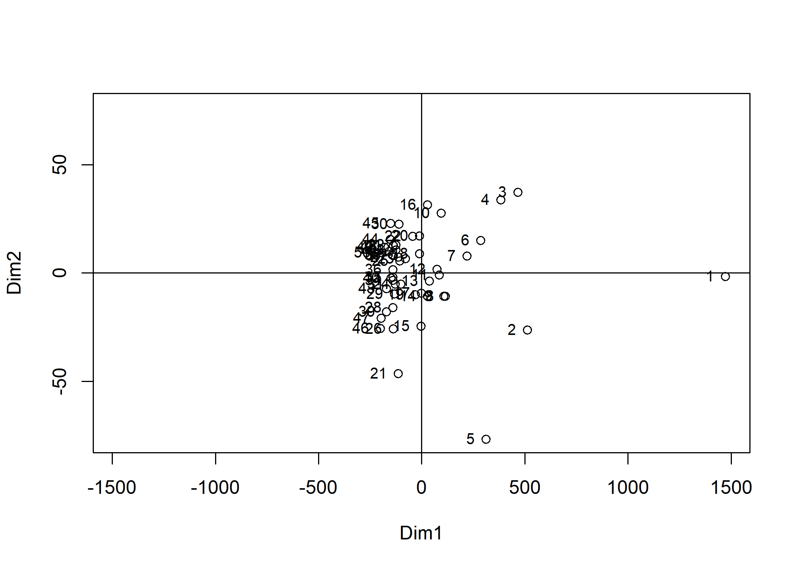
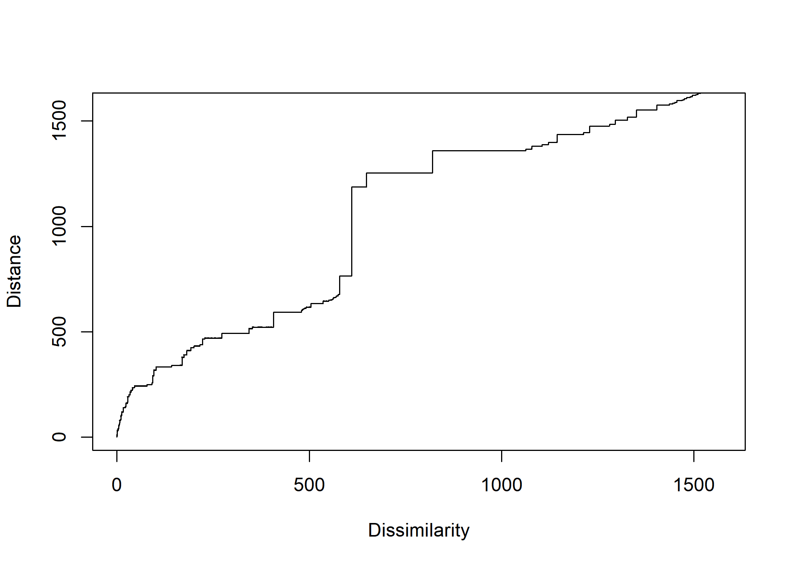
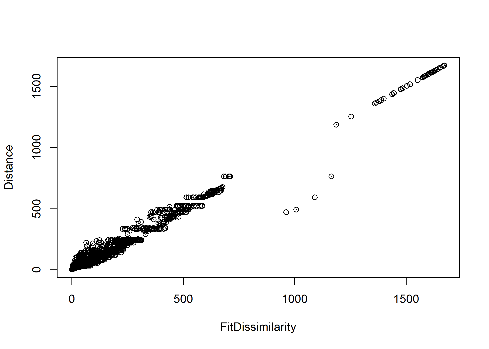
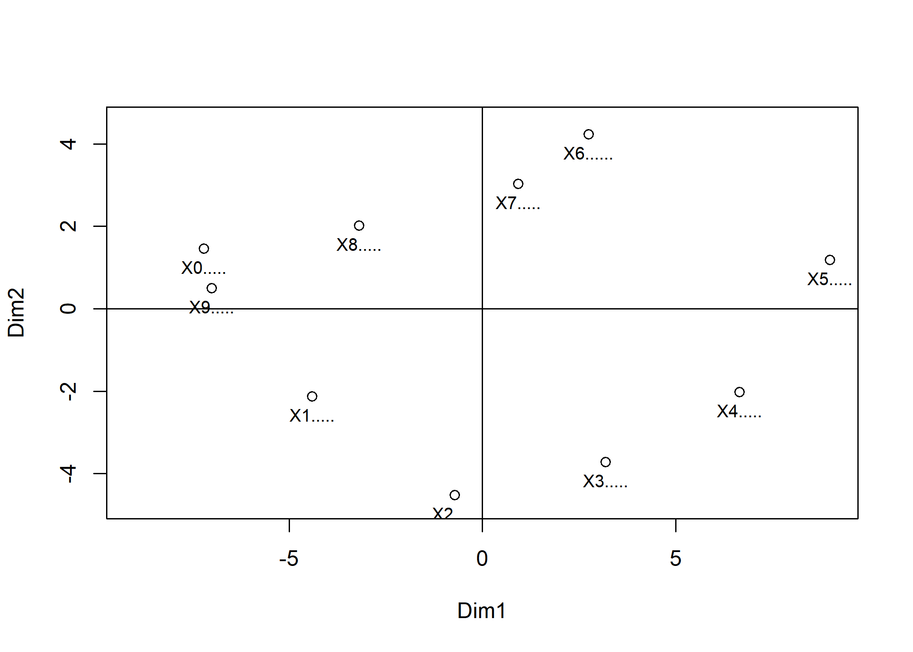
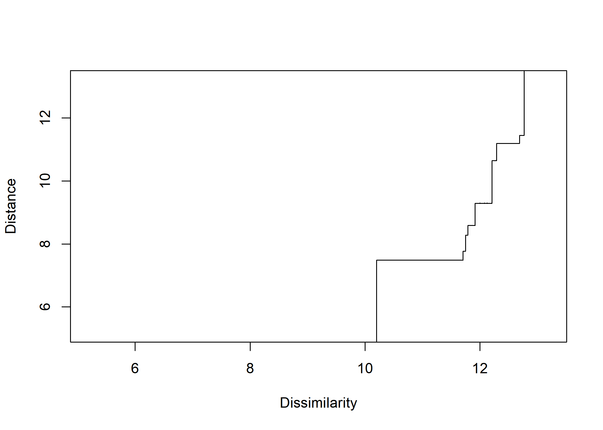
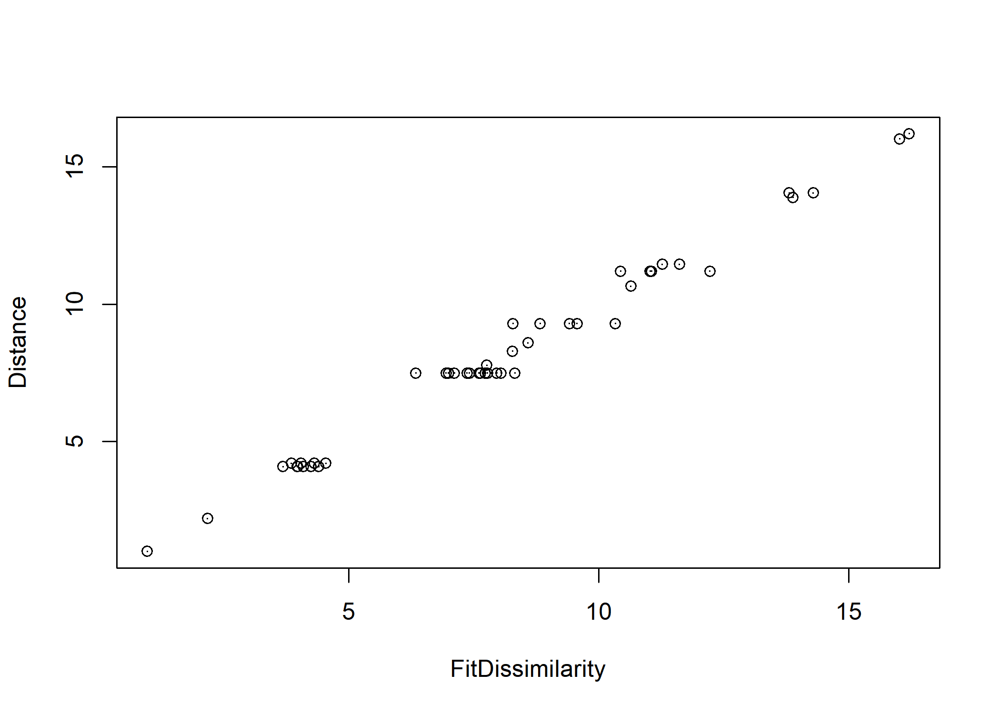

Multidimensional Scaling(MDS) - (2)
================
Jae Kwan Koo

-   [Non-Metric MDS - klpga.txt data](#non-metric-mds---klpga.txt-data)
    -   [표준화 유클리드거리](#표준화-유클리드거리)
    -   [Dissimilarity Matrix](#dissimilarity-matrix)
    -   [Nonmetric MDS](#nonmetric-mds)
    -   [Shepard Diagram](#shepard-diagram)
    -   [Image Diagram](#image-diagram)
-   [Non-Metric MDS - Morse.txt data](#non-metric-mds---morse.txt-data)
    -   [Standard Transformation : cij(similarity) to dij(dissimilarity)](#standard-transformation-cijsimilarity-to-dijdissimilarity)
    -   [Non Metric MDS](#non-metric-mds)
    -   [Shepard Diagram](#shepard-diagram-1)
    -   [Image Diagram](#image-diagram-1)

Non-Metric MDS - klpga.txt data
-------------------------------

``` r
setwd("D:\\Jae Kwan\\R프로그래밍\\Multivariate Analysis")
data<-read.table("klpga.txt", header=T)

X<-scale(data, scale=T)

X<-as.matrix(data)
player<-rownames(X); n<-nrow(X); p<-ncol(X)
```

비계량형 MDS : 데이터가 순서척도인 경우 사용
거리가 특별한 단위의미를 가지지 않는 경우이다.

KLPGA 선수의 성적(klpga.txt)에 대한 비계량형 MDS

### 표준화 유클리드거리

``` r
D <- as.matrix(dist(X, method="euclidean"))
```

### Dissimilarity Matrix

``` r
m <-as.matrix(dist(X, method="euclidean", diag=T))
D<-round(m^2, 3)/p
```

비계량형 MDS에서는 비유사성행렬 D가 반드시 거리행렬이라 여기지 않아도 되나 실제로 자료가 유사성행렬로 나타날 때 가장 적절한 경우가 많다.

스트레스 공식의 최소화는 최경사하경법, Levenberg-Marquart, 가우스-뉴턴법과 같은 비선형회귀문제를 해결하는 수치최적화 알고리즘이 적용된다.

### Nonmetric MDS

``` r
library(MASS)  # for using isoMDS functions - Nonmetric MDS

con<-isoMDS(D, k=2)
```

    ## initial  value 11.603323 
    ## final  value 11.602415 
    ## converged

``` r
con
```

    ## $points
    ##           [,1]        [,2]
    ## 1  1473.578321  -1.6312744
    ## 2   512.121492 -26.3674826
    ## 3   467.078621  37.2300837
    ## 4   383.695477  33.6529194
    ## 5   311.600799 -76.9201513
    ## 6   286.720714  14.9169342
    ## 7   220.747810   7.7850770
    ## 8   114.440505 -10.7706779
    ## 9   107.085057 -10.7649203
    ## 10   94.149479  27.5867521
    ## 11   85.460900  -0.9239858
    ## 12   74.303807   1.7354483
    ## 13   36.856933  -3.7563014
    ## 14   27.933992 -10.7237637
    ## 15   -3.196979 -24.7112255
    ## 16   29.187263  31.3950032
    ## 17   -1.456697  -9.3352729
    ## 18  -10.413565   8.8206893
    ## 19  -30.250018 -10.0168942
    ## 20  -10.850549  17.0062229
    ## 21 -113.653736 -46.4713403
    ## 22  -44.113000  16.9296717
    ## 23  -78.990075   6.5714102
    ## 24 -101.294095  -5.1046247
    ## 25 -106.743226   5.5694887
    ## 26 -137.651090 -25.9383300
    ## 27 -113.718582   7.1868956
    ## 28 -139.753045 -16.0964697
    ## 29 -131.799819  -9.7588986
    ## 30 -110.290742  22.4801465
    ## 31 -127.561703  -5.1788259
    ## 32 -123.606001  12.7946735
    ## 33 -124.916204  10.5232204
    ## 34 -138.777657  -3.4610787
    ## 35 -138.358884  -1.9567674
    ## 36 -139.618332   1.5549868
    ## 37 -137.611673   7.9126265
    ## 38 -141.990706   8.3806969
    ## 39 -171.003854 -17.9138591
    ## 40 -148.626607  -2.2987541
    ## 41 -137.058028  12.6544862
    ## 42 -157.480409   9.9125680
    ## 43 -171.112991  -7.1874919
    ## 44 -152.575486  15.4691408
    ## 45 -149.495929  22.8213681
    ## 46 -198.987540 -25.7614121
    ## 47 -196.903722 -21.0228837
    ## 48 -163.754137  11.9576908
    ## 49 -178.709892  11.9013745
    ## 50 -192.636198   9.3231106
    ## 
    ## $stress
    ## [1] 11.60241

크루스칼 판별기준에 따르면 stress = 11.60241%는 적합도가 보통정도에 해당한다.

``` r
x<-con$points[,1]; y<-con$points[,2]
lim1<-c(-max(abs(x)), max(abs(x))); lim2<-c(-max(abs(y)), max(abs(y)))


plot(x,y, xlab="Dim1", ylab="Dim2", xlim=lim1, ylim=lim2)
text(x,y,player, cex=0.8, pos=2)
abline(v=0, h=0)
```



### Shepard Diagram

``` r
klpga_sh <- Shepard(D[lower.tri(D)], con$points)

plot(klpga_sh$x, klpga_sh$yf, pch = ".", xlab = "Dissimilarity", ylab = "Distance", 
     xlim = range(klpga_sh$x), ylim = range(klpga_sh$x))
lines(klpga_sh$x, klpga_sh$yf, type = "S")
```



함수의 단조성을 가지고 이야기하게 되는데, 전체적으로 단조함수라고 볼 수 있으므로 gof에 대해서 볼 때, 적합이 잘 되었다.
세퍼드그림은 수직축에 순위상과 수평축에 실제 비유사성에 대한 산점도로 비계량형 MDS모형에서 가정한 f()의 단조성이 만족됨을 보이고 있다.

### Image Diagram

``` r
plot(klpga_sh$y, klpga_sh$yf, pch=".", xlab="FitDissimilarity", ylab="Distance", 
  xlim=range(klpga_sh$y), ylim=range(klpga_sh$y))
lines(klpga_sh$y, klpga_sh$yf, type="p")
```



상그림은 수직축에 순위상과 수평축에 2차원의 형상좌표로부터 얻어지는 비유사성에 대한 산점도로 원점을 지나는 직선상에 잘 놓여 있어 비계량형 MDS가 잘 적합되었다고 여겨진다.

Non-Metric MDS - Morse.txt data
-------------------------------

``` r
setwd("D:\\Jae Kwan\\R프로그래밍\\Multivariate Analysis")
data2<-read.table("morse.txt", header=T)

C<-as.matrix(data2)
sign<-colnames(C); n<-nrow(C)

data2
```

    ##    X1..... X2..... X3..... X4..... X5..... X6...... X7..... X8.....
    ## 1       84      62      16       6       2       12      20      37
    ## 2       62      89      59      23       8       14      25      25
    ## 3       16      59      86      38      27       33      17      16
    ## 4        6      23      38      89      56       34      24      13
    ## 5        2       8      27      56      90       30      18      10
    ## 6       12      14      33      34      30       86      65      22
    ## 7       20      25      17      24      18       65      85      65
    ## 8       37      25      16      13      10       22      65      88
    ## 9       57      28       9       7       5        8      31      58
    ## 10      52      18       9       7       5       18      15      39
    ##    X9..... X0.....
    ## 1       57      52
    ## 2       28      18
    ## 3        9       9
    ## 4        7       7
    ## 5        5       5
    ## 6        8      18
    ## 7       31      15
    ## 8       58      39
    ## 9       91      79
    ## 10      79      94

### Standard Transformation : cij(similarity) to dij(dissimilarity)

``` r
J<-matrix(1,n,n)

cii<-diag(diag(C))%*%J
cij<-C
cjj<-J%*%diag(diag(C))

D<-sqrt(cii-2*cij+cjj)
D
```

    ##         X1.....   X2.....   X3.....   X4.....   X5.....  X6......
    ##  [1,]  0.000000  7.000000 11.747340 12.688578 13.038405 12.083046
    ##  [2,]  7.000000  0.000000  7.549834 11.489125 12.767145 12.124356
    ##  [3,] 11.747340  7.549834  0.000000  9.949874 11.045361 10.295630
    ##  [4,] 12.688578 11.489125  9.949874  0.000000  8.185353 10.344080
    ##  [5,] 13.038405 12.767145 11.045361  8.185353  0.000000 10.770330
    ##  [6,] 12.083046 12.124356 10.295630 10.344080 10.770330  0.000000
    ##  [7,] 11.357817 11.135529 11.704700 11.224972 11.789826  6.403124
    ##  [8,]  9.899495 11.269428 11.916375 12.288206 12.569805 11.401754
    ##  [9,]  7.810250 11.135529 12.609520 12.884099 13.076697 12.688578
    ## [10,]  8.602325 12.124356 12.727922 13.000000 13.190906 12.000000
    ##         X7.....   X8.....   X9.....   X0.....
    ##  [1,] 11.357817  9.899495  7.810250  8.602325
    ##  [2,] 11.135529 11.269428 11.135529 12.124356
    ##  [3,] 11.704700 11.916375 12.609520 12.727922
    ##  [4,] 11.224972 12.288206 12.884099 13.000000
    ##  [5,] 11.789826 12.569805 13.076697 13.190906
    ##  [6,]  6.403124 11.401754 12.688578 12.000000
    ##  [7,]  0.000000  6.557439 10.677078 12.206556
    ##  [8,]  6.557439  0.000000  7.937254 10.198039
    ##  [9,] 10.677078  7.937254  0.000000  5.196152
    ## [10,] 12.206556 10.198039  5.196152  0.000000

### Non Metric MDS

``` r
library(MASS)
con<-isoMDS(D, k=2)
```

    ## initial  value 14.382457 
    ## iter   5 value 5.592055
    ## iter  10 value 4.838002
    ## iter  10 value 4.834016
    ## iter  10 value 4.834016
    ## final  value 4.834016 
    ## converged

``` r
con
```

    ## $points
    ##             [,1]       [,2]
    ##  [1,] -4.4076098 -2.1261653
    ##  [2,] -0.7137196 -4.5293677
    ##  [3,]  3.1894738 -3.7254810
    ##  [4,]  6.6534637 -2.0263835
    ##  [5,]  9.0022930  1.1841416
    ##  [6,]  2.7519821  4.2269555
    ##  [7,]  0.9296257  3.0261964
    ##  [8,] -3.1954076  2.0171432
    ##  [9,] -7.0021901  0.4974936
    ## [10,] -7.2079111  1.4554671
    ## 
    ## $stress
    ## [1] 4.834016

``` r
x<-con$points[,1]; y<-con$points[,2]
lim1<-c(-max(abs(x)), max(abs(x))); lim2<-c(-max(abs(y))-0.2, max(abs(y)))

plot(x,y, xlab="Dim1", ylab="Dim2", xlim=lim1, ylim=lim2)
text(x,y,sign, cex=0.8, pos=1)
abline(v=0,h=0)
```



MDS 그림에서의 모스부호끼리의 거리가 살짝 달라지긴 했지만, 기본적으로 큰 차이가 없어보인다.

### Shepard Diagram

``` r
morse_sh <- Shepard(D[lower.tri(D)], con$points)

plot(morse_sh$x, morse_sh$yf, pch = ".", xlab = "Dissimilarity", ylab = "Distance", 
     xlim = range(morse_sh$x), ylim = range(morse_sh$x))
lines(morse_sh$x, morse_sh$yf, type = "S")
```



함수의 단조성을 가지고 이야기하게 되는데, 전체적으로 단조함수라고 볼 수 있으므로 gof에 대해서 볼 때, 적합이 잘 되었다.
세퍼드그림은 수직축에 순위상과 수평축에 실제 비유사성에 대한 산점도로 비계량형 MDS모형에서 가정한 f()의 단조성이 만족됨을 보이고 있다.

### Image Diagram

``` r
plot(morse_sh$y, morse_sh$yf, pch=".", xlab="FitDissimilarity", ylab="Distance", 
  xlim=range(morse_sh$y), ylim=range(morse_sh$y))
lines(morse_sh$y, morse_sh$yf, type="p")
```



상그림은 수직축에 순위상과 수평축에 2차원의 형상좌표로부터 얻어지는 비유사성에 대한 산점도로 원점을 지나는 직선상에 잘 놓여 있어 비계량형 MDS가 잘 적합되었다고 여겨진다.
