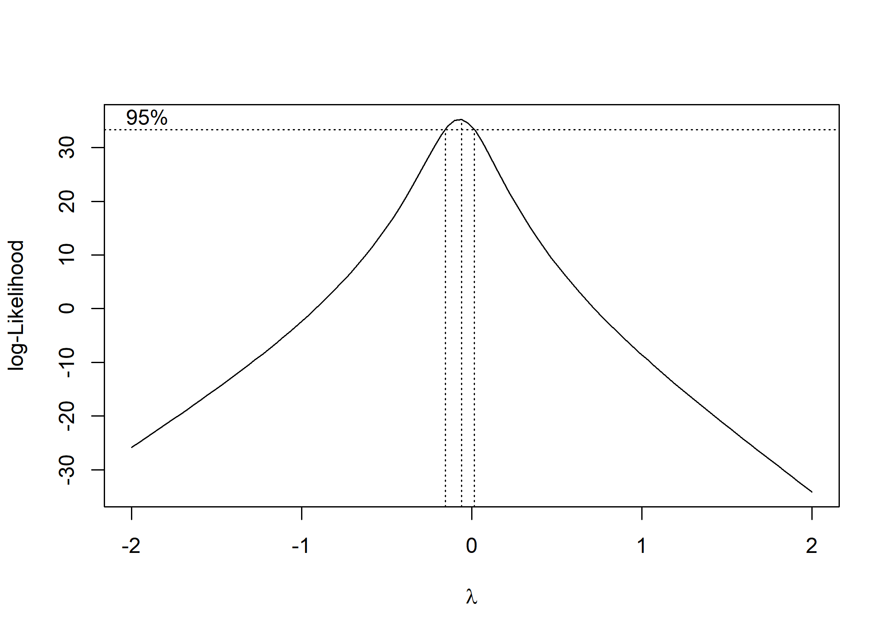
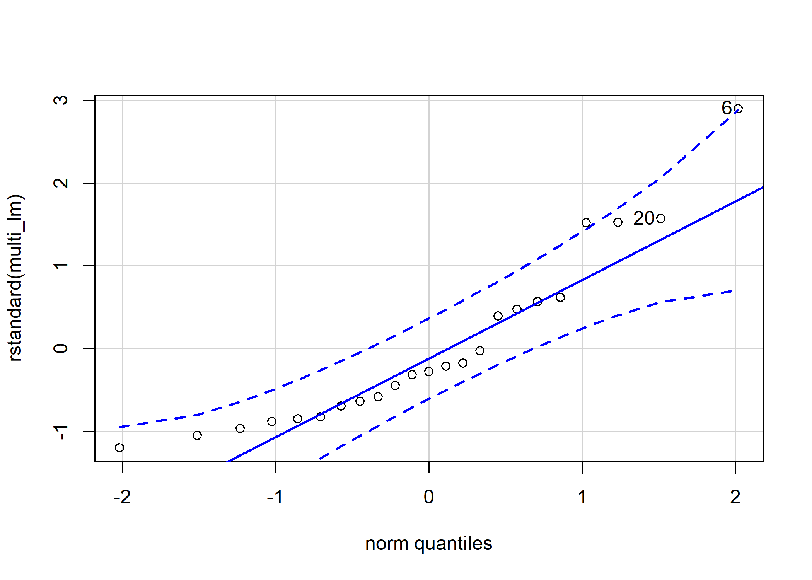
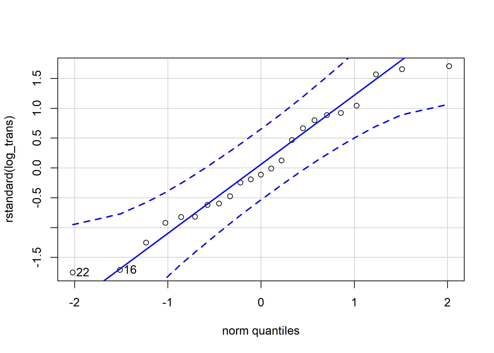

Regression Analysis ( Ⅱ ) Project 1 using R.
================
Jae Kwan Koo

-   [1.Make your own dataset based on data in Example 6.5 (p. 251). Let X1&lt;-X1+e, X2&lt;-X2+e, Y&lt;-Y+e, where e~N(0,1^2). Do the response surface analysis with contour plot.](#make-your-own-dataset-based-on-data-in-example-6.5-p.-251.-let-x1-x1e-x2-x2e-y-ye-where-en012.-do-the-response-surface-analysis-with-contour-plot.)
    -   [set the data](#set-the-data)
        -   [add the error terms.](#add-the-error-terms.)
    -   [Fitting a response-surface model](#fitting-a-response-surface-model)
        -   [First-order rsm](#first-order-rsm)
        -   [Second-order rsm](#second-order-rsm)
-   [2.Make your own dataset based on data in Example 6.6(p.254). Let X1&lt;-X1+e, Y&lt;-Y+e, where e~N(0,0.1^2). Compute the WLSE using the same method as the one in text.](#make-your-own-dataset-based-on-data-in-example-6.6p.254.-let-x1-x1e-y-ye-where-en00.12.-compute-the-wlse-using-the-same-method-as-the-one-in-text.)
    -   [set the data](#set-the-data-1)
    -   [add the error terms.](#add-the-error-terms.-1)
    -   [linear model with weight](#linear-model-with-weight)
-   [3.Make your own dataset based on data in Example 6.7(p.259). Let Y&lt;-Y+e, where e~N(0,1).](#make-your-own-dataset-based-on-data-in-example-6.7p.259.-let-y-ye-where-en01.)
    -   [(1)Fit the data to the multiple linear regression model.](#fit-the-data-to-the-multiple-linear-regression-model.)
        -   [set the data](#set-the-data-2)
        -   [add the error terms](#add-the-error-terms)
    -   [(2)Fit the data to the Box-Cox transformation model.](#fit-the-data-to-the-box-cox-transformation-model.)
        -   [log transformation model](#log-transformation-model)
    -   [(3)Compare two models in (1) and (2) by using the Q-Q plot of residuals in each model.](#compare-two-models-in-1-and-2-by-using-the-q-q-plot-of-residuals-in-each-model.)
    -   [Reference](#reference)
        -   [Response Surface Analysis](#response-surface-analysis)
        -   [WLSE](#wlse)
        -   [BOX-COX](#box-cox)
        -   [참고 문헌 : 회귀분석 제 2판 (김충락, 강근석)](#참고-문헌-회귀분석-제-2판-김충락-강근석)

1.Make your own dataset based on data in Example 6.5 (p. 251). Let X1&lt;-X1+e, X2&lt;-X2+e, Y&lt;-Y+e, where e~N(0,1^2). Do the response surface analysis with contour plot.
-----------------------------------------------------------------------------------------------------------------------------------------------------------------------------

### set the data

``` r
x1<-c(4,20,12,12,12,12,12,6.3,6.3,17.7,17.7)
x2<-c(250,250,250,250,220,280,250,229,271,229,271)
y<-c(83.8,81.7,82.4,82.9,84.7,67.9,81.2,81.3,83.1,85.3,72.7)
```

#### add the error terms.

``` r
set.seed(2019)
X1<-x1+rnorm(n=1,mean=0,sd=1)
X2<-x2+rnorm(n=1,mean=0,sd=1)
Y<-y+rnorm(n=1,mean=0,sd=1)

data<-data.frame(X1,X2,Y)
data
```

    ##           X1       X2        Y
    ## 1   4.738523 249.4852 82.15982
    ## 2  20.738523 249.4852 80.05982
    ## 3  12.738523 249.4852 80.75982
    ## 4  12.738523 249.4852 81.25982
    ## 5  12.738523 219.4852 83.05982
    ## 6  12.738523 279.4852 66.25982
    ## 7  12.738523 249.4852 79.55982
    ## 8   7.038523 228.4852 79.65982
    ## 9   7.038523 270.4852 81.45982
    ## 10 18.438523 228.4852 83.65982
    ## 11 18.438523 270.4852 71.05982

### Fitting a response-surface model

#### First-order rsm

``` r
# install.packages("rsm")  for response-surface analysis
library(rsm)
rsm1<-rsm(Y~ FO(X1,X2),data=data)

summary(rsm1)
```

    ## 
    ## Call:
    ## rsm(formula = Y ~ FO(X1, X2), data = data)
    ## 
    ##               Estimate Std. Error t value  Pr(>|t|)    
    ## (Intercept) 132.784318  17.111097  7.7601 5.433e-05 ***
    ## X1           -0.206544   0.249835 -0.8267    0.4324    
    ## X2           -0.205051   0.067214 -3.0507    0.0158 *  
    ## ---
    ## Signif. codes:  0 '***' 0.001 '**' 0.01 '*' 0.05 '.' 0.1 ' ' 1
    ## 
    ## Multiple R-squared:  0.5553, Adjusted R-squared:  0.4441 
    ## F-statistic: 4.995 on 2 and 8 DF,  p-value: 0.0391
    ## 
    ## Analysis of Variance Table
    ## 
    ## Response: Y
    ##             Df  Sum Sq Mean Sq F value  Pr(>F)
    ## FO(X1, X2)   2 160.856  80.428  4.9951 0.03910
    ## Residuals    8 128.810  16.101                
    ## Lack of fit  6 127.283  21.214 27.7911 0.03514
    ## Pure error   2   1.527   0.763                
    ## 
    ## Direction of steepest ascent (at radius 1):
    ##         X1         X2 
    ## -0.7096673 -0.7045370 
    ## 
    ## Corresponding increment in original units:
    ##         X1         X2 
    ## -0.7096673 -0.7045370

FO는 "first-order"을 의미한다. 먼저 첫번째 반응표면모형을 적합하였다.
아래의 분산분석표에서 lack of fit과 pure error의 분해를 확인할 수 있다. 이 예제에서 이 모형의 lack of fit의 p-value는 0.03514&lt;alpha=0.05이다. 이 사실은 우리가 higher-order model을 사용해야 함을 제안한다.
first-order rsm의 contour plot을 먼저 확인해본 후, 다음으로 "second-order"모형을 적합시켜보자.

``` r
contour(rsm1,~X1+X2, image = TRUE)
```


#### Second-order rsm

``` r
rsm2<-rsm(Y~ SO(X1,X2),data=data)

summary(rsm2)
```

    ## 
    ## Call:
    ## rsm(formula = Y ~ SO(X1, X2), data = data)
    ## 
    ##                Estimate  Std. Error t value Pr(>|t|)  
    ## (Intercept) -3.2996e+02  1.3609e+02 -2.4246  0.05978 .
    ## X1           6.8603e+00  2.4730e+00  2.7740  0.03918 *
    ## X2           3.1560e+00  1.0642e+00  2.9656  0.03131 *
    ## X1:X2       -3.0075e-02  9.4237e-03 -3.1914  0.02423 *
    ## X1^2         1.7134e-02  2.9597e-02  0.5789  0.58776  
    ## X2^2        -5.9682e-03  2.1178e-03 -2.8181  0.03719 *
    ## ---
    ## Signif. codes:  0 '***' 0.001 '**' 0.01 '*' 0.05 '.' 0.1 ' ' 1
    ## 
    ## Multiple R-squared:  0.9121, Adjusted R-squared:  0.8243 
    ## F-statistic: 10.38 on 5 and 5 DF,  p-value: 0.01128
    ## 
    ## Analysis of Variance Table
    ## 
    ## Response: Y
    ##             Df  Sum Sq Mean Sq F value   Pr(>F)
    ## FO(X1, X2)   2 160.856  80.428 15.8022 0.006896
    ## TWI(X1, X2)  1  51.840  51.840 10.1853 0.024226
    ## PQ(X1, X2)   2  51.522  25.761  5.0614 0.062856
    ## Residuals    5  25.448   5.090                 
    ## Lack of fit  3  23.922   7.974 10.4461 0.088623
    ## Pure error   2   1.527   0.763                 
    ## 
    ## Stationary point of response surface:
    ##         X1         X2 
    ##   9.920527 239.406876 
    ## 
    ## Eigenanalysis:
    ## eigen() decomposition
    ## $values
    ## [1]  0.02454460 -0.01337914
    ## 
    ## $vectors
    ##          [,1]       [,2]
    ## X1 -0.8969851 -0.4420607
    ## X2  0.4420607 -0.8969851

second-order rsm을 수행하였다. 이제는 lack of fit이 0.088623으로 alpha(=0.05)보다 커 더이상 유의하지 않다. 따라서, 이 모형으로 반응표면분석을 수행해도 될 것 같다.
second-order moel의 summary는 표면의 정준분석의 결과를 제공한다. 이 분석은 적합된 표면의 정상점이 코드화된 단위 (9.920527, 239.406876)로 나타나며, 실험 영역 이내에 있는 것으로 나타났다.
또한, 둘 eigenvalue의 부호가 서로 달라 stationary point는 saddel point이다.
contour plot을 마지막으로 확인해보자.

``` r
contour(rsm2,~X1+X2, image = TRUE)
```


2.Make your own dataset based on data in Example 6.6(p.254). Let X1&lt;-X1+e, Y&lt;-Y+e, where e~N(0,0.1^2). Compute the WLSE using the same method as the one in text.
-----------------------------------------------------------------------------------------------------------------------------------------------------------------------

### set the data

``` r
x<-c(1.15,1.90,3,3,3,3,3,5.34,5.38,5.4,5.4,5.45,7.7,7.8,7.81,7.85,7.87,7.91,
     7.94,9.03,9.07,9.11,9.14,9.16,9.37,10.17,10.18,10.22,10.22,10.22,10.18,10.50,10.23,10.03,10.23)

y<-c(0.99,0.98,2.6,2.67,2.66,2.78,2.8,5.92,5.35,4.33,4.89,5.21,7.68,9.81,6.52,9.71,9.82,9.81,
     8.5,9.47,11.45,12.14,11.5,10.65,10.64,9.78,12.39,11.03,8,11.9,8.68,7.25,13.46,10.19,9.93)

w<-c(1.24028,2.18224,7.84930,7.84930,7.84930,7.84930,7.84930,7.43652,6.99309,6.78574,6.78574,6.30514,0.89204,0.84420,0.83963,0.82171,0.81296,0.79588,
     0.78342,0.47385,0.46621,0.45878,0.45327,0.44968,0.41435,0.31182,0.31079,0.30672,0.30672,0.30672,0.31079,0.28033,0.30571,0.32680,0.30571)
```

35개의 관측치로 이루어진 자료이다. 여기서 w는 weight를 의미한다.

### add the error terms.

``` r
set.seed(2019)
X<-x+rnorm(n=1,mean=0,sd=1)
Y<-y+rnorm(n=1,mean=0,sd=1)

data2<-data.frame(X,Y,w)
head(data2)
```

    ##          X         Y       w
    ## 1 1.888523 0.4752395 1.24028
    ## 2 2.638523 0.4652395 2.18224
    ## 3 3.738523 2.0852395 7.84930
    ## 4 3.738523 2.1552395 7.84930
    ## 5 3.738523 2.1452395 7.84930
    ## 6 3.738523 2.2652395 7.84930

오차항을 넣어준 뒤 X,Y의 변수를 재할당하였다. 그리고 데이터프레임으로 만들어 앞 6개 행만 확인해보았다.

### linear model with weight

``` r
lm(y~x, data=data2,weights = w)
```

    ## 
    ## Call:
    ## lm(formula = y ~ x, data = data2, weights = w)
    ## 
    ## Coefficients:
    ## (Intercept)            x  
    ##     -0.8891       1.1648

오차항이 없을때, weight가 주어진 linear model이다. 이 식은 책의 식과 같음을 확인할 수 있다.
이제 오차항이 주어졌을 때의 모형을 살펴보자.

``` r
lm(Y~X, data=data2, weights = w)
```

    ## 
    ## Call:
    ## lm(formula = Y ~ X, data = data2, weights = w)
    ## 
    ## Coefficients:
    ## (Intercept)            X  
    ##      -2.264        1.165

weighted least estimator은 다음과 같다.

$$
\\hat{\\beta\_0} = -2.26413 , \\hat{\\beta\_1} = 1.16482
$$

모형이 적합한지 확인해보자.

``` r
summary(lm(Y~X, data=data2, weights = w))
```

    ## 
    ## Call:
    ## lm(formula = Y ~ X, data = data2, weights = w)
    ## 
    ## Weighted Residuals:
    ##     Min      1Q  Median      3Q     Max 
    ## -2.7896 -0.5574  0.1532  0.9828  1.6375 
    ## 
    ## Coefficients:
    ##             Estimate Std. Error t value Pr(>|t|)    
    ## (Intercept) -2.26413    0.34099   -6.64 1.49e-07 ***
    ## X            1.16482    0.05941   19.61  < 2e-16 ***
    ## ---
    ## Signif. codes:  0 '***' 0.001 '**' 0.01 '*' 0.05 '.' 0.1 ' ' 1
    ## 
    ## Residual standard error: 1.137 on 33 degrees of freedom
    ## Multiple R-squared:  0.9209, Adjusted R-squared:  0.9185 
    ## F-statistic: 384.4 on 1 and 33 DF,  p-value: < 2.2e-16

절편과 기울기의 p-value는 모두 충분히 작다. 또한 F-statistic은 매우 크고 p-value는 거의 0이므로 모형은 적절하다고 판단할 수 있다.

3.Make your own dataset based on data in Example 6.7(p.259). Let Y&lt;-Y+e, where e~N(0,1).
-------------------------------------------------------------------------------------------

### (1)Fit the data to the multiple linear regression model.

#### set the data

``` r
y<-c(26,38,50,76,108,157,
     17,26,37,53,83,124,
     13,20,27,37,57,87,
     NA,15,22,27,41,63)
x1<-c(rep(0,6),rep(10,6),rep(20,6),rep(30,6))
x2<-c(rep(seq(0,60,12),4))
```

#### add the error terms

``` r
set.seed(2019)
Y<-y+rnorm(n=1,mean=0,sd=1)

data3<-data.frame(x1,x2,Y)
data3
```

    ##    x1 x2         Y
    ## 1   0  0  26.73852
    ## 2   0 12  38.73852
    ## 3   0 24  50.73852
    ## 4   0 36  76.73852
    ## 5   0 48 108.73852
    ## 6   0 60 157.73852
    ## 7  10  0  17.73852
    ## 8  10 12  26.73852
    ## 9  10 24  37.73852
    ## 10 10 36  53.73852
    ## 11 10 48  83.73852
    ## 12 10 60 124.73852
    ## 13 20  0  13.73852
    ## 14 20 12  20.73852
    ## 15 20 24  27.73852
    ## 16 20 36  37.73852
    ## 17 20 48  57.73852
    ## 18 20 60  87.73852
    ## 19 30  0        NA
    ## 20 30 12  15.73852
    ## 21 30 24  22.73852
    ## 22 30 36  27.73852
    ## 23 30 48  41.73852
    ## 24 30 60  63.73852

y에 error terms을 더한 후 x1, x2와 함께 데이터프레임으로 만들었다. 특이사항으로는 Y값에 결측치가 한개 보인다는 것이다.

``` r
multi_lm<-lm(Y~x1+x2,data=data3)
summary(multi_lm)
```

    ## 
    ## Call:
    ## lm(formula = Y ~ x1 + x2, data = data3)
    ## 
    ## Residuals:
    ##     Min      1Q  Median      3Q     Max 
    ## -15.592  -9.695  -3.722   6.713  35.296 
    ## 
    ## Coefficients:
    ##             Estimate Std. Error t value Pr(>|t|)    
    ## (Intercept)  28.9222     6.3322   4.568 0.000187 ***
    ## x1           -1.7166     0.2640  -6.502 2.44e-06 ***
    ## x2            1.5587     0.1452  10.735 9.48e-10 ***
    ## ---
    ## Signif. codes:  0 '***' 0.001 '**' 0.01 '*' 0.05 '.' 0.1 ' ' 1
    ## 
    ## Residual standard error: 13.82 on 20 degrees of freedom
    ##   (1 observation deleted due to missingness)
    ## Multiple R-squared:  0.8793, Adjusted R-squared:  0.8673 
    ## F-statistic: 72.87 on 2 and 20 DF,  p-value: 6.543e-10

multiple linear regression model을 적합시켰다. 그 후, adjusted r square을 확인해보았다.
F-statistic이 충분히 크고 p-value는 0에 가까워 모형은 잘 적합이 되었음을 알 수 있고, 수정된 결정계수는 0.8673이다.

### (2)Fit the data to the Box-Cox transformation model.

``` r
library(MASS) #using boxcox function in r
box_cox<-boxcox(multi_lm)  #log transformation
```



``` r
lambda<-box_cox$x
likeli_value<-box_cox$y

order_table<-cbind(lambda,likeli_value)
sorted<-order_table[order(-likeli_value),] 
```

boxcox함수를 통해 람다가 언제일 때 최대가능도 함수가 최대가 되는지 그림으로 살펴보았다. 대략 0 근처인 것 같다. 자세한 람다값을 살펴보자. 가능도 함수의 값이 큰 순서대로 정렬을 한 뒤, 람다값을 확인해 보았다.

``` r
head(sorted)  # maximum when lambda is about -0.05.
```

    ##           lambda likeli_value
    ## [1,] -0.06060606     35.25923
    ## [2,] -0.10101010     35.09827
    ## [3,] -0.02020202     34.54317
    ## [4,] -0.14141414     34.02224
    ## [5,]  0.02020202     33.06571
    ## [6,] -0.18181818     32.26908

*λ* = −0.06060606 일 때, 최대가능도 함수는 최대가 된다. 이 값은 거의 0에 가까우므로 log transformation을 이용해보도록 한다.

#### log transformation model

``` r
log_trans<-lm(log(Y)~x1+x2,data=data3)
summary(log_trans)
```

    ## 
    ## Call:
    ## lm(formula = log(Y) ~ x1 + x2, data = data3)
    ## 
    ## Residuals:
    ##      Min       1Q   Median       3Q      Max 
    ## -0.08522 -0.03485 -0.00536  0.04050  0.08090 
    ## 
    ## Coefficients:
    ##               Estimate Std. Error t value Pr(>|t|)    
    ## (Intercept)  3.2441608  0.0234713  138.22   <2e-16 ***
    ## x1          -0.0309299  0.0009785  -31.61   <2e-16 ***
    ## x2           0.0302873  0.0005382   56.27   <2e-16 ***
    ## ---
    ## Signif. codes:  0 '***' 0.001 '**' 0.01 '*' 0.05 '.' 0.1 ' ' 1
    ## 
    ## Residual standard error: 0.05123 on 20 degrees of freedom
    ##   (1 observation deleted due to missingness)
    ## Multiple R-squared:  0.9949, Adjusted R-squared:  0.9943 
    ## F-statistic:  1934 on 2 and 20 DF,  p-value: < 2.2e-16

먼저, F-statistic이 충분히 크고, p-value가 거의 0이므로 모형은 적절하다고 할 수 있다. 또한 수정된 결정계수는 0.9943으로 변환하기 전보다 높다. 변환시키지 않은 원래의 모형이 box-cox 변환모형보다 훨씬 적합도가 떨어짐을 알 수 있다.

### (3)Compare two models in (1) and (2) by using the Q-Q plot of residuals in each model.

``` r
library(car) #using qqPlot function.
qqPlot(rstandard(multi_lm))
```



    ##  6 20 
    ##  6 19

``` r
qqPlot(rstandard(log_trans))
```



    ## 22 16 
    ## 21 16

변환하기 전의 Q-Q plot은 6번 잔차가 신뢰대 밖으로 나가는 모습을 보이고 있다.
또한, 로그변환 한 모형의 Q-Q plot의 잔차들이 조금더 직선위에 잘 모여있는 모습이다. 그러므로, 로그변환한 모형이 정규분포에 더 가까움을 알 수 있다. car package의 함수를 이용하지 않고 기본함수로도 Q-Q plot은 그려볼 수 있다.

``` r
par(mfrow=c(1,2))
qqnorm(multi_lm$residuals)
qqline(multi_lm$residuals)

qqnorm(log_trans$residuals)
qqline(log_trans$residuals)
```


### Reference

#### Response Surface Analysis

[contour](https://rdrr.io/cran/rsm/man/contour.lm.html)
[download the paper](https://www.jstatsoft.org/article/view/v032i07)
[rsm in R for response-surface regression](https://www.rdocumentation.org/packages/rsm/versions/1.0/topics/rsm)

#### WLSE

[weighted linear regression in r](https://www.datasciencecentral.com/profiles/blogs/weighted-linear-regression-in-r)

#### BOX-COX

[box cox transformation](https://rpubs.com/bskc/288328)

#### 참고 문헌 : 회귀분석 제 2판 (김충락, 강근석)
