머신러닝을 이용한 당뇨병 예측
================
Jae Kwan Koo

-   [Variable Description.](#variable-description.)
-   [EDA](#eda)
    -   [Missing Values.](#missing-values.)
    -   [Box-Plot](#box-plot)
        -   [preg](#preg)
        -   [plas](#plas)
        -   [pres](#pres)
        -   [skin](#skin)
        -   [insu](#insu)
        -   [mass](#mass)
        -   [pedi](#pedi)
-   [](#section)
    -   [Correlation Plot.](#correlation-plot.)
-   [partition the dataset.](#partition-the-dataset.)
-   [Logistic Regression.](#logistic-regression.)
-   [Decision Tree.](#decision-tree.)
-   [RandomForest](#randomforest)
-   [XGBOOST](#xgboost)

``` r
# install.packages("webshot")
# webshot::install_phantomjs()
```

``` r
# data wrangling
library(data.table)
library(tidyverse)    
    

# data assessment/visualizations
library(caret)         # using confusionMatrix function and createDataPartition function 
library(DT)       
library(corrplot)
library(knitr)
library(plotly)


# model
library(rpart)         # making decision tree
library(rpart.plot)    # plot for decision tree
library(randomForest)  # using randomForest algorithm
library(pROC)          # using roc function in package
library(mice)          # (multiple imputation, MI)
library(xgboost)
```

``` r
setwd("d:/")
data<-fread("dataset_37_diabetes.csv")
```

### Variable Description.

-   preg : 임신횟수
-   plas : 혈장 포도당 농도
-   pres : 혈압
-   skin : 피부 주름 두께
-   insu : 2시간 혈청 인슐린
-   mass : weight / (height)^2
-   pedi : 당뇨병 혈통 기능
-   age : 나이
-   class : 당뇨병 여부

EDA
---

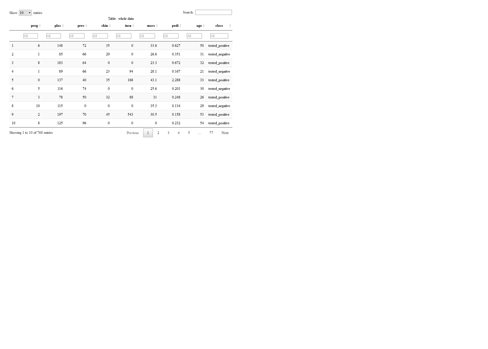

``` r
summary(data); str(data)
```

    ##       preg             plas            pres             skin      
    ##  Min.   : 0.000   Min.   :  0.0   Min.   :  0.00   Min.   : 0.00  
    ##  1st Qu.: 1.000   1st Qu.: 99.0   1st Qu.: 62.00   1st Qu.: 0.00  
    ##  Median : 3.000   Median :117.0   Median : 72.00   Median :23.00  
    ##  Mean   : 3.845   Mean   :120.9   Mean   : 69.11   Mean   :20.54  
    ##  3rd Qu.: 6.000   3rd Qu.:140.2   3rd Qu.: 80.00   3rd Qu.:32.00  
    ##  Max.   :17.000   Max.   :199.0   Max.   :122.00   Max.   :99.00  
    ##       insu            mass            pedi             age       
    ##  Min.   :  0.0   Min.   : 0.00   Min.   :0.0780   Min.   :21.00  
    ##  1st Qu.:  0.0   1st Qu.:27.30   1st Qu.:0.2437   1st Qu.:24.00  
    ##  Median : 30.5   Median :32.00   Median :0.3725   Median :29.00  
    ##  Mean   : 79.8   Mean   :31.99   Mean   :0.4719   Mean   :33.24  
    ##  3rd Qu.:127.2   3rd Qu.:36.60   3rd Qu.:0.6262   3rd Qu.:41.00  
    ##  Max.   :846.0   Max.   :67.10   Max.   :2.4200   Max.   :81.00  
    ##     class          
    ##  Length:768        
    ##  Class :character  
    ##  Mode  :character  
    ##                    
    ##                    
    ## 

    ## Classes 'data.table' and 'data.frame':   768 obs. of  9 variables:
    ##  $ preg : int  6 1 8 1 0 5 3 10 2 8 ...
    ##  $ plas : int  148 85 183 89 137 116 78 115 197 125 ...
    ##  $ pres : int  72 66 64 66 40 74 50 0 70 96 ...
    ##  $ skin : int  35 29 0 23 35 0 32 0 45 0 ...
    ##  $ insu : int  0 0 0 94 168 0 88 0 543 0 ...
    ##  $ mass : num  33.6 26.6 23.3 28.1 43.1 25.6 31 35.3 30.5 0 ...
    ##  $ pedi : num  0.627 0.351 0.672 0.167 2.288 ...
    ##  $ age  : int  50 31 32 21 33 30 26 29 53 54 ...
    ##  $ class: chr  "tested_positive" "tested_negative" "tested_positive" "tested_negative" ...
    ##  - attr(*, ".internal.selfref")=<externalptr>

``` r
data$class<-as.factor(data$class)
```

### Missing Values.

``` r
sapply(data,function(x) sum(is.na(x)))
```

    ##  preg  plas  pres  skin  insu  mass  pedi   age class 
    ##     0     0     0     0     0     0     0     0     0

``` r
sapply(data,function(x) sum(x==0))
```

    ##  preg  plas  pres  skin  insu  mass  pedi   age class 
    ##   111     5    35   227   374    11     0     0     0

``` r
data<-data %>% mutate(plas=replace(plas, list=(plas==0), NA),
                      pres=replace(pres, list=(pres==0), NA),
                      skin=replace(skin, list=(skin==0), NA),
                      insu=replace(insu, list=(insu==0), NA),
                      mass=replace(mass, list=(mass==0), NA))


# dataset을 m개 만든다. 디폴트는 5 , method : randomforest
miceMod <- mice(data,method="rf",seed = 1234,print=F) 


miceOutput <- complete(miceMod)
datatable(miceOutput)
```

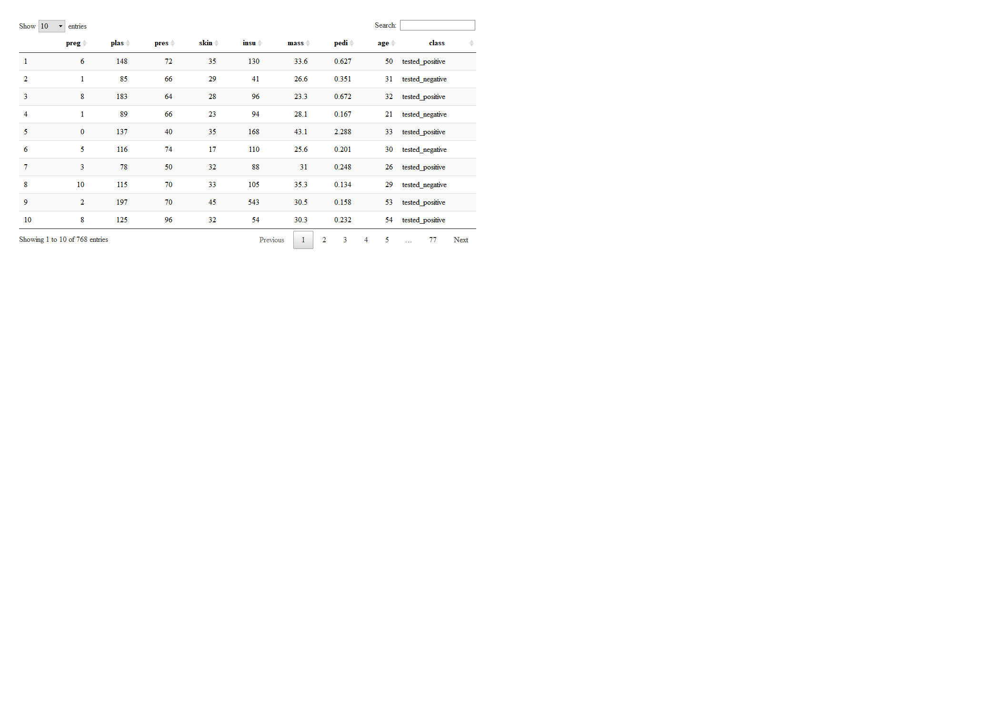

``` r
fit <- with(miceMod,lm(preg~plas+pres+skin+insu+mass+pedi+age+class))
pool_fit <- pool(fit)
summary(pool_fit)
```

    ##                          estimate   std.error  statistic        df
    ## (Intercept)          -0.745298538 0.806142133 -0.9245250 403.52146
    ## plas                 -0.005215451 0.004551946 -1.1457630 260.01029
    ## pres                  0.009351285 0.009859817  0.9484238 153.99592
    ## skin                  0.012187136 0.016847456  0.7233814  17.69597
    ## insu                 -0.001779030 0.001230901 -1.4453076  30.61109
    ## mass                 -0.018239665 0.021374400 -0.8533416 113.23089
    ## pedi                 -0.614426175 0.314260299 -1.9551505 731.67187
    ## age                   0.150262768 0.009609915 15.6362222 709.69299
    ## classtested_positive  1.030768243 0.255132313  4.0401321 745.24495
    ##                           p.value
    ## (Intercept)          3.557656e-01
    ## plas                 2.529466e-01
    ## pres                 3.443997e-01
    ## skin                 4.788993e-01
    ## insu                 1.585320e-01
    ## mass                 3.952715e-01
    ## pedi                 5.094566e-02
    ## age                  0.000000e+00
    ## classtested_positive 5.896291e-05

``` r
anyNA(miceOutput)
```

    ## [1] FALSE

``` r
str(miceOutput)
```

    ## 'data.frame':    768 obs. of  9 variables:
    ##  $ preg : int  6 1 8 1 0 5 3 10 2 8 ...
    ##  $ plas : int  148 85 183 89 137 116 78 115 197 125 ...
    ##  $ pres : int  72 66 64 66 40 74 50 70 70 96 ...
    ##  $ skin : int  35 29 28 23 35 17 32 33 45 32 ...
    ##  $ insu : int  130 41 96 94 168 110 88 105 543 54 ...
    ##  $ mass : num  33.6 26.6 23.3 28.1 43.1 25.6 31 35.3 30.5 30.3 ...
    ##  $ pedi : num  0.627 0.351 0.672 0.167 2.288 ...
    ##  $ age  : int  50 31 32 21 33 30 26 29 53 54 ...
    ##  $ class: Factor w/ 2 levels "tested_negative",..: 2 1 2 1 2 1 2 1 2 2 ...

``` r
data2<-miceOutput
```

결측치는 없음을 확인했고, preg(임신횟수)를 제외한 나머지 변수에서 0은 일어날 수 없는 수치이므로 mice패키지를 이용하여 결측치를 채워넣었다.

``` r
data2 %>% mutate(age_group=
                  case_when(age>=20 & age<30 ~ "20s",
                            age>=30 & age<40 ~ "30s",
                            age>=40 & age<50 ~ "40s",
                            age>=50 & age<60 ~ "50s",
                            age>=60 & age<70 ~ "60s",
                            age>=70 & age<80 ~ "70s",
                            age>=80 & age<90 ~ "80s")) %>% group_by(age_group) %>% summarise(n=n())
```

    ## # A tibble: 7 x 2
    ##   age_group     n
    ##   <chr>     <int>
    ## 1 20s         396
    ## 2 30s         165
    ## 3 40s         118
    ## 4 50s          57
    ## 5 60s          29
    ## 6 70s           2
    ## 7 80s           1

나이대별로 사람수를 알 수 있다. 60대 이상부터는 한 그룹으로 묶는게 나아보인다.

``` r
data2 %>% mutate(age_group=
                  case_when(age>=20 & age<30 ~ "20s",
                            age>=30 & age<40 ~ "30s",
                            age>=40 & age<50 ~ "40s",
                            age>=50 & age<60 ~ "50s",
                            age>=60 ~ "60~")) %>% group_by(age_group) %>% summarise(n=n())
```

    ## # A tibble: 5 x 2
    ##   age_group     n
    ##   <chr>     <int>
    ## 1 20s         396
    ## 2 30s         165
    ## 3 40s         118
    ## 4 50s          57
    ## 5 60~          32

``` r
group_num<-data2 %>% mutate(age_group=
                  case_when(age>=20 & age<30 ~ "20s",
                            age>=30 & age<40 ~ "30s",
                            age>=40 & age<50 ~ "40s",
                            age>=50 & age<60 ~ "50s",
                            age>=60 ~ "60~")) %>% group_by(age_group) %>% 
  summarise(number=n()) %>% 
  ggplot(aes(x=age_group,y=number))+geom_bar(stat="identity")+
  theme_bw(base_size = 20,base_line_size = 0.5)

ggplotly(group_num,session="knitr")
```

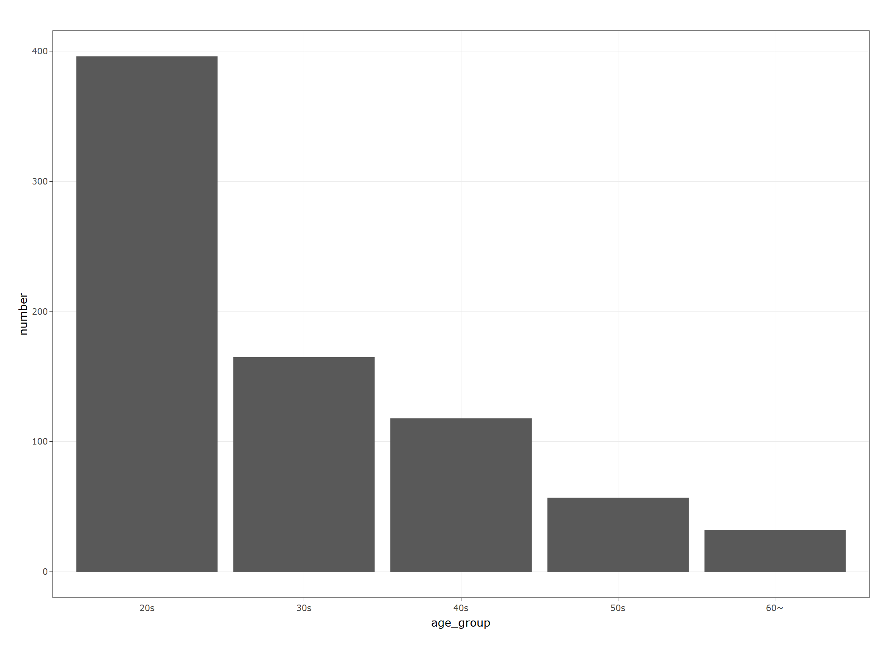

나이대별로 사람수이다.

``` r
data2 %>% mutate(age_group=
                  case_when(age>=20 & age<30 ~ "20s",
                            age>=30 & age<40 ~ "30s",
                            age>=40 & age<50 ~ "40s",
                            age>=50 & age<60 ~ "50s",
                            age>=60 ~ "60~")) %>% group_by(age_group) %>%
  summarise(mean(preg),mean(plas),mean(pres),mean(skin),mean(insu),mean(mass),mean(pedi))
```

    ## # A tibble: 5 x 8
    ##   age_group `mean(preg)` `mean(plas)` `mean(pres)` `mean(skin)`
    ##   <chr>            <dbl>        <dbl>        <dbl>        <dbl>
    ## 1 20s               1.92         114.         68.8         27.6
    ## 2 30s               4.99         126.         73.7         29.7
    ## 3 40s               7.05         126.         77.3         31.9
    ## 4 50s               6.60         140.         79.8         28.1
    ## 5 60~               5.03         138.         78.1         29.7
    ## # ... with 3 more variables: `mean(insu)` <dbl>, `mean(mass)` <dbl>,
    ## #   `mean(pedi)` <dbl>

나이대별로 각 요인들의 평균치이다.

``` r
data3<-data2 %>% mutate(age_group=
                  case_when(age>=20 & age<30 ~ "20s",
                            age>=30 & age<40 ~ "30s",
                            age>=40 & age<50 ~ "40s",
                            age>=50 & age<60 ~ "50s",
                            age>=60 ~ "60~"))
```

### Box-Plot

#### preg

``` r
data3[,!(names(data3) %in% c("class"))] %>% group_by(age_group) %>% 
  ggplot(aes(x=age_group,y=preg))+ geom_boxplot(outlier.color = 'red',outlier.shape = 2)+
  stat_summary(fun.y="mean", geom="point", shape=22, size=3, fill="blue")  
```

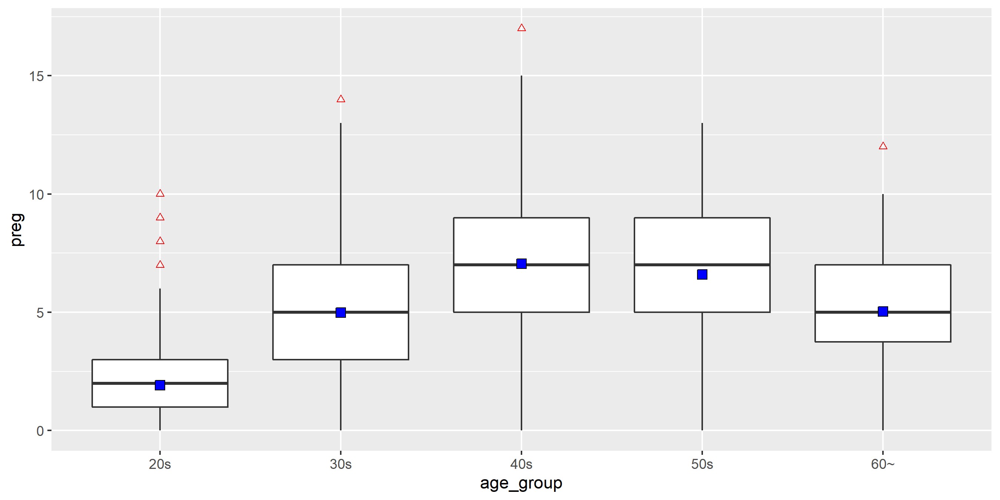

#### plas

``` r
data3[,!(names(data3) %in% c("class"))] %>% group_by(age_group) %>% 
  ggplot(aes(x=age_group,y=plas))+geom_boxplot(outlier.color = 'red',outlier.shape = 2)+
  stat_summary(fun.y="mean", geom="point", shape=22, size=3, fill="blue")  
```

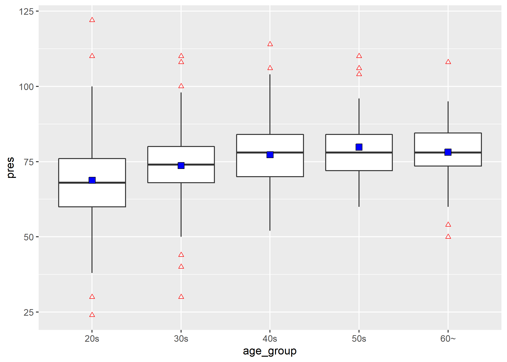

#### pres

``` r
data3[,!(names(data3) %in% c("class"))] %>% group_by(age_group) %>% 
  ggplot(aes(x=age_group,y=pres))+geom_boxplot(outlier.color = 'red',outlier.shape = 2)+
  stat_summary(fun.y="mean", geom="point", shape=22, size=3, fill="blue")
```

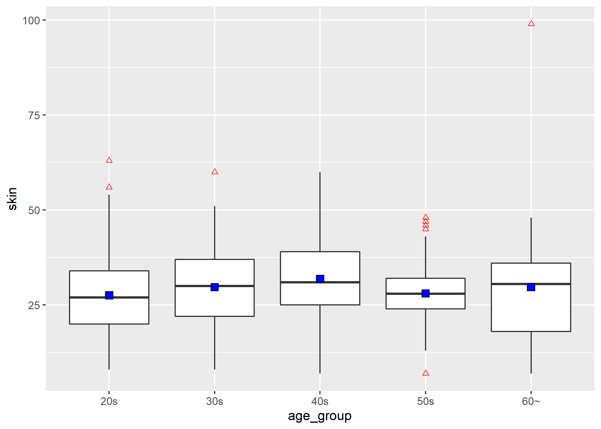

#### skin

``` r
data3[,!(names(data3) %in% c("class"))] %>% group_by(age_group) %>% 
  ggplot(aes(x=age_group,y=skin))+geom_boxplot(outlier.color = 'red',outlier.shape = 2)+
  stat_summary(fun.y="mean", geom="point", shape=22, size=3, fill="blue") 
```

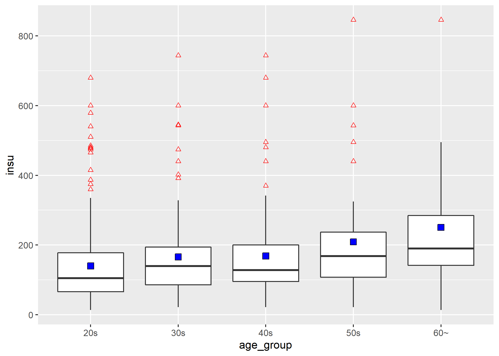

#### insu

``` r
data3[,!(names(data3) %in% c("class"))] %>% group_by(age_group) %>% 
  ggplot(aes(x=age_group,y=insu))+geom_boxplot(outlier.color = 'red',outlier.shape = 2)+
  stat_summary(fun.y="mean", geom="point", shape=22, size=3, fill="blue")
```


#### mass

``` r
data3[,!(names(data3) %in% c("class"))] %>% group_by(age_group) %>% 
  ggplot(aes(x=age_group,y=mass))+geom_boxplot(outlier.color = 'red',outlier.shape = 2)+
  stat_summary(fun.y="mean", geom="point", shape=22, size=3, fill="blue")
```

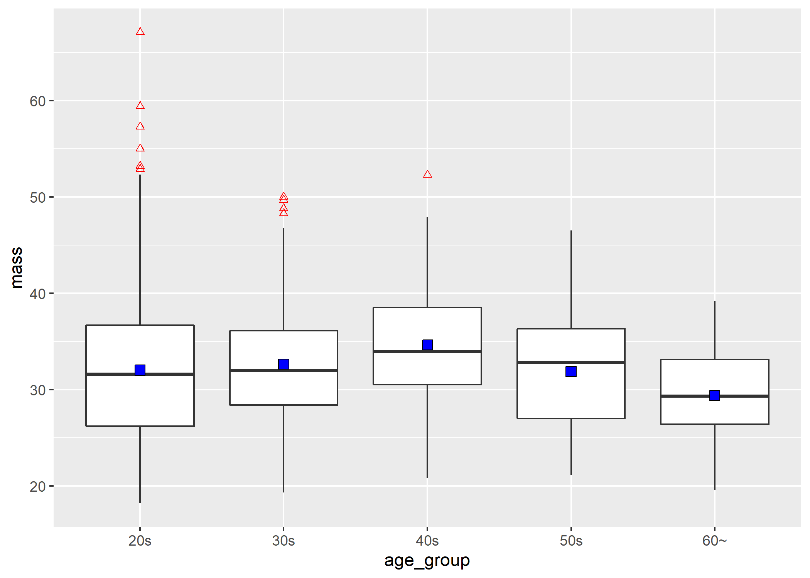

#### pedi

``` r
data3[,!(names(data3) %in% c("class"))] %>% group_by(age_group) %>% 
  ggplot(aes(x=age_group,y=pedi))+geom_boxplot(outlier.color = 'red',outlier.shape = 2)+
  stat_summary(fun.y="mean", geom="point", shape=22, size=3, fill="blue")
```

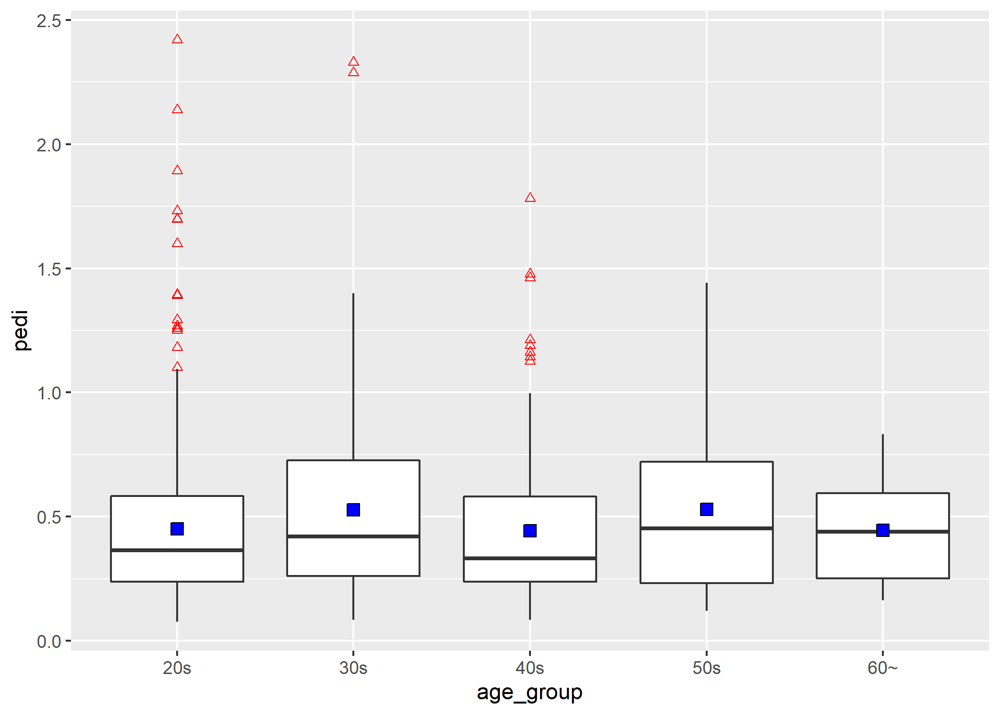

content below tabbed region

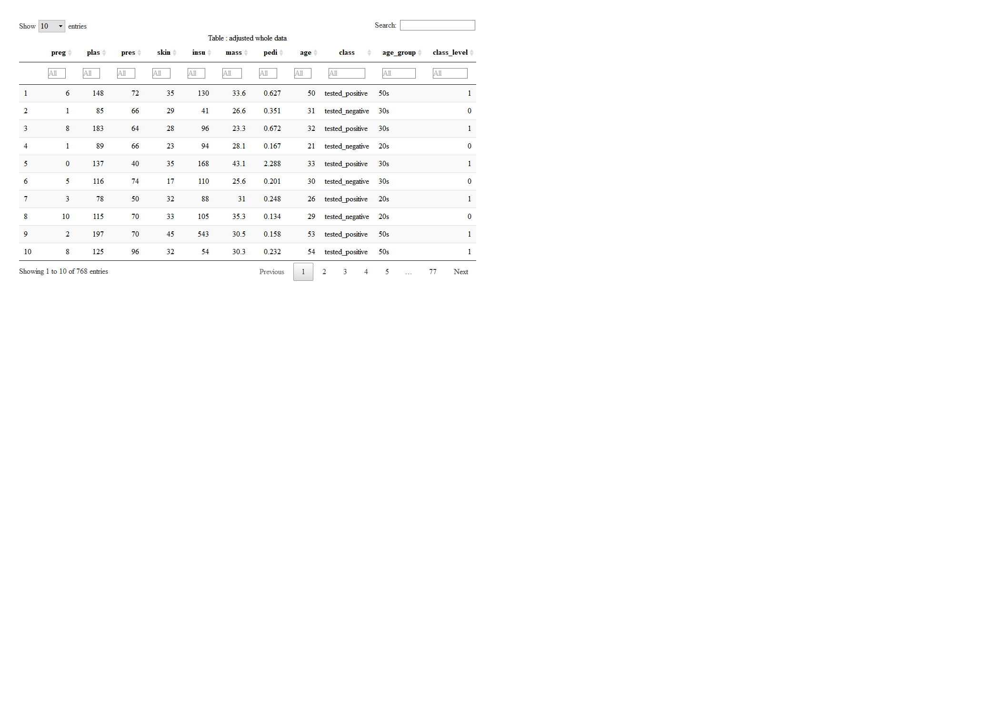

``` r
data3 %>% group_by(age_group) %>% 
  summarise(ratio=sum(class_level)/n()) %>%
  ggplot(aes(x=age_group,y=ratio))+geom_bar(stat="identity")
```

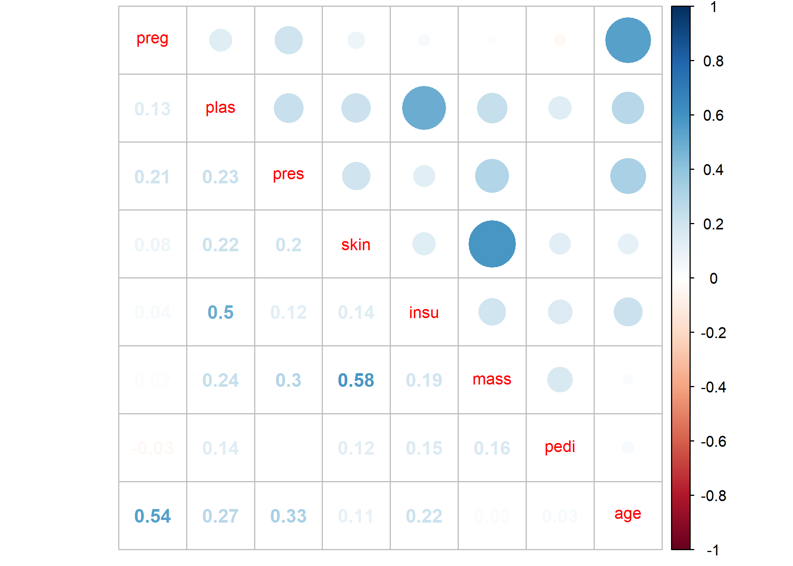

당뇨병 환자들의 나이대들에 대한 비율 그래프이다. 위의 boxplot에서 plas(혈장 포도당 농도)의 그래프와 비슷한 양상을 보이고 있다.

### Correlation Plot.

``` r
data3 %>% 
  select(-class, -age_group, -class_level) %>%
  select_if(is.numeric) %>%
  cor(use="complete.obs") %>%
  corrplot.mixed(tl.cex=0.85)
```


partition the dataset.
----------------------

``` r
set.seed(1234)
index<-createDataPartition(data3$class,p=0.7,list=F)

train<-data3[index,]
test<-data3[-index,]
```

train과 test데이터를 70%확률로 랜덤하게 분리하였다.

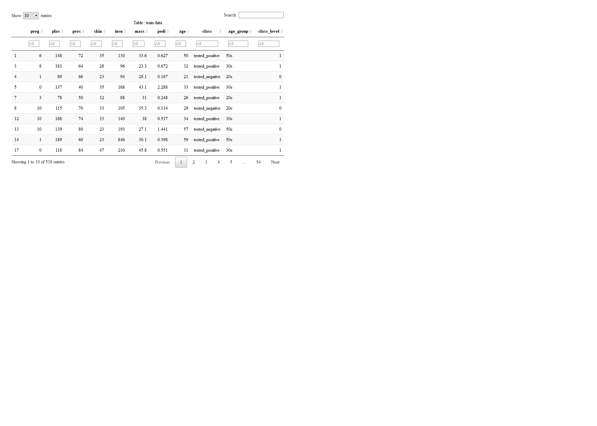

Logistic Regression.
--------------------

``` r
logistic_model<-glm(class_level~preg+plas+pres+skin+insu+mass+pedi+age,
                    data = train, family = "binomial")

summary(logistic_model)
```

    ## 
    ## Call:
    ## glm(formula = class_level ~ preg + plas + pres + skin + insu + 
    ##     mass + pedi + age, family = "binomial", data = train)
    ## 
    ## Deviance Residuals: 
    ##     Min       1Q   Median       3Q      Max  
    ## -2.8096  -0.7208  -0.4134   0.7226   2.4232  
    ## 
    ## Coefficients:
    ##               Estimate Std. Error z value Pr(>|z|)    
    ## (Intercept) -9.0920023  0.9498043  -9.573  < 2e-16 ***
    ## preg         0.0973060  0.0388095   2.507 0.012167 *  
    ## plas         0.0382225  0.0046740   8.178 2.89e-16 ***
    ## pres        -0.0028609  0.0104634  -0.273 0.784534    
    ## skin         0.0074268  0.0134063   0.554 0.579591    
    ## insu        -0.0007037  0.0010110  -0.696 0.486437    
    ## mass         0.0753888  0.0215427   3.500 0.000466 ***
    ## pedi         1.0284548  0.3435768   2.993 0.002759 ** 
    ## age          0.0120199  0.0115899   1.037 0.299690    
    ## ---
    ## Signif. codes:  0 '***' 0.001 '**' 0.01 '*' 0.05 '.' 0.1 ' ' 1
    ## 
    ## (Dispersion parameter for binomial family taken to be 1)
    ## 
    ##     Null deviance: 696.28  on 537  degrees of freedom
    ## Residual deviance: 504.48  on 529  degrees of freedom
    ## AIC: 522.48
    ## 
    ## Number of Fisher Scoring iterations: 5

``` r
test$class_prob<-predict(logistic_model, test[,1:8],type = "response")

test$class_pred<-ifelse(test$class_prob>0.5,1,0)
```

``` r
mean(test$class_level==test$class_pred)
```

    ## [1] 0.7652174

``` r
confusionMatrix(as.factor(test$class_pred),as.factor(test$class_level))
```

    ## Confusion Matrix and Statistics
    ## 
    ##           Reference
    ## Prediction   0   1
    ##          0 129  33
    ##          1  21  47
    ##                                          
    ##                Accuracy : 0.7652         
    ##                  95% CI : (0.705, 0.8184)
    ##     No Information Rate : 0.6522         
    ##     P-Value [Acc > NIR] : 0.0001394      
    ##                                          
    ##                   Kappa : 0.4637         
    ##                                          
    ##  Mcnemar's Test P-Value : 0.1344166      
    ##                                          
    ##             Sensitivity : 0.8600         
    ##             Specificity : 0.5875         
    ##          Pos Pred Value : 0.7963         
    ##          Neg Pred Value : 0.6912         
    ##              Prevalence : 0.6522         
    ##          Detection Rate : 0.5609         
    ##    Detection Prevalence : 0.7043         
    ##       Balanced Accuracy : 0.7238         
    ##                                          
    ##        'Positive' Class : 0              
    ## 

In this exercise you will create a ROC curve and compute the area under the curve (AUC) to evaluate the logistic regression model of donations you built earlier.

``` r
ROC<-roc(test$class_level,test$class_prob)            # Create a ROC curve

plot(ROC,col="blue")                                  # Plot the ROC curve
```

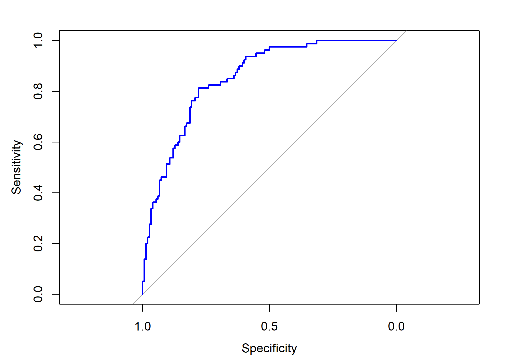

``` r
auc(ROC)                                              # Calculate the area under the curve (AUC)
```

    ## Area under the curve: 0.8533

Decision Tree.
--------------

``` r
tree_model <- rpart(class~preg+plas+pres+skin+insu+mass+pedi+age, data = train, method = "class", control = rpart.control(cp = 0))

tree_model
```

    ## n= 538 
    ## 
    ## node), split, n, loss, yval, (yprob)
    ##       * denotes terminal node
    ## 
    ##   1) root 538 188 tested_negative (0.65055762 0.34944238)  
    ##     2) plas< 127.5 343  65 tested_negative (0.81049563 0.18950437)  
    ##       4) mass< 26.45 89   0 tested_negative (1.00000000 0.00000000) *
    ##       5) mass>=26.45 254  65 tested_negative (0.74409449 0.25590551)  
    ##        10) pedi< 0.6345 196  35 tested_negative (0.82142857 0.17857143)  
    ##          20) plas< 101.5 85   6 tested_negative (0.92941176 0.07058824) *
    ##          21) plas>=101.5 111  29 tested_negative (0.73873874 0.26126126)  
    ##            42) age< 28.5 52   8 tested_negative (0.84615385 0.15384615) *
    ##            43) age>=28.5 59  21 tested_negative (0.64406780 0.35593220)  
    ##              86) pres>=67 46  12 tested_negative (0.73913043 0.26086957)  
    ##               172) preg>=2.5 36   6 tested_negative (0.83333333 0.16666667)  
    ##                 344) preg< 5.5 14   0 tested_negative (1.00000000 0.00000000) *
    ##                 345) preg>=5.5 22   6 tested_negative (0.72727273 0.27272727)  
    ##                   690) age>=39 15   2 tested_negative (0.86666667 0.13333333) *
    ##                   691) age< 39 7   3 tested_positive (0.42857143 0.57142857) *
    ##               173) preg< 2.5 10   4 tested_positive (0.40000000 0.60000000) *
    ##              87) pres< 67 13   4 tested_positive (0.30769231 0.69230769) *
    ##        11) pedi>=0.6345 58  28 tested_positive (0.48275862 0.51724138)  
    ##          22) age< 27.5 21   5 tested_negative (0.76190476 0.23809524) *
    ##          23) age>=27.5 37  12 tested_positive (0.32432432 0.67567568)  
    ##            46) insu< 120.5 16   6 tested_negative (0.62500000 0.37500000) *
    ##            47) insu>=120.5 21   2 tested_positive (0.09523810 0.90476190) *
    ##     3) plas>=127.5 195  72 tested_positive (0.36923077 0.63076923)  
    ##       6) plas< 165.5 136  65 tested_positive (0.47794118 0.52205882)  
    ##        12) preg< 7.5 107  47 tested_negative (0.56074766 0.43925234)  
    ##          24) pedi< 0.7305 91  34 tested_negative (0.62637363 0.37362637)  
    ##            48) pres< 91 84  28 tested_negative (0.66666667 0.33333333)  
    ##              96) pedi>=0.653 9   0 tested_negative (1.00000000 0.00000000) *
    ##              97) pedi< 0.653 75  28 tested_negative (0.62666667 0.37333333)  
    ##               194) pedi< 0.3135 38   9 tested_negative (0.76315789 0.23684211) *
    ##               195) pedi>=0.3135 37  18 tested_positive (0.48648649 0.51351351)  
    ##                 390) plas< 137.5 12   3 tested_negative (0.75000000 0.25000000) *
    ##                 391) plas>=137.5 25   9 tested_positive (0.36000000 0.64000000) *
    ##            49) pres>=91 7   1 tested_positive (0.14285714 0.85714286) *
    ##          25) pedi>=0.7305 16   3 tested_positive (0.18750000 0.81250000) *
    ##        13) preg>=7.5 29   5 tested_positive (0.17241379 0.82758621) *
    ##       7) plas>=165.5 59   7 tested_positive (0.11864407 0.88135593) *

``` r
prediction<-predict(tree_model, test[,1:8], type = "class")

table(actual=test$class,pre=prediction); mean(prediction==test$class)
```

    ##                  pre
    ## actual            tested_negative tested_positive
    ##   tested_negative             120              30
    ##   tested_positive              34              46

    ## [1] 0.7217391

``` r
confusionMatrix(prediction,test$class)
```

    ## Confusion Matrix and Statistics
    ## 
    ##                  Reference
    ## Prediction        tested_negative tested_positive
    ##   tested_negative             120              34
    ##   tested_positive              30              46
    ##                                          
    ##                Accuracy : 0.7217         
    ##                  95% CI : (0.659, 0.7786)
    ##     No Information Rate : 0.6522         
    ##     P-Value [Acc > NIR] : 0.0148         
    ##                                          
    ##                   Kappa : 0.3794         
    ##                                          
    ##  Mcnemar's Test P-Value : 0.7077         
    ##                                          
    ##             Sensitivity : 0.8000         
    ##             Specificity : 0.5750         
    ##          Pos Pred Value : 0.7792         
    ##          Neg Pred Value : 0.6053         
    ##              Prevalence : 0.6522         
    ##          Detection Rate : 0.5217         
    ##    Detection Prevalence : 0.6696         
    ##       Balanced Accuracy : 0.6875         
    ##                                          
    ##        'Positive' Class : tested_negative
    ## 

``` r
# Plot the model with default settings
rpart.plot(tree_model)
```

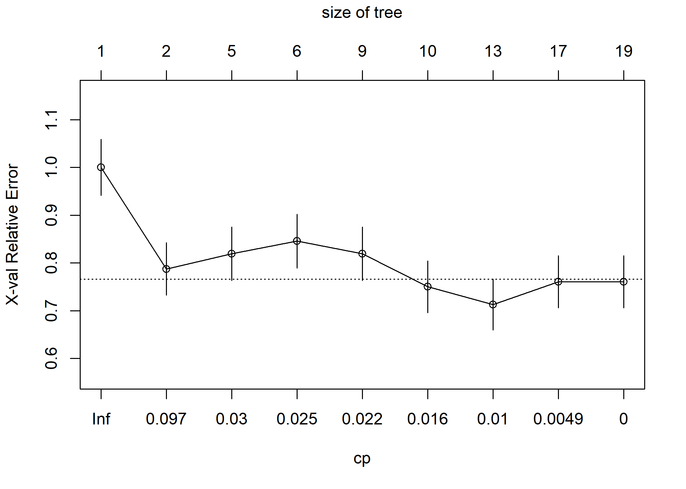

``` r
# cross-validation을 계산해 주는 함수로 print.cp를 제공,rpart패키지도 과적합화 문제가 있기 때문
printcp(tree_model)
```

    ## 
    ## Classification tree:
    ## rpart(formula = class ~ preg + plas + pres + skin + insu + mass + 
    ##     pedi + age, data = train, method = "class", control = rpart.control(cp = 0))
    ## 
    ## Variables actually used in tree construction:
    ## [1] age  insu mass pedi plas preg pres
    ## 
    ## Root node error: 188/538 = 0.34944
    ## 
    ## n= 538 
    ## 
    ##          CP nsplit rel error  xerror     xstd
    ## 1 0.2712766      0   1.00000 1.00000 0.058825
    ## 2 0.0345745      1   0.72872 0.77128 0.054743
    ## 3 0.0265957      4   0.60638 0.76596 0.054624
    ## 4 0.0230496      5   0.57979 0.73936 0.054006
    ## 5 0.0212766      8   0.51064 0.73936 0.054006
    ## 6 0.0124113      9   0.48936 0.67021 0.052250
    ## 7 0.0088652     12   0.45213 0.71277 0.053357
    ## 8 0.0026596     16   0.41489 0.76596 0.054624
    ## 9 0.0000000     18   0.40957 0.77660 0.054862

``` r
plotcp(tree_model)
```

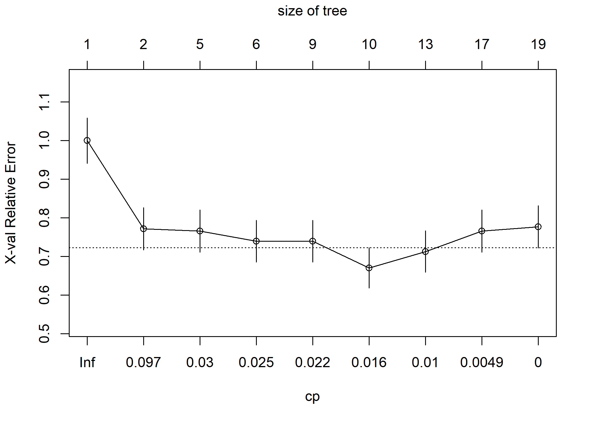

``` r
ptree<-prune(tree_model, cp= tree_model$cptable[which.min(tree_model$cptable[,"xerror"]),"CP"])
plot(ptree)
text(ptree)
```

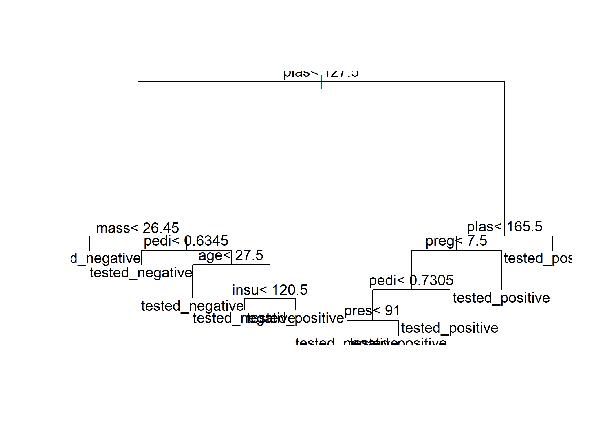

``` r
rpartpred<-predict(ptree, test, type='class')
confusionMatrix(rpartpred, test$class)
```

    ## Confusion Matrix and Statistics
    ## 
    ##                  Reference
    ## Prediction        tested_negative tested_positive
    ##   tested_negative             131              49
    ##   tested_positive              19              31
    ##                                           
    ##                Accuracy : 0.7043          
    ##                  95% CI : (0.6408, 0.7625)
    ##     No Information Rate : 0.6522          
    ##     P-Value [Acc > NIR] : 0.0543270       
    ##                                           
    ##                   Kappa : 0.2858          
    ##                                           
    ##  Mcnemar's Test P-Value : 0.0004368       
    ##                                           
    ##             Sensitivity : 0.8733          
    ##             Specificity : 0.3875          
    ##          Pos Pred Value : 0.7278          
    ##          Neg Pred Value : 0.6200          
    ##              Prevalence : 0.6522          
    ##          Detection Rate : 0.5696          
    ##    Detection Prevalence : 0.7826          
    ##       Balanced Accuracy : 0.6304          
    ##                                           
    ##        'Positive' Class : tested_negative 
    ## 

RandomForest
------------

``` r
RandomForest_model<-randomForest(class~preg+plas+skin+insu+mass+pedi+age,data=train[,1:9],ntree=500,importance=T)
prediction2<-predict(RandomForest_model, test[,1:8], type = "class")
mean(prediction2==test$class)
```

    ## [1] 0.7652174

``` r
confusionMatrix(prediction2, test$class)
```

    ## Confusion Matrix and Statistics
    ## 
    ##                  Reference
    ## Prediction        tested_negative tested_positive
    ##   tested_negative             130              34
    ##   tested_positive              20              46
    ##                                          
    ##                Accuracy : 0.7652         
    ##                  95% CI : (0.705, 0.8184)
    ##     No Information Rate : 0.6522         
    ##     P-Value [Acc > NIR] : 0.0001394      
    ##                                          
    ##                   Kappa : 0.4605         
    ##                                          
    ##  Mcnemar's Test P-Value : 0.0768812      
    ##                                          
    ##             Sensitivity : 0.8667         
    ##             Specificity : 0.5750         
    ##          Pos Pred Value : 0.7927         
    ##          Neg Pred Value : 0.6970         
    ##              Prevalence : 0.6522         
    ##          Detection Rate : 0.5652         
    ##    Detection Prevalence : 0.7130         
    ##       Balanced Accuracy : 0.7208         
    ##                                          
    ##        'Positive' Class : tested_negative
    ## 

``` r
importance(RandomForest_model)
```

    ##      tested_negative tested_positive MeanDecreaseAccuracy MeanDecreaseGini
    ## preg       10.196586        1.314382             9.263333         19.55949
    ## plas       27.655790       30.168801            39.742105         61.70907
    ## skin        2.934596        2.429964             3.920632         23.41577
    ## insu        4.766881        6.215151             7.842287         37.24799
    ## mass        6.978018       13.285936            14.039764         36.80683
    ## pedi        5.820796        3.470388             6.509452         32.31468
    ## age        12.371411        7.230036            14.315468         33.04688

``` r
varImpPlot(RandomForest_model, type=2, pch=19, col=1, cex=1, main="")
```

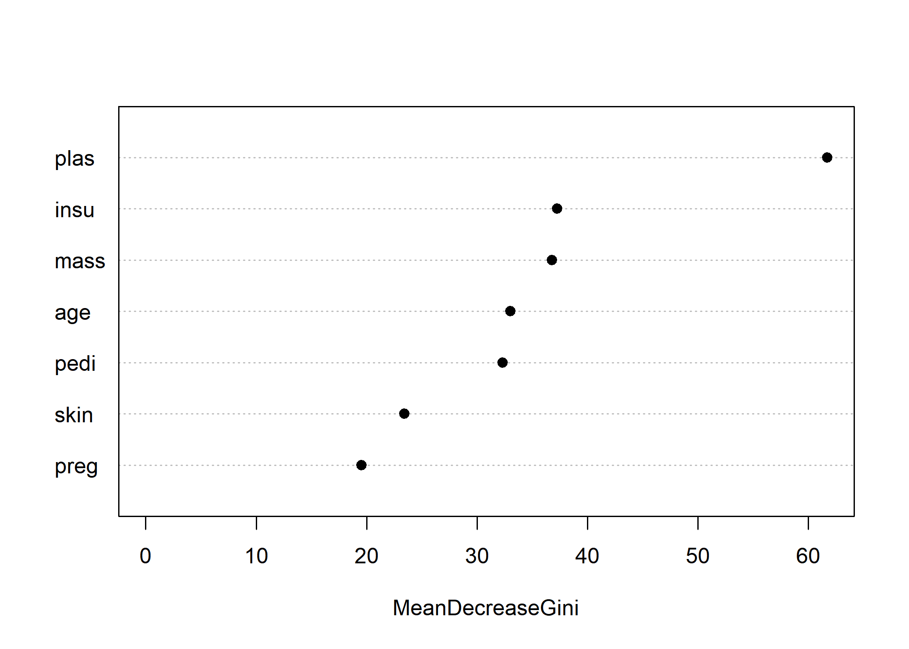

``` r
importance_data<-data.frame(importance(RandomForest_model))
importance_data[,5]<-rownames(importance_data)

ggplot(data=importance_data,aes(x=reorder(V5,-MeanDecreaseGini),y=MeanDecreaseGini))+
  geom_bar(stat="identity",fill="red")+
  theme_bw()
```

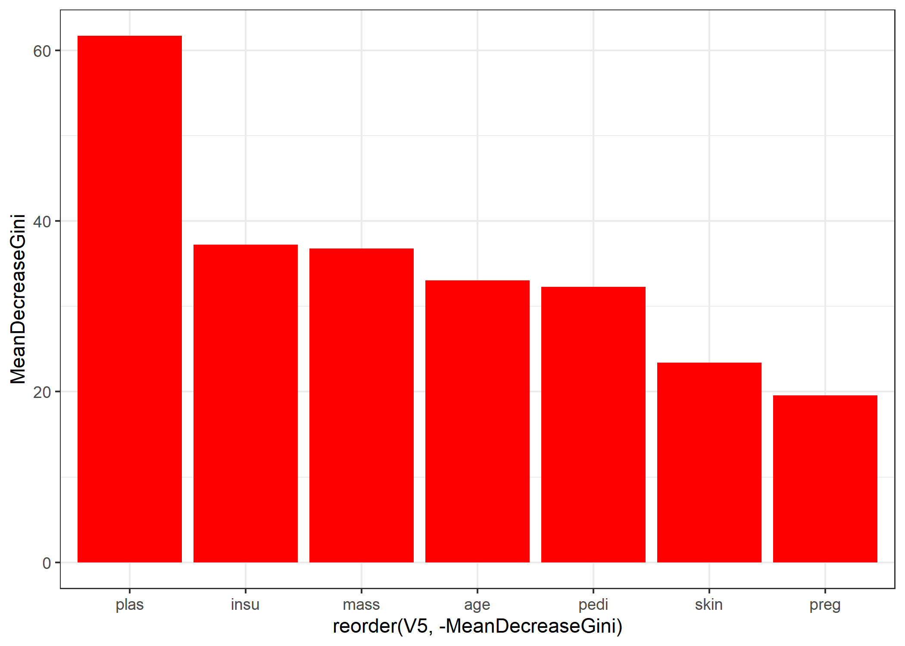

``` r
plot(RandomForest_model$err.rate[,1],col='red')
```

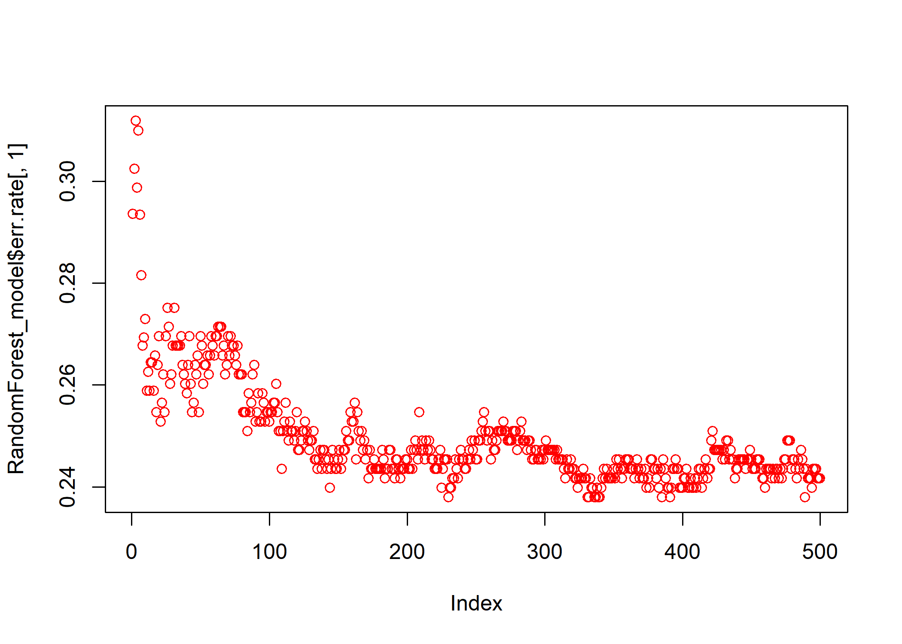

XGBOOST
-------
